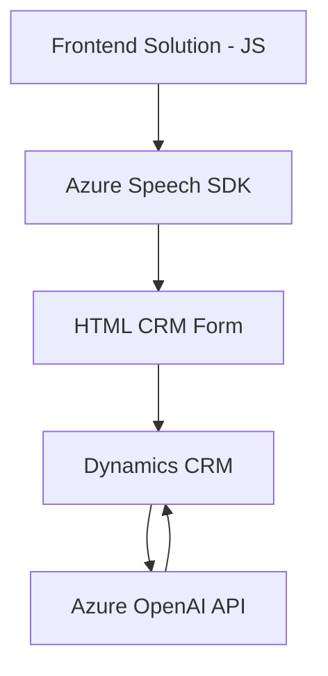

### Breve Resumen Técnico

El repositorio tiene elementos clave que abarcan una solución híbrida con funcionalidades específicas para frontend (JavaScript) y capacidades extendidas en backend (plugin para Dynamics CRM), utilizando servicios Cloud como Azure (Speech SDK y OpenAI). 

### Descripción de Arquitectura

1. **Tipo de Solución:**  
   Este repositorio implementa capacidades divididas en dos principales:
   - **Frontend:** Interactuar con formularios vía voz y manipularlos en tiempo real, integrando el Azure Speech SDK.
   - **Backend:** Procesar texto y ejecutar lógica avanzada en Dynamics CRM mediante un plugin conectado a Azure OpenAI.

2. **Arquitectura:**  
   - **Frontend:** Arquitectura modelada como **MVC extendido** con módulos altamente desacoplados que procesan datos y delegan responsabilidades de I/O y lógica a servicios externos (Speech SDK).  
   - **Backend:** **Plugin Architecture** orientada a eventos del CRM que utiliza una **Service-Oriented Architecture (SOA)**, haciendo llamadas a APIs externas (Azure OpenAI).  

3. **Patrones Aplicados:**
   - **Carga Dinámica:** El SDK de Azure Speech se incluye bajo demanda solo cuando es necesario.  
   - **Facade:** Métodos encapsulan llamadas complejas a servicios externos con abstracciones simples.  
   - **Procesador de Texto:** Normalización y preprocesamiento de datos (e.g., conversión números-texto).  
   - **Adaptador (contexto CRM):** El frontend y backend adaptan los modelos de datos según el contexto de Microsoft CRM.

---

### Tecnologías y Frameworks Usados

1. **Frontend:**  
   - **JavaScript** (ES6+).  
   - **Azure Cognitive Services - Speech SDK.**  
   - **DOM API** para interacción con HTML y formularios CRM.  
   - **Promise/Await:** Uso intensivo para operaciones asincrónicas.  

2. **Backend:**  
   - **Microsoft Dynamics CRM SDK:** Manejo de eventos y contexto con `IPlugin`.  
   - **Azure OpenAI API:** Procesamiento inteligente de texto.  
   - **HTTP Client (System.Net.Http):** HttpRequest para comunicación externa.  
   - **JSON Managers:** Serialización/deserialización con `System.Text.Json` y `Newtonsoft.Json.Linq`.

---

### Dependencias o Componentes Externos

1. **Azure Speech SDK:** Funcionalidad de voz (con integración dinámica en frontend).  
2. **Azure OpenAI API:** Servicio de procesamiento avanzado para interpretación del texto.  
3. **Microsoft Dynamics CRM:** Sistema de gestión integrado en el backend mediante plugins.  
4. **Promesas (Promise):** Múltiples componentes JavaScript dependen de esta mecánica asincrónica.  
5. **Librerías JSON:** En el backend para manipulación eficiente de estructuras JSON.

---

### Diagrama Mermaid

---

### Conclusión Final

Este repositorio representa una solución diseñada para extender y mejorar la experiencia de usuario en aplicaciones CRM, usando servicios Azure avanzados. Aunque modular, es una arquitectura intermedia entre sistemas monolíticos y distribuidos. El frontend y backend están desacoplados en gran medida con puntos de integración en los servicios Cloud. Sin embargo, sugeriría para futuras versiones considerar:
- Combinación con una arquitectura **Hexagonal** en backend para mejorar la testabilidad y el desacoplamiento.  
- Seguridad mejorada (e.g., gestión de claves API via Vaults).  
- Optimización del SDK de voz para escenarios de carga masiva.  

Esta solución demuestra buenas prácticas de integración Cloud y evidencia un enfoque robusto para extender funcionalidades de sistemas empresariales.