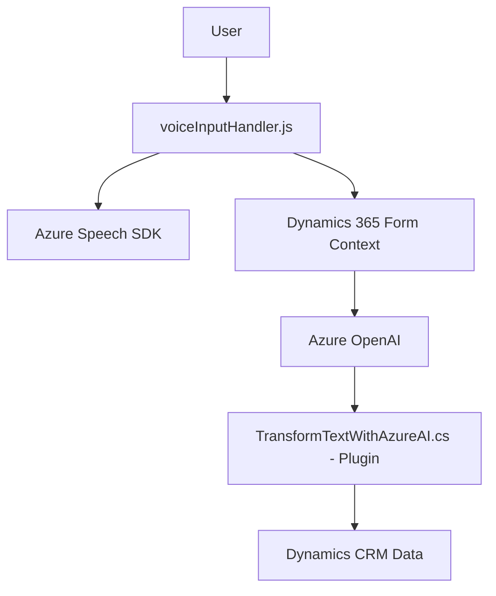

### Breve resumen técnico
El repositorio es una solución integral que combina un frontend basado en JavaScript y un backend en C# (Plugins). La finalidad principal del sistema consiste en facilitar la interacción entre usuarios y formularios en Dynamics 365 mediante reconocimiento de voz y procesamiento de texto. También hace uso de servicios externos como Azure Cognitive Services Speech SDK y Azure OpenAI GPT para transcripción, síntesis de voz y transformación de texto.

---

### Descripción de arquitectura
La solución sigue un enfoque modular orientado a la integración con servicios externos y herramientas de inteligencia artificial. A nivel de frontend, implementa un modelo basado en eventos y callbacks que facilita la interacción con formularios en Dynamics 365 mediante el uso de voz. En el backend, la arquitectura se sustenta sobre la estructura basada en eventos de Dynamics CRM Plugins, donde las operaciones son ejecutadas mediante la interfaz `IPlugin`.

La solución puede ser clasificada como una arquitectura de **n capas** con integración de servicios externos:
1. **Capa de presentación**: Frontend en JavaScript para interacción con usuarios.
2. **Capa de negocio**: Plugins en C# procesan datos y transforman texto mediante Azure OpenAI GPT.
3. **Capa de integración/external services**: Azure Speech SDK y OpenAI GPT.
4. **Capa de datos**: Dynamics 365 gestiona los modelos de datos y la interacción con los formularios.

---

### Tecnologías y frameworks usados
#### Frontend:
- **JavaScript**: Para manipulación DOM, eventos y callbacks.
- **Azure Speech SDK**: Reconocimiento y síntesis de voz.

#### Backend:
- **C#**: Implementación de Plugins.
- **Dynamics CRM SDK (`Microsoft.Xrm.Sdk`)**: Integración con el modelo de datos de Dynamics.
- **Azure OpenAI GPT**: Procesamiento de texto avanzado.

#### Otros:
- **HTTP Client Libraries**: Se utiliza para llamadas REST a la API de OpenAI GPT.
- **JSON**: Para la preparación y gestion de datos estructurados (entrada y salida).

---

### Diagrama Mermaid
A continuación, se presenta el diagrama **Mermaid** que describe cómo interactúan los componentes de la solución:

---

### Conclusión final
Este repositorio representa una solución robusta y moderna que aprovecha servicios cloud y lógica basada en eventos para ampliar la funcionalidad de un sistema CRM como Dynamics 365. La implementación utiliza estrategias claras como la modularización de funciones y la integración de APIs externas, lo que permite realizar tareas avanzadas como la transcripción y síntesis de voz, junto con la transformación de texto en estructuras JSON mediante inteligencia artificial.

En términos de arquitectura, el sistema puede considerarse **n capas** dada la separación explícita de lógica de presentación, negocio y servicios externos, con una fuerte dependencia hacia Azure Cognitive Services y Dynamics CRM SDK. La solución también destaca por su cumplimiento con principios como responsabilidad única y modularidad, lo que facilita el mantenimiento y escalabilidad futura.