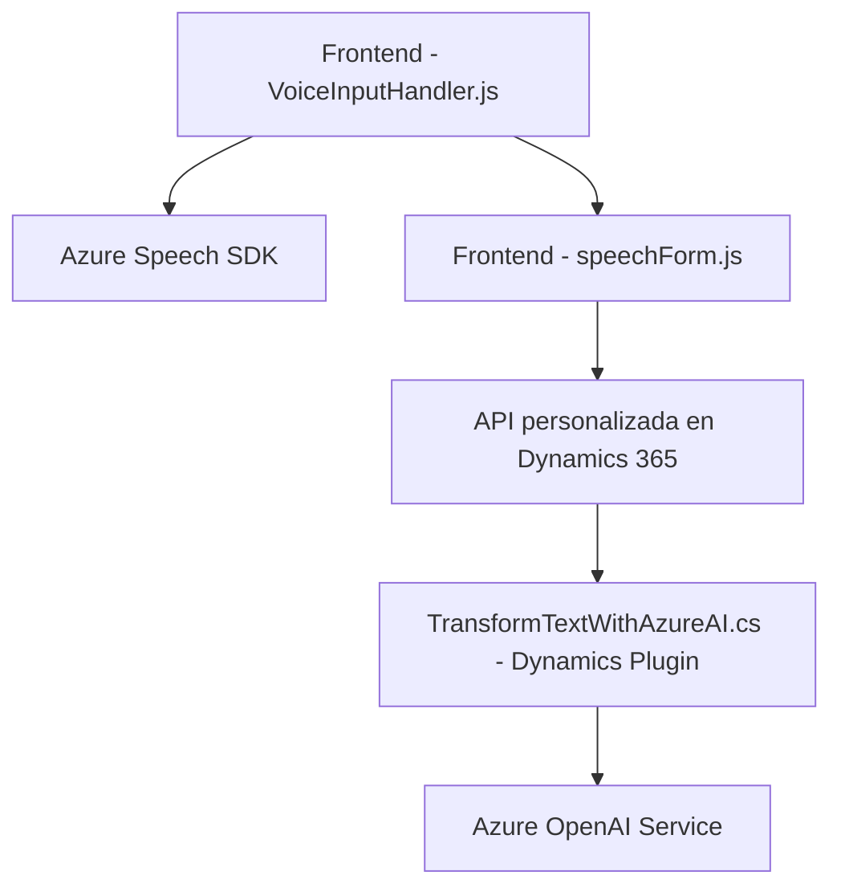

### Breve resumen técnico:
El repositorio se centra en la integración de voz y procesamiento de datos con Microsoft Dynamics CRM, complementado por servicios externos como Azure Speech SDK y Azure OpenAI. Los archivos destacan funcionalidades en **frontend** (para manejar entrada y salida de datos en formularios dinámicos) y **backend/plugins** (para transformar datos mediante IA). Esto apunta a una solución integrada para enriquecer la experiencia dinámica en CRM utilizando inteligencia artificial y voz.

---

### Descripción de arquitectura:
La arquitectura es híbrida:
1. **N Capas/Integración Modular**: 
   - El frontend opera como una capa de interacción para entrada de datos y procesamiento en tiempo real (voz y texto) usando Azure Speech SDK.
   - El backend basado en Dynamics CRM utiliza plugins para extender capacidades de datos, con un enfoque hacia la integración de APIs externas como Azure OpenAI.

2. **Extensión plugin para Dynamics CRM**:
   - Usa el patrón IPlugin de Dynamics para implementar lógica ejecutada en eventos del sistema CRM.
   - Se integra con servicios externos (APIs de Azure) para realizar transformaciones avanzadas de datos.

3. **Microservicio Implicado**:
   - Aunque el repositorio no implementa una arquitectura específica de microservicios, la interacción con APIs externas muestra que algunas funcionalidades técnicas (como los plugins y `callCustomApi`) operan como microservicios conectados al entorno de Dynamics.

4. **Patrones usados**:
   - **Patrón Observador**: Callbacks para manejar eventos como cargas de Azure Speech SDK.
   - **Modularidad**: Separación de lógica en funciones específicas en frontend y backend.
   - **Integración de servicios externos**: Solicitudes HTTP para interactuar con APIs de Azure como Speech SDK y OpenAI.

5. **Dependencias y componentes externos**:
   - Azure Speech SDK y OpenAI Service para reconocimiento y síntesis de voz, y procesamiento de texto mediante IA.
   - Microsoft Dynamics CRM SDK.
   - Otras librerías de .NET para manejo de JSON y solicitudes HTTP.

---

### Tecnologías usadas:
- **Frontend**:
  - JavaScript como lenguaje principal.
  - Console-based debugging en funciones específicas.
  - Azure Speech SDK (cargado dinámicamente desde el CDN).

- **Backend (plugin)**:
  - .NET Framework.
  - Microsoft Dynamics CRM SDK (`IPlugin`, `IPluginExecutionContext`).
  - `System.Net.Http` y `System.Text.Json` para requests HTTP y manejo de JSON.
  - Azure OpenAI Service para transformación avanzada de texto con IA.

---

### Diagrama **Mermaid** (válido para GitHub Markdown):

---

### Conclusión final:
El repositorio está diseñado para potenciar la interacción en Microsoft Dynamics CRM mediante la integración de reconocimiento y síntesis de voz, junto con capacidades de procesamiento de texto usando inteligencia artificial. La arquitectura combina patrones de N capas en su frontend/backend y asume servicios externos mediante APIs. Esto es ideal para escenarios de CRM dinámicos donde el enriquecimiento de datos y la interacción natural (voz) optimizan la experiencia de usuario.