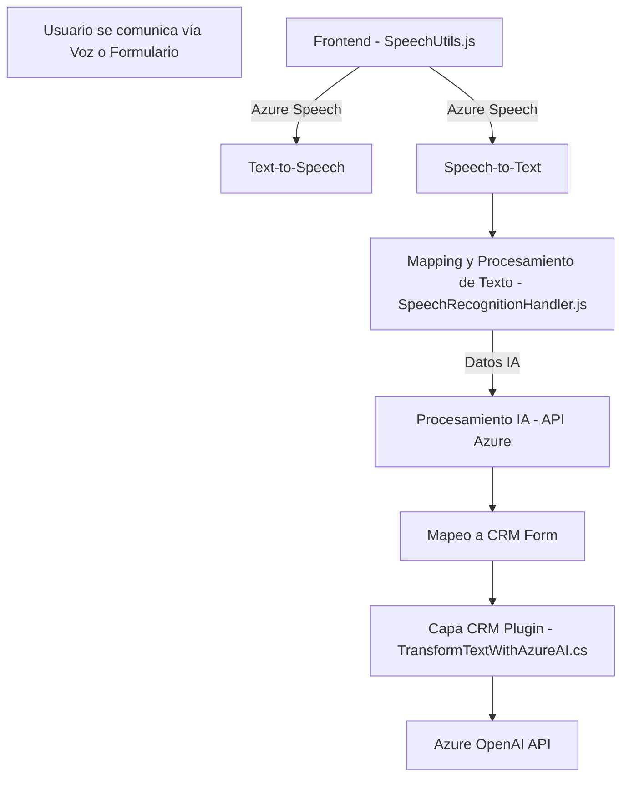

### Breve resumen técnico
El repositorio presenta una solución que integra reconocimiento de voz, síntesis de audio, transformación de texto mediante IA y CRM para Microsoft Dynamics. Los archivos evidencian una combinación de desarrollo frontend (JavaScript), plugins para Dynamics (C#) y conexiones externas (Azure).

---

### Descripción de arquitectura
La arquitectura puede clasificarse como **n-capas**: 
1. **Capa de presentación:** Implementada mediante archivos JavaScript que interactúan con formularios y el SDK de Azure Speech.
2. **Capa de lógica:** Extensiones dinámicas del CRM gracias a los plugins de Dynamics CRM en C#.
3. **Capa de servicios externos:** Incluye servicios de Azure Speech y Azure OpenAI.

El sistema busca modularizar la interacción con formularios (frontend), reconocimiento de voz, síntesis de texto y procesamiento IA. Se utiliza un enfoque basado en servicios con comunicación mediante APIs externas.

---

### Tecnologías utilizadas
#### Lenguajes y frameworks:
- **JavaScript:** Para la lógica de frontend.
- **C#:** Para la creación de plugins en Dynamics CRM.
- **Microsoft Dynamics CRM SDK:** Framework para extensiones del CRM.
- **Azure Speech SDK:** Reconocimiento y síntesis de voz.
- **Azure OpenAI API:** Procesamiento avanzado de texto mediante IA.

#### Patrones observados:
- **Facade Pattern:** Abstrae la complejidad del reconocimiento de voz en funciones específicas.
- **Handler Pattern:** Procesamiento lógico de texto y datos mapeados.
- **Plugin Design Pattern:** Extensión modular del sistema CRM mediante interfaces estándar (`IPlugin`).
- **APIs asíncronas:** Uso de operaciones asíncronas para asegurar la carga del SDK y comunicación con servicios externos.

---

### Dependencias externas presentes
1. **Azure Speech SDK:** Para procesamiento Text-to-Speech y Speech-to-Text.
2. **Azure OpenAI API:** Manejo del procesamiento texto/IA.
3. **Microsoft Dynamics CRM SDK:** Para extensiones CRM.
4. **HttpClient:** En plugins, para consumo API externa.

---

### Diagrama **Mermaid**

---

### Conclusión final
La solución implementada integra eficientemente capacidades de reconocimiento de voz, síntesis de texto y procesamiento IA con un sistema CRM. Combina tecnologías de frontend (JavaScript), plugins para extensibilidad del backend (C#), y herramientas en la nube de Azure para interacciones avanzadas. La arquitectura **n-capas** es adecuada para su propósito, aunque podría mejorarse hacia una **arquitectura hexagonal** para desacoplar aún más las interacciones entre capas y servicios externos. Esto facilitaría mantenimiento y escalabilidad, especialmente si se desea agregar nuevas fuentes de datos o servicios.