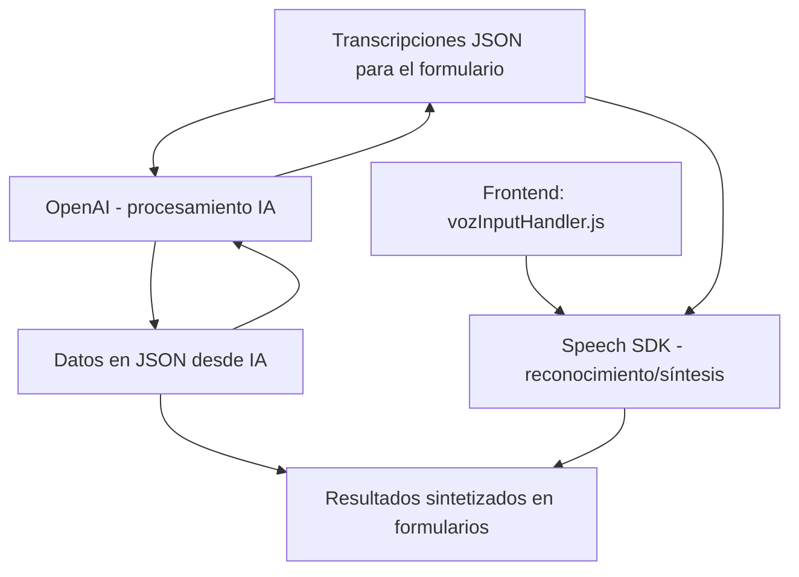

### Breve resumen técnico
El repositorio parece ser un sistema híbrido que combina componentes de **frontend (JavaScript)**, **backend (C#)** y **integraciones con servicios cloud (Azure Speech SDK, Azure OpenAI Service)**. Su propósito principal es manejar formularios dinámicos mediante entrada y salida de voz, además de utilizar inteligencia artificial para transformar datos y actualizar estructuras CRM (como Microsoft Dynamics).

---

### Descripción de arquitectura
La solución se basa en una arquitectura de **n capas** que separa funcionalidad en:
- **Capa de presentación:** Implementada en `frontend/JS` con operaciones en tiempo de ejecución.
- **Capa de integración:** Usa APIs de Azure Speech y OpenAI para servicios en la nube.
- **Backend en Dynamics CRM:** Usa plugins como `TransformTextWithAzureAI.cs` para procesar datos mediante manipulación dinámica (intercepción de pipelines de ejecución).
  
El diseño facilita **integración con servicios externos**, **procesamiento modular** y funciona como un sistema **orientado a servicios**.

---

### Tecnologías usadas
1. **Frontend:**
   - Azure Speech SDK: Para reconocimiento y síntesis de voz.
   - JavaScript ES6+: Es el lenguaje base para interactuar con el SDK y formularios.
   - Dinámica en navegadores: Carga externa de librerías de Azure mediante URLs.
2. **Backend/Plugins:**
   - C#: Implementación de lógica de negocio en **Microsoft Dynamics CRM**.
   - Azure OpenAI: Usado para transformar texto mediante modelos GPT.
   - Microsoft.Xrm.Sdk: Interacción con el contexto y servicios de Dynamics CRM.
   - Newtonsoft.Json: Generación y modificación de objetos JSON.
   - System.Net.Http: Comunicación HTTP con APIs externas.
3. **Arquitectura de integración:**
   - Integración con APIs externas (e.g., Azure Speech, OpenAI).
   - Entrada dinámica de voz y salida en formularios visuales.
   - Lógica basado en eventos del runtime de Dynamics CRM.

---

### Diagrama Mermaid
A continuación, un diagrama que representa la interacción entre las capas y servicios del sistema:

---

### Conclusión final
La solución es una **aplicación híbrida** con **arquitectura de n capas** altamente orientada a servicios cloud. Su funcionalidad une reconocimiento y síntesis de voz con inteligencia artificial para optimizar formularios dinámicos en el contexto de CRM Microsoft Dynamics.

Los puntos destacados incluyen:
- **Frontend dinámico:** Integra Azure Speech SDK para entrada y salida basada en voz.
- **Plugins backend:** Usa procesamiento en pipelines de ejecución de Dynamics CRM.
- **Servicios cloud:** Azure OpenAI y Azure Speech SDK proveen funcionalidades avanzadas, permitiendo transformar y procesar datos mediante AI y voz.

Esta solución es apta para integrar **sistemas empresariales**, pero requerirá **ajustes en seguridad**, especialmente en el manejo de claves API directamente en código fuente.