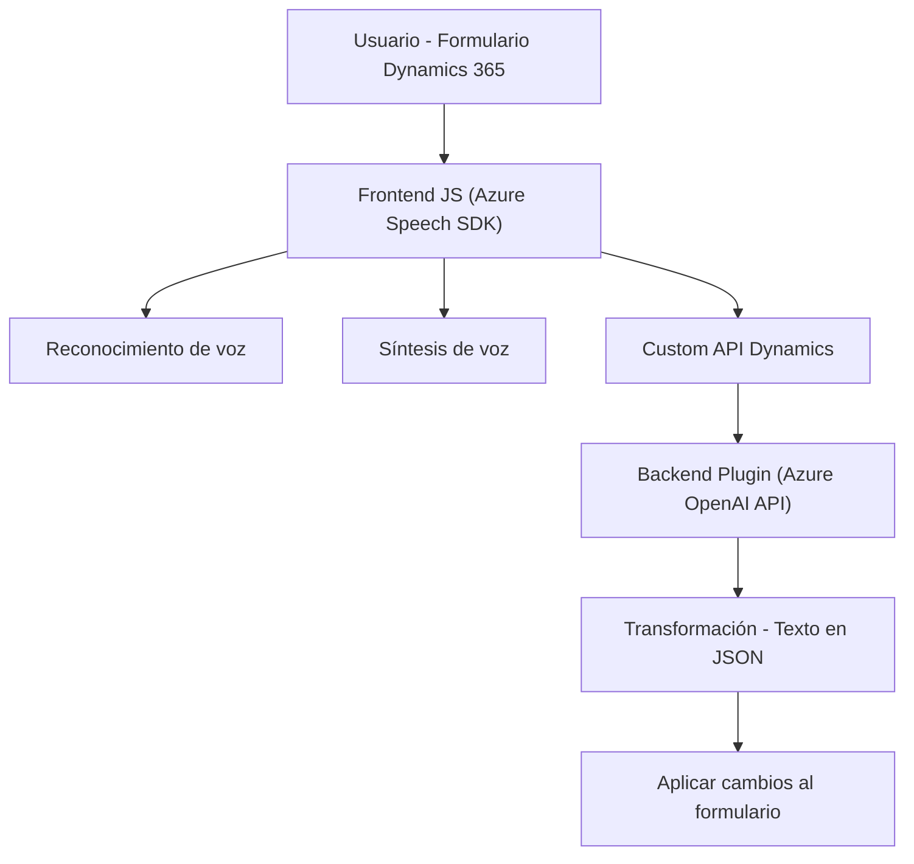

### **Breve Resumen Técnico**

El repositorio contiene archivos dedicados a la generación y procesamiento de voz y texto, utilizando Microsoft Azure Speech SDK y Azure OpenAI para aplicaciones dentro del sistema **Dynamics 365 CRM**. Está compuesto por un frontend (JavaScript) y un plugin de backend en C#. Su propósito principal es la interacción entre usuarios y formularios mediante voz y procesamiento de texto con capacidades de inteligencia artificial.

---

### **Descripción de Arquitectura**

La arquitectura está dividida en dos capas principales:

1. **Frontend (JavaScript)**: Maneja la entrada y salida de voz, así como la interacción dinámica con formularios de Dynamics 365. Utiliza el **Microsoft Azure Speech SDK** para la síntesis y reconocimiento de voz, y realiza llamadas a Custom APIs.
2. **Backend (C# Plugin)**: Es un servicio de procesamiento que transforma texto utilizando **Azure OpenAI API**. Se ejecuta como un plugin dentro de Dynamics 365 CRM, permitiendo transformar texto en JSON estructurado según normas específicas y luego aplicar los resultados.

La arquitectura general es de **n capas**:
- **Presentación**: Manejo de interacciones, entrada de voz y presentación de los datos procesados en formularios.
- **Lógica**: Consumo de Azure Speech SDK y generación de inputs dinámicos hacia los formularios.
- **Datos**: Consultas y actualizaciones en formularios de Dynamics 365 mediante `Xrm.WebApi`.
- **Backend/Servicios**: Transformación del texto usando Azure OpenAI API; ejecución mediante plugins para Dynamics CRM.

---

### **Tecnologías usadas**
1. **Frontend**:
   - Lenguaje: **JavaScript**.
   - Frameworks/SDK: **Microsoft Azure Speech SDK**.
   - Plataforma de ejecución: **Dynamics 365 JavaScript API**.
2. **Backend**:
   - Lenguaje: **C#**.
   - Frameworks/Platforma: **Microsoft Dynamics CRM SDK**.
   - Servicios: **Azure OpenAI API**, **Azure Speech SDK**.
3. **Patrones de desarrollo**:
   - Modularidad: Separación clara de funciones específicas para facilitar mantenimiento.
   - SDK-Driven Development: Arquitectura basada en ecosistemas SDK de Microsoft.
   - Evento-asíncrono: Operaciones no bloqueantes con `async` y `callback`.
   - Plugin Pattern: Backend implementa plugins extensibles en Dynamics CRM.

---

### **Diagrama Mermaid**
El siguiente diagrama representa la interacción entre los componentes de frontend, plugins y APIs:

---

### **Conclusión Final**

El repositorio presenta una solución habilitada para el reconocimiento de voz, síntesis y procesamiento mediante inteligencia artificial de Azure. La combinación de frontend y backend en una arquitectura **n capas** permite la integración fluida con entornos Dynamics 365 CRM.

La implementación muestra un diseño modular en la capa del frontend, óptima para el mantenimiento y la escalabilidad. La interacción con el SDK y servicios externos de Azure en ambas capas refleja una estrategia basada en la integración de múltiples APIs especializadas, mientras el backend extiende la funcionalidad a través de plugins para transformar datos estructurados.

*Algunas potenciales mejoras incluyen la externalización de configuraciones sensibles y un manejo más robusto de errores en las llamadas a servicios externos*.