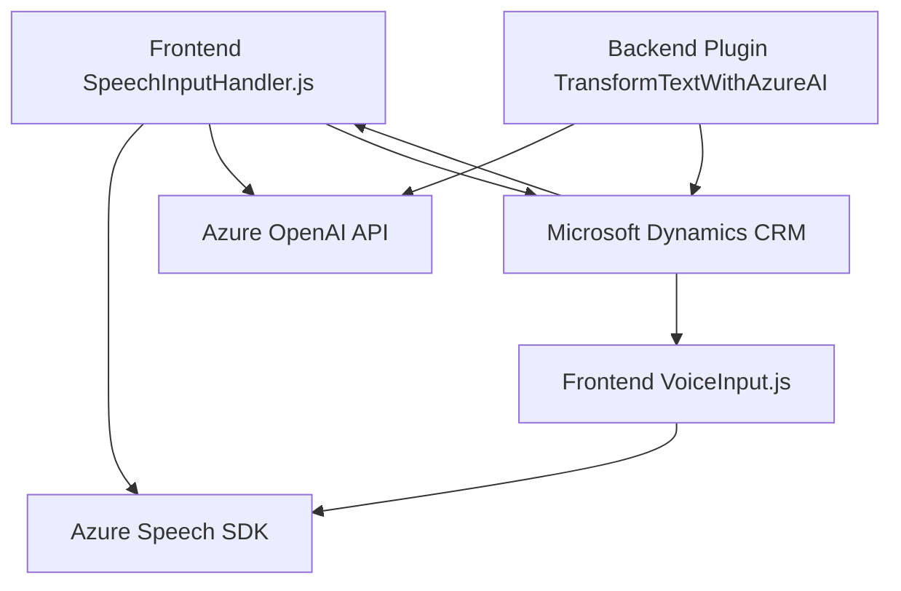

# Análisis técnico

## Resumen técnico
El repositorio implementa una solución basada en Microsoft Dynamics CRM que usa el **Azure Speech SDK** y **Azure OpenAI API**. La funcionalidad convierte texto a voz y procesa datos mediante captura de voz y arquitectura de plugins en CRM. Existen tres componentes clave:
1. **Frontend scripts (VoiceInput.js y SpeechInputHandler.js):** Interactúan directamente con formularios dinámicos y procesan datos.
2. **Backend plugin (TransformTextWithAzureAI.cs):** Procesa datos con IA de Azure OpenAI y los devuelve estructurados al CRM.
3. **Azure services:** Speech SDK para síntesis/captura de voz y OpenAI para procesamiento avanzado del texto.

---

## Descripción de arquitectura
### Tipo de solución: 
La solución combina **frontend (interfaz y lógica del cliente)** y **backend (plugin en Microsoft Dynamics CRM)** con integraciones de servicios externos (Azure Speech SDK y Azure OpenAI API). Esto apunta a una arquitectura híbrida.

### Arquitectura principal:
- **N capas**:
  1. **Capa de presentación:** Scripts JavaScript en el frontend para integrarse a los formularios dinámicos de Dynamics CRM.
  2. **Capa lógica de negocio (backend):** Procesos relacionados con AI y manipulación de datos en el backend (mediante plugins de Dynamics CRM y Azure services).
  3. **Capa de datos:** CRUD en entidades del CRM y manejo de datos procesados.

### Patrones utilizados:
1. **Adapter:** Traduce datos del formulario al formato necesario para interactuar con el Azure Speech SDK y OpenAI API.
2. **Facade:** Centraliza funciones y facilita integración con Azure Speech SDK y el resto de los sistemas.
3. **MVC:** Representado en los scripts del frontend que gestionan el flujo entre el modelo, el usuario (vista) y controlador para la captura/procesamiento de entrada y salida.
4. **API Service:** Backend y frontend usan APIs externas.

---

## Tecnologías usadas
### Frontend:
- **JavaScript**: Principal lenguaje utilizado.
- **Azure Speech SDK**: Síntesis y captura de voz.
- **Microsoft Dynamics SDK (`executionContext`, `formContext`)**: Manipulación de formularios CRM.

### Backend:
- **C#**: Lenguaje para el plugin.
- **Microsoft Dynamics CRM Plugin SDK**: Integra la lógica del plugin en eventos de CRM.
- **Azure OpenAI API**: Servicios REST para el procesamiento de texto con modelos GPT avanzados.
- **System.Net.Http**, **Newtonsoft.Json**, **Text.Json**: Utilizados para solicitud y procesamiento de respuestas en formato JSON.
  
### General:
- **Dynamics CRM**: Sistema donde se implementan los scripts del frontend y los plugins que modifican el comportamiento del sistema.  
- **Integraciones externas:** Uso extensivo de servicios en la nube (Azure Speech SDK y OpenAI).

---

## Diagrama Mermaid

---

## Conclusión final
La solución implementa una arquitectura **n capas** donde la capa de presentación está diseñada con JavaScript y se comunica con tecnologías Microsoft Dynamics y Azure (Speech SDK y OpenAI). La capa de lógica de negocio está manejada en parte por el backend (plugin en C#). Se ha aplicado una alta modularidad, donde las integraciones con servicios externos están bien encapsuladas. Esto permite escalabilidad en caso de que se requiera ampliar la funcionalidad con nuevos modelos de IA o servicios adicionales.

La solución está enfocada en enriquecer la interacción de usuarios con formularios mediante voz (síntesis y captura) y procesamiento avanzado de datos con IA. El diseño arquitectónico cumple su propósito, pero puede beneficiarse de una exploración adicional hacia un enfoque más desacoplado, como arquitectura basada en eventos o microservicios, especialmente si el sistema se escala a múltiples canales de entrada y salida.