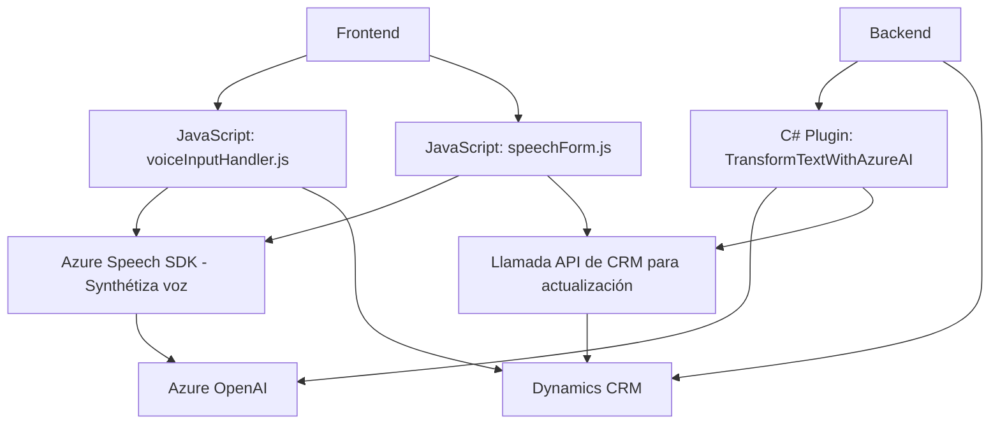

### Breve resumen técnico
El repositorio parece tener una integración entre Dynamics CRM y Azure AI/SDK para habilitar el análisis, transformación y entrada de voz en formularios de Dynamics. La solución incluye componentes frontend en JavaScript para la interacción directa del usuario con los formularios, y un plugin backend en C# para procesamiento avanzado de datos a través de Azure AI.

---

### Descripción de arquitectura
1. **Tipo de solución**: La solución es híbrida y apunta a integrar funcionalidades mediante una **API de terceros (Azure OpenAI y Azure Speech)** con **Dynamics CRM**. Combina un **frontend personalizado** basado en JavaScript y un **backend mediante plugins en C#**.
2. **Arquitectura**: La arquitectura cumple con criterios de **integración de servicios externos** y **desacoplamiento modular**, aunque en un sistema extensible común en CRM, que puede considerarse **n capas**.
    - **Capa de presentación (Frontend)**: JavaScript interactúa con el usuario, procesando voz y datos del formulario.
    - **Capa de lógica de negocio (Backend Plugin)**: Plugins en C# y APIs como Azure OpenAI procesan el texto para integrarlo dinámicamente en CRM.
    - **Servicios externos**: Azure SDK, OpenAI y API REST se integran para ofrecer funcionalidades avanzadas como reconocimiento de voz y transformación de texto.

---

### Tecnologías usadas
1. **Frontend**:
   - **JavaScript**: Para interacción en navegadores y manipulación dinámica del contexto del formulario.
   - **Azure Speech SDK**: Reconocimiento de voz y síntesis mediante integración dinámica en navegador.
   - **Dynamics Web API**: Comunicación con el backend CRM mediante solicitudes REST.
2. **Backend**:
   - **C# en Plugins**: Extensibilidad de Dynamics CRM mediante código ejecutado en eventos del sistema.
   - **Azure OpenAI**: Transformación de texto mediante un modelo GPT, configurado desde el plugin.
   - **HTTP Client en .NET**: Para solicitudes REST hacia Azure OpenAI.
3. **Integración**:
   - **Microsoft Dynamics CRM Framework**: Extensibilidad mediante `Xrm` API y la funcionalidad de `IPluginExecutionContext`.

---

### Dependencias y componentes externos
1. **Azure Speech SDK**: Para reconocimiento y síntesis de voz.
2. **Azure OpenAI**: Para transformación de texto basado en reglas definidas por el operador.
3. **Dynamics CRM Web API**:
   - Gestión, actualización y consulta de datos en formularios.
   - Llamadas a sistemas internos y entidades personalizadas.
4. **Sistema de Plugins de Dynamics CRM**:
   - Dependencia de `Microsoft.Xrm.Sdk` para lógica backend desde eventos del CRM.
5. **Entorno del navegador**:
   - Dinámico, dependiente de DOM para cargar SDK y ejecutar scripts.
6. **Servicios de integración REST**:
   - En el plugin, la integración con Azure OpenAI depende de HTTP mediante `System.Net.Http`.

---

### Diagrama Mermaid

---

### Conclusión final
La solución presentada es un sistema integrado de procesamiento de datos de formularios CRM con capacidades avanzadas como reconocimiento de voz y transformación mediante reglas específicas. Utiliza componentes desacoplados con una estructura modular para gestionar la entrada de datos del usuario, enlazando el frontend y backend con servicios de Azure. Aunque utiliza arquitectura de **n capas**, se observa un patrón de integración con servicios externos, lo que facilita que los datos sean gestionados en tiempo real dentro del entorno propio de Dynamics CRM.