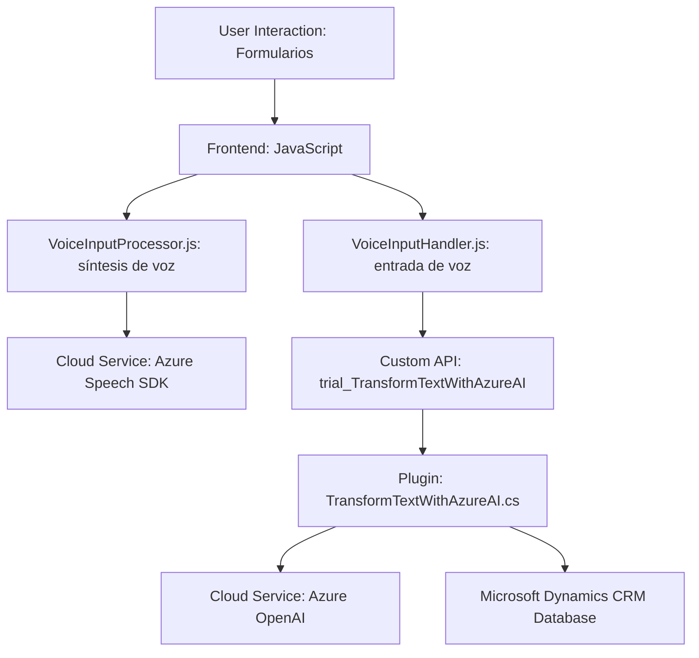

### Breve resumen técnico

Este repositorio contiene componentes relacionados con la interacción entre usuarios y formularios dinámicos en sistemas como Microsoft Dynamics CRM. La solución aprovecha servicios de Azure, como el Speech SDK para síntesis y reconocimiento de voz, y Azure OpenAI para realizar transformaciones avanzadas de texto con inteligencia artificial. La arquitectura está diseñada para conectar un frontend funcional y dinámico con servicios backend especializados en procesamiento de datos y generación de respuestas estructuradas.

---

### Descripción de arquitectura

La solución implementa una arquitectura *n-capas* con integración fluida entre las siguientes componentes:

**1. Frontend Layer:**
- Archivos JavaScript (`VoiceInputProcessor.js` y `VoiceInputHandler.js`) encargados de interactuar directamente con el usuario. 
- Integran funcionalidades como:
  - Conversión de datos de formularios a voz mediante el Azure Speech SDK.
  - Entrada de comandos de voz para manipular dinámicamente los formularios.

**2. Business Logic Layer (Middle Layer):**
- Representado por un plugin (`TransformTextWithAzureAI.cs`) que utiliza Azure OpenAI para transformar comandos y datos de entrada en respuestas estructuradas que el sistema comprende y aplica a los formularios.

**3. Backend Integration & APIs:**
- Incluyen el `Custom API` que sirve como intermediario entre el frontend, CRM backend y el Azure OpenAI service.
- Se basa en API calls y permite que el procesamiento con IA ocurra sin exponer complejidad al usuario.

El diseño sigue una estructura modular y utiliza una arquitectura orientada a *Servicios*:

- Cada componente (Speech SDK, OpenAI plugin) es desacoplado y realiza tareas específicas.
- Controladores en el frontend (JavaScript) administran entrada/salida de datos y se comunican con APIs y servicios externos.

---

### Tecnologías usadas

#### Principalmente:
- **Azure Speech SDK:** Usado en la capa frontend para síntesis y reconocimiento de voz.
- **Azure OpenAI Service:** Usado por el plugin backend para procesamiento de texto con inteligencia artificial.
- **Microsoft Dynamics CRM SDK:** Permite manipulación y actualización de datos del modelo CRM desde el plugin (`TransformTextWithAzureAI.cs`) y las Custom APIs.

#### Otras:
- **JavaScript:** Implementado con un estilo modular para manejo de eventos y procesamiento en el frontend.
- **C#:** Lenguaje principal del plugin para integración backend con CRM y Azure OpenAI.
- **REST APIs:** Usadas para comunicarse con Azure Speech y OpenAI.

#### Arquitectura:
- **Patrón n-capas:** Separación clara entre presentación (frontend), lógica de negocio (plugins y middleware APIs) y datos (Microsoft CRM).
- **Service-oriented Pattern:** Uso de servicios externos (Azure) para funcionalidades avanzadas.
- **Microservicios:** Provisión de una API personalizada en el backend (Custom API) para tareas específicas como extensiones con IA.

---

### Diagrama Mermaid válido para GitHub

---

### Conclusión final

La solución está diseñada para sistemas que requieren interacción avanzada con usuarios a través de voz, inteligencia artificial y formularios dinámicos. Presenta una arquitectura desacoplada basada en servicios, donde cada componente realizan tareas específicas. La integración con Azure Speech SDK y OpenAI potencia la funcionalidad, mientras que el plugin en C# opera eficientemente con Microsoft Dynamics CRM. 

La gran dependencia de servicios externos demanda una correcta configuración de credenciales y regiones de Azure en entornos productivos. Sin embargo, el diseño es escalable, modular, y fácil de extender para agregar nuevas funcionalidades.