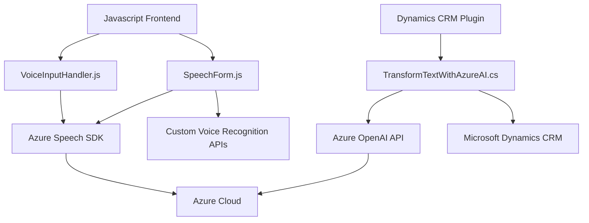

### Breve Resumen Técnico:
El repositorio contiene tres módulos que destacan por integrar servicios de Azure en un entorno orientado a formularios y CRM Dynamics. La arquitectura está diseñada para trabajar con una combinación de frontend en JavaScript, plugins en .NET para Dynamics CRM, y Azure Speech/OpenAI como dependencias externas clave.

---

### Descripción de Arquitectura:
La solución tiene una arquitectura **orientada a integración de servicios cloud**. Es un sistema de múltiples capas, con las siguientes características clave:
- **Frontend:** Implementado en JavaScript, interactúa directamente con Azure Speech SDK para sintetizar o transcribir datos de voz y procesar formularios web.
- **Plugin CRM (Backend):** Utiliza .NET basado en el modelo de extensiones de Microsoft Dynamics CRM para transformación de texto con Azure OpenAI.
- **Servicios Externos:** Alta dependencia de servicios de Azure, incluyendo Speech SDK para manejo de voz y OpenAI API para procesamiento avanzado de texto.

### Tecnologías Usadas:
1. **Frontend (JavaScript):**
   - Azure Speech SDK (sintetización y reconocimiento de voz).
   - APIs nativas del navegador para manipulación del DOM y carga dinámica.
   
2. **Plugin (Backend en .NET):**
   - Microsoft Dynamics SDK para interacción con datos de CRM.
   - Azure OpenAI para computación cloud.
   - Newtonsoft.Json para manipulación de JSON.
   - HttpClient para llamadas a APIs externas.

3. **Servicios Externos:**
   - Speech SDK: Sintetización y reconocimiento.
   - OpenAI API: Procesamiento de texto estructurado y avanzado.

### Diagrama Mermaid válido para GitHub:

---

### Conclusión Final:
La solución muestra un enfoque distribuido, que combina frontend con manejo de formularios y voz junto a un backend independiente para procesamiento textual avanzado. La integración con servicios de Azure fortalece la capacidad de escala y mantenimiento, pero introduce acoplamiento alto con infraestructura específica (Azure). Se recomienda mejorar la abstracción sobre dependencias externas para facilitar infraestructuras híbridas o migración futura.