# Breve resumen técnico  
El repositorio incluye soluciones para integrar Dynamics 365 con servicios avanzados de Azure, específicamente Azure Speech SDK y Azure OpenAI, con dos subconjuntos principales: manejo de entrada y síntesis de voz en la interfaz frontend y un plugin para procesamiento textual integrado en el backend de Dynamics CRM.

---

# Descripción de la arquitectura  
La arquitectura utiliza un enfoque híbrido de n capas, combinando un diseño modular para el frontend (JavaScript) y plugins ejecutados en el backend del sistema Dynamics CRM. La solución integra tecnologías externas como el SDK de Azure Speech y la Azure OpenAI REST API para procesamiento avanzado. Se observan patrones de separación de responsabilidades y delegación de procesamiento pesado a servicios externos.

### Frontend
- Modularidad en funciones específicas: extracción de datos del formulario y síntesis/transcripción de voz.
- Integración asincrónica para cargar dinámicamente SDK externos y realizar transcripciones/síntesis.
- Uso adecuado de la dependencia al contexto del formulario (`executionContext`) de Dynamics 365.

### Backend
- El plugin en C# sigue los patrones estándar de Dynamics CRM para implementar extensiones funcionales.
- Invocaciones a Azure OpenAI para procesar texto con reglas normalizadas, enviando solicitudes HTTP y tratando respuestas estructuradas como JSON.

---

# Tecnologías usadas  
1. **Frontend (JavaScript)**
   - **Dynamics 365**: Contexto y API para formularios.
   - **Azure Speech SDK**: Para síntesis y reconocimiento de voz, cargado dinámicamente desde un CDN.
   - **JavaScript Promises y callbacks**: Para manejar dinámicamente eventos de carga y operaciones asincrónicas.
   - ES6+: Uso moderno de funciones y objetos funcionales.

2. **Backend (C# Plugin)**
   - **Microsoft Dynamics SDK**: Manejo de plugins y contexto de Dynamics CRM.
   - **Azure OpenAI REST API**: Integración avanzada para procesamiento de texto con machine learning y GPT-4.
   - **HttpClient**: Interacción con APIs REST externas.
   - **System.Text.Json y Newtonsoft.Json**: Manejo y parseo de datos JSON.

3. **External Libraries**
   - Speech SDK via CDN: Declarado externamente, lo que garantiza la carga según demanda.

---

# Diagrama Mermaid válido para GitHub Markdown  

```mermaid
graph TD
A["Frontend/JS/readForm.js - Procesa-formulario-síntesis-de-voz"] --> B["Funciones principales"]
B --> C["startVoiceInput - Inicia-proceso-de-voz"]
B --> D["leerFormulario - Lee-datos-del-formulario"]
B --> E["getVisibleFieldData - Extrae-campos-visibles"]
B --> F["speakText - Convierte-texto-a-voz-vía-Azure"]

A --> G["Dependencias"]
G --> H["Azure Speech SDK - CDN"]
G --> I["Dynamics-365-formContext"]

A --> J["Patrones"]
J --> K["Integración-con-SDK"]
J --> L["Evento-asíncrono"]
J --> M["Estrategia-extracción-datos"]

N["Frontend/JS/speechForm.js - Reconocimiento-de-voz-agregado-al-formulario"] --> O["Clases-y-funciones-principales"]
O --> P["startVoiceInput - Activación-con-Azure-SDK"]
O --> Q["callCustomApi - API-dedicada-para-texto-en-D365"]
O --> R["processTranscript - Procesa-transcripción-texto-a-campos-formulario"]
O --> S["processTranscriptIA - Procesa-transcripción-con-inteligencia-artificial"]

N --> G

Z["Plugin: TransformTextWithAzureAI.cs - Plugin-para-crm-backend"]
Z --> AA["Clase-principal: TransformTextWithAzureAI - Implementa-IPlugin"]
AA --> AB["Método-Execute - Procesa-el-texto-en-CRM"]
AB --> AC["GetOpenAIResponse - Envía-a-Azure-GPT4"]

Z --> AD["Dependencias"]
AD --> AE["Microsoft SDK Dynamics"] 
AD --> AF["Azure OpenAI REST API"]
AD --> AG["Newtonsoft.Json-y-System.Text.Json"]

AA --> AH["Patrones-de-arquitectura"]
AH --> AI["Delegate-servicio-OpenAI-vía-REST"]
AH --> AJ["Plugin-Dynamics-CRM"]
```

---

# Conclusión final  
La solución implementada representa una arquitectura híbrida con capacidades adicionales para integrar Dynamics 365 con servicios avanzados de Microsoft Azure. Por una parte, se observa un sistema frontend que trabaja como una extensión de los formularios del CRM, agregando capacidades de voz mediante el Azure Speech SDK. Por otra parte, en el backend, se define un plugin que delega el proceso de texto al servicio Azure OpenAI REST API. 

Los archivos están organizados de manera modular y siguen patrones típicos de diseño para maximizar la extensibilidad y minimizar el acoplamiento. Esto hace que el sistema sea adecuado para escenarios de productividad avanzada dentro de plataformas de CRM con capacidad de ampliación a IA.