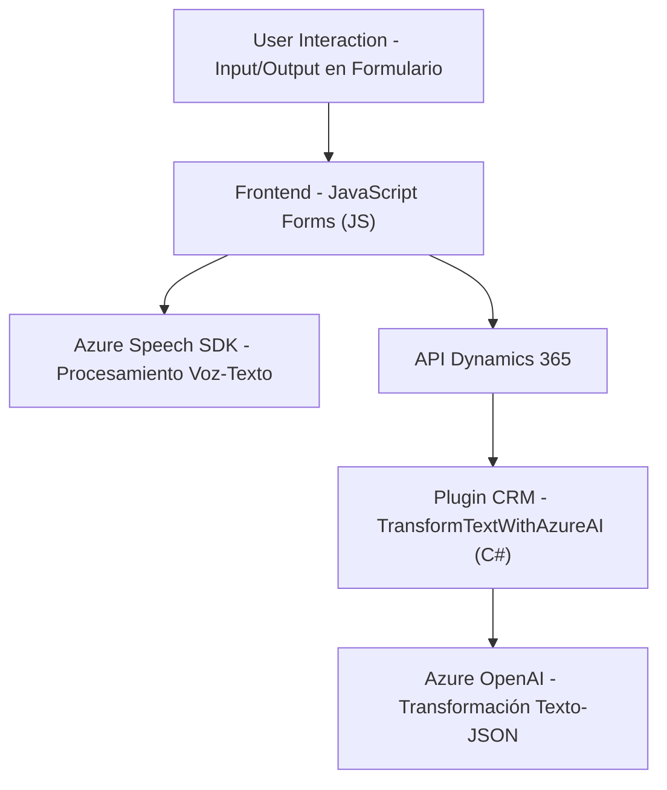

## Breve resumen técnico:

La solución representa un sistema integrado que combina formularios frontales interactivos con funcionalidades de procesamiento de voz y texto utilizando servicios inteligentes de Microsoft Azure (Speech SDK y OpenAI). Está diseñado para integrarse directamente con Microsoft Dynamics 365 para capturar, transformar y aplicar datos en formularios CRM.

---

## Descripción de arquitectura:

### Componentes identifiables:
1. **Frontend**:
   - Código basado en JavaScript (`main.js`, `VoiceInput.js`) que se encarga de:
     - Interactuar con usuarios mediante voz (transcripción con el SDK Azure Speech).
     - Procesar datos del cliente (formulario).
     - Relacionar etiquetas visibles y valores en Dynamics 365 CRM.

2. **Backend Plugin**:
   - Plugin para Dynamics CRM (`TransformTextWithAzureAI.cs`) que aplica reglas de transformación al texto proporcionado por el usuario utilizando modelos de Azure OpenAI.
   - Integra la arquitectura de plugins de Dynamics mediante la interfaz `IPlugin`.

### Modelo: 
- **En el frontend**: Se utiliza una arquitectónica de capas (p.ej., funcionalidad segregada en módulos).
- **En conjunto**:
  - **Cliente-servidor**: Frontend interactúa directamente con servicios API tanto en Dynamics 365 como en Azure Speech/OpenAI.
  - **N capas**: Frontend representa la capa de presentación (formulario y entrada de voz) y Dynamics 365 actúa como una capa de negocio donde se ejecutan los plugins, que eventualmente invocan la capa de datos para obtener información.

---

## Tecnologías usadas:

1. **Frontend**:
   - Lenguaje: JavaScript.
   - Integración: Microsoft Dynamics 365 Web API (`Xrm.WebApi`).
   - SDK y servicios:
     - **Azure Speech SDK**: Para transcribir y generar audio basado en texto.
   - Modelo de arquitectura: Estructura modular con funciones para procesar formularios, controlar SDKs dinámicamente y aplicar lógica en interfaces visibles.

2. **Backend**:
   - Lenguaje: C# (.NET).
   - Microsoft Dynamics CRM Plugin Framework:
     - Implementación de lógica empresarial basada en eventos (realización de transformaciones en JSON).
   - SDK y servicios:
     - **Azure OpenAI API**: Para realizar transformaciones sobre textos.
   - Integración:
     - `Newtonsoft.Json.Linq` para manejar estructuras JSON.
     - `System.Net.Http` para llamadas API externas.

### Patrones utilizados:
- Modularización, separación de interés.
- Patrones de callback en el frontend y petición HTTP.
- Arquitectura de plugins en el backend.
- Uso de servicios en la nube.

---

## Diagrama Mermaid válido para GitHub:

---

## Conclusión final:

### Datos Clave:
La solución está diseñada para automatizar la captura, procesamiento y complementación de datos en formularios CRM utilizando tecnologías de inteligencia artificial y procesamiento de voz. La arquitectura se divide formalmente en frontend, servicios cloud (Azure SDK y OpenAI), y extensiones backend específicas (Dynamics CRM plugin). 

### Beneficios:
- **Escalabilidad**: El uso de Dynamics CRM unido a Azure garantiza robustez en aplicaciones empresariales.
- **Modular**: Facilitando el mantenimiento y evolución futura.
- **Integración**: Proporciona capacidad de combinar múltiples tecnologías de Microsoft y terceros.

### Áreas de mejora:
- **Seguridad**: Utilización de Azure Key Vault y el manejo seguro de credenciales en lugar de configuración estática.
- **Gestión de errores**: Robustecer el manejo de posibles fallos y latencia en servicios externos (SDK y API).