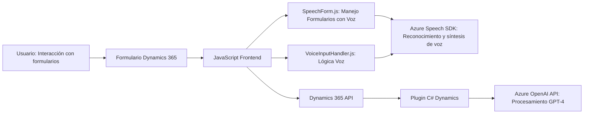

### Breve resumen técnico
Este repositorio ofrece una solución centrada en la integración entre Microsoft Dynamics 365 y servicios externos de Azure. Está diseñada para manejar formularios interactivos y procesarlos mediante inteligencia artificial. La solución se encuentra dividida en componentes frontend (JavaScript) y un plugin backend (C#) para habilitar la funcionalidad tanto en el cliente como en el servidor.

---

### Descripción de arquitectura
La arquitectura es híbrida. Combina una **n-capas** clásica (Dynamics CRM como plataforma principal gestionando plugins en el backend) con la integración de **microservicios** externos de Azure para tareas específicas. Esto incluye el uso del Azure Speech SDK para la interacción con voz y la API de OpenAI para procesamiento avanzado. Los componentes frontend están estructurados modularmente para facilitar la interacción con formularios y servicios externos mediante JavaScript, mientras que el backend utiliza extensiones basadas en plugins acorde a los estándares de Dynamics CRM.

---

### Tecnologías usadas
1. **Frontend:**
   - **JavaScript ES6+:** Para manejar lógica en Dynamics Forms.
   - **Azure Speech SDK:** Para capacidades de síntesis y reconocimiento de voz.
   - **Dynamics 365 API:** Para realizar configuraciones de formularios.

2. **Backend:**
   - **C# (.NET Framework):** En plugins.
   - **Microsoft Dynamics SDK:** Para extender la funcionalidad de Dynamics CRM.
   - **Azure OpenAI API:** Para procesamiento de texto basado en GPT-4.
   - **Newtonsoft.Json:** Para manipulación eficiente de JSON.
   - **System.Net.Http:** Para realizar solicitudes REST contra la API de Azure.

---

### Patrones de diseño
1. **Event-driven Programming:** Callbacks para la carga dinámica de SDK y eventos como la grabación de voz.
2. **Plugin Pattern:** Implementación de extensibilidad en Dynamics CRM mediante el diseño basado en la interfaz `IPlugin`.
3. **Facade:** El backend incluye métodos que encapsulan el manejo de solicitudes HTTP hacia Azure OpenAI, simplificando la lógica externa.
4. **Modularidad:** Código separado en funciones específicas tanto para el frontend como el backend, siguiendo el principio de única responsabilidad.
5. **Microservicio externo:** Las capacidades avanzadas (síntesis y procesamiento de texto) son delegadas a servicios de Azure, aislados de la lógica central de negocio del CRM.

---

### Diagrama **Mermaid**

---

### Conclusión final
La solución proporciona una integración robusta entre Microsoft Dynamics 365 y servicios de Azure para formularios interactivos y reconocimiento de voz. Su arquitectura híbrida combina n-capas (Dynamics CRM) con microservicios externos (Azure APIs) para potenciar el procesamiento de datos y mejorar la experiencia del usuario. Los patrones de diseño empleados logran modularidad y extensibilidad, adaptándose tanto a entornos clientes mediante frontend como backend empresarial mediante plugins.