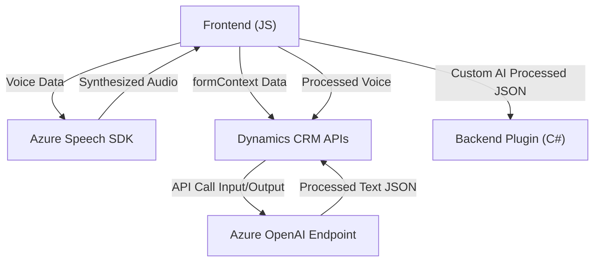

# Resumen técnico
El repositorio es una solución orientada principalmente a la interacción del cliente con formularios mediante reconocimiento de voz y síntesis de texto, complementada con un procesamiento avanzado usando servicios en la nube (Azure Speech y Azure OpenAI). Incluye implementación directamente en el navegador y extensibilidad para entornos CRM (Dynamics 365).

# Descripción de arquitectura
La arquitectura general es **modular** y se asemeja a un diseño en capas (nTiers):
- **Capa de presentación**: Archivos frontend en JavaScript (como `readForm.js` y `speechForm.js`) manejan la interacción entre el usuario y los formularios en el navegador.
- **Capa de lógica de negocio**: Plugins en C# (`TransformTextWithAzureAI.cs`) para Dynamics 365 realizan tareas avanzadas como transformaciones con IA y manipulación del contexto CRM.
- **Servicios externos**: Azure Speech SDK y Azure OpenAI se utilizan para síntesis de voz, reconocimiento de voz y procesamiento de texto inteligente.

Esta arquitectura puede clasificarse como un **cliente ligero con lógica distribuida basada en servicios en la nube**.

# Tecnologías usadas
1. **Front-end**:
   - **JavaScript estándar**: Para manipulación del DOM e integración del SDK de Azure Speech.
   - **Azure Speech SDK**: Reconocimiento de voz y síntesis de texto en voz.
   - **Dynamics CRM APIs**: Interacción y manipulación de formularios mediante `formContext` y Xrm APIs.

2. **Back-end/CRM**:
   - **C# (`TransformTextWithAzureAI.cs`)**:
     - Implementación de plugins mediante `IPlugin`.
     - Integración con Azure OpenAI para procesamiento de texto.

3. **Patrones arquitectónicos**:
   - **Lazy-loading**: Carga dinámica del SDK en el cliente solo si es necesario.
   - **Integración de API externas**: Llamadas a servicios como Azure Speech y OpenAI.
   - **Plug-in Pattern**: Extensibilidad para entornos CRM (Dynamics) mediante plugins.

# Diagrama Mermaid

# Conclusión final
La solución está diseñada para entornos CRM como Dynamics 365, facilitando la interacción entre usuarios y formularios con capacidades de voz e inteligencia artificial. Su arquitectura combina frontend ligero con acceso directo a servicios externos en la nube. Esto permite flexibilidad y escalabilidad, mientras aprovecha Azure Speech para tareas en tiempo real y Azure OpenAI para procesamiento avanzado.