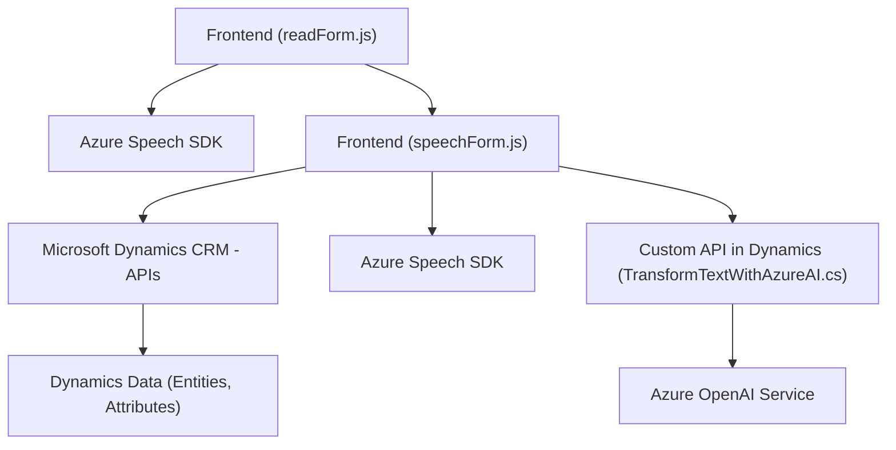

### Breve resumen técnico

El repositorio contiene tres archivos relevantes que implementan una solución de inteligencia artificial integrada con Microsoft Dynamics CRM. Combina un frontend basado en JavaScript con la conexión hacia un servicio externo (Azure OpenAI y Azure Speech SDK). La solución permite a los usuarios realizar interacciones con Microsoft Dynamics mediante comandos de voz, utilizando los servicios de IA para transformar texto y aplicarlo a atributos propios del formulario.

---

### Descripción de arquitectura

La arquitectura general es una variante de **arquitectura orientada a servicios (SOA)** con distribuciones en varios niveles. En términos generales:
1. **Frontend (FRONTEND/JS/readForm.js y FRONTEND/JS/speechForm.js)**:
   - Actúa como una interfaz interactiva de usuario con lógica de negocio desencadenada por eventos de captura de voz. Utiliza la instancia del contexto de formulario de Dynamics CRM y servicios externos (Azure Speech SDK).
   - Implementa modularización, carga dinámica de SDK, y encapsulación de lógica especializada.

2. **Backend (Plugins/TransformTextWithAzureAI.cs)**:
   - Implementa un modelo **plugin** asociado a Dynamics CRM para transformar el texto usando un API REST externo (Azure OpenAI) y devolver datos en formato JSON para su procesamiento y visualización en el frontend.
   - Usa el patrón común de integración SOA con llamadas HTTP externas adoptando el API Gateway.

Visualizando el sistema, se siguen buenas prácticas de desacoplamiento funcional, carga dinámica de módulos del SDK, y procesamiento híbrido (reglas + IA). Sin embargo, el diseño es intermedio entre una arquitectura **n capas** y **orientada a servicios** (por la mínima interacción entre los componentes internos y externos).

---

### Tecnologías usadas

1. **Frontend:**
   - **JavaScript**: Lenguaje principal para crear lógica de interacción entre usuario y entidades CRM.
   - **Azure Speech SDK**: Servicio de síntesis y reconocimiento de voz.
   - **Microsoft Dynamics CRM APIs**: APIs específicas de Dynamics usadas para gestionar entidades como formularios, atributos y valores.

2. **Backend:**
   - **Microsoft Dynamics SDK (C#)**: Framework para la implementación de plugins en Dynamics CRM.
   - **Azure OpenAI API**: Mensajes de transformación generados por IA basándose en reglas y modelos preentrenados.
   - **Newtonsoft.Json** y **System.Text.Json**: Librerías para manejar datos JSON.

3. **Arquitectura SOA**:
   - Se aplica un enfoque modular con comunicación entre servicios externos (Azure SDKs y OpenAI).

---

### Diagrama Mermaid válido para GitHub:

- **A**: Archivo para lectura y síntesis de voz de los valores visibles en un formulario de Dynamics CRM.
- **B**: Archivo para recibir comandos de voz y aplicar valores al formulario utilizando el mapeo interno.
- **C/E**: Integración con Azure Speech SDK.
- **D**: Interacción del frontend con las APIs de Dynamics CRM para gestionar los datos de las entidades.
- **F**: Llamadas del frontend a una API personalizada (plugin) en Dynamics CRM para procesamiento de texto mediante IA.
- **G**: Azure OpenAI para transformar texto y devolver representaciones JSON.
- **H**: Base de datos de Dynamics CRM con entidades, atributos y valores procesados.

---

### Conclusión final

La solución aprovecha una combinación de servicios cloud inteligentes (Azure Speech SDK y Azure OpenAI) y un ecosistema empresarial robusto como Microsoft Dynamics CRM para habilitar una interfaz avanzada de interacción basada en voz. La implementación respalda una arquitectura orientada a servicios que segmenta el sistema en componentes desacoplados.
1. **Modular y extensible**: El uso de funciones bien delimitadas en el frontend y un plugin especializado en el backend facilita la mantenibilidad y extensión de la solución.
2. **Integración: Excelente manejo del SDK y APIs externas mediante comunicación asíncrona y carga dinámica**
3. **Aspectos mejorables**:
   - Validar y gestionar más detalladamente errores en las APIs externas.
   - Usar almacenamiento seguro para claves de API y configuraciones sensibles.
   - Opcionalmente, considerar un enfoque de arquitectura Hexagonal para maximizar desacoplamiento y flexibilidad en el desarrollo futuro.