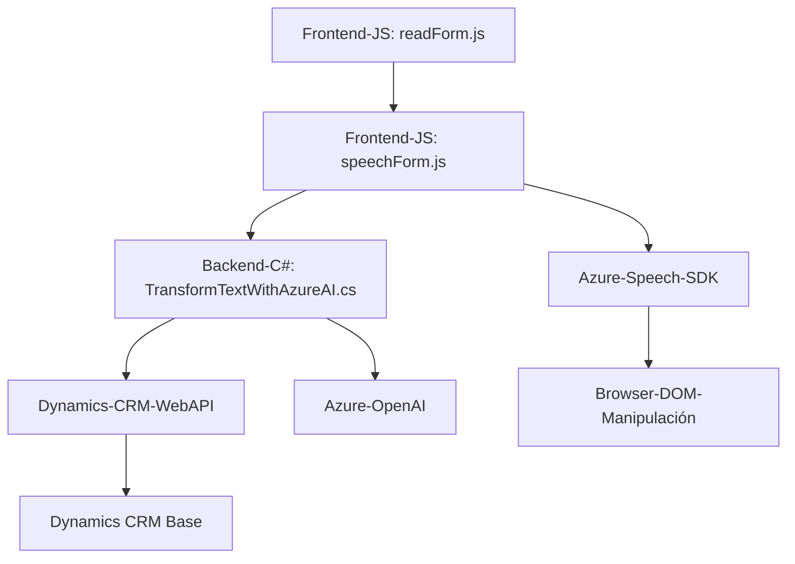

### Breve Resumen Técnico
El repositorio contiene una solución que implementa interacción entre un frontend (JavaScript/HTML) y una backend (Dynamics CRM plugin), con funcionalidades centradas en la síntesis y reconocimiento de voz mediante **Azure Cognitive Services Speech SDK** y procesamiento de texto asistido por **Azure OpenAI**. El objetivo principal es permitir la manipulación y transformación de formularios mediante voz y texto estructurado.

---

### Descripción de arquitectura
La arquitectura de la aplicación se basa en la **arquitectura n capas**:
1. **Capa de presentación (frontend):** Se implementa en **JavaScript**, interactúa con Dynamics CRM y utiliza el **Azure Speech SDK**.
2. **Capa de negocio:** El backend está desarrollado como un **plugin de Dynamics CRM**, implementado en **.NET C#**. Este plugin emplea el **Azure OpenAI** para transformar texto en objetos JSON.
3. **Capa de datos:** Utiliza **Dynamics CRM Web API** para operaciones CRUD sobre los datos del sistema CRM y actualizaciones en los formularios.

Se detecta un fuerte uso de integraciones con servicios externos, lo que sugiere una tendencia hacia una **arquitectura orientada a servicios (SOA)**.

---

### Tecnologías, Frameworks y Patrones
1. **Frontend:**
   - Lenguaje: JavaScript.
   - Frameworks/SDK: **Azure Speech SDK**.
   - Patrones:
     - *Procedural Design*: Uso de funciones específicas para modularizar tareas.
     - *Dependency Injection*: Dinámica (carga de Azure Speech SDK mediante scripts en tiempo de ejecución).
     - *Callback Pattern*: Utilización de funciones de tipo callback como en `ensureSpeechSDKLoaded`.

2. **Backend Plugin (`TransformTextWithAzureAI.cs`):**
   - Lenguaje: C#.
   - Framework: **.NET Framework** (probablemente .NET SDK compatible con Dynamics).
   - Librerías: **Newtonsoft.Json**, **System.Net.Http**, **System.Linq**, **System.Text.Json**.
   - Servicio: **Azure OpenAI (GPT)** para tareas NLP.
   - Patrones:
     - *Plugin Pattern*: Diseño específico para Dynamics CRM utilizando la interfaz `IPlugin`.
     - *Service-Oriented Architecture (SOA)*: Integración extensiva con APIs externas para procesamiento de texto y reconocimiento de voz.
     - *Error Handling*: Mecanismos básicos para manejar excepciones y fallos de red.

---

### Dependencias y Componentes Externos
1. **Azure Cognitive Services Speech SDK:** Para síntesis y reconocimiento de voz en tiempo real.
    - Endpoint: `https://aka.ms/csspeech/jsbrowserpackageraw`.

2. **Azure OpenAI API:** Para procesamiento avanzado de texto y transformación en estructuras JSON.
    - Endpoint: `https://openai-netcore.openai.azure.com/openai/deployments/gpt-4o/chat/completions`.

3. **Dynamics Web API:** Comunicación con el CRM para operaciones en los formularios dinámicos.

4. **Microsoft Dynamics SDK:** Interfaz para la personalización y extensión del comportamiento estándar del CRM.

5. **Browsable JavaScript Runtime:** Manejo del DOM y carga dinámica de scripts desde el navegador.

6. **Service Provider/Dependency Injection** (Backend): Utilización de Dynamics CRM's `IServiceProvider` para acceder al contexto del sistema.

---

### Diagrama Mermaid

---

### Conclusión Final
La solución corresponde a una implementación de servicios de voz integrados con formularios de un sistema CRM, utilizando una arquitectura **n capas**. La capa de presentación (frontend) utiliza **Azure Speech SDK** para la síntesis y reconocimiento de voz, mientras que la capa de negocio incluye un plugin que extiende Dynamics CRM con una función para realizar transformaciones avanzadas de texto mediante el **Azure OpenAI API**. El uso de patrones como **SOA**, **plugin design**, y **callback pattern** refuerzan la flexibilidad y arriba terminología moderna del sistema.

Los futuros desarrollos deben considerar el manejo avanzado de posibles errores en las interacciones con Azure OpenAI y Dynamics Web API, así como expandir las funcionalidades de procesamiento y mapeo para formularios dinámicos.