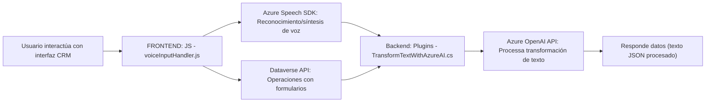

# Análisis Técnico

### **Resumen Técnico**
El repositorio parece estar diseñado para manejar interacciones entre frontend (JavaScript), plugins backend (C#), un CRM basado en Dataverse, y servicios externos como Azure Speech SDK y Azure OpenAI API. La funcionalidad incluye reconocimiento de voz y síntesis, procesamiento de datos de formularios dinámicos dentro de un CRM, y transformación de texto mediante una API de inteligencia artificial.

---

### **1. Tipo de solución**
La solución es híbrida, consistiendo en:
- **Frontend JavaScript Components:** Dedicados a la interacción con formularios en una interfaz de usuario CRM.
- **Backend Plugins (Microsoft Dynamics):** Es un mecanismo que amplía las capacidades del CRM utilizando lógica personalizada.
- **Servicios Externos:** Utilización de Azure APIs para reconocimiento de voz, síntesis de texto y procesamiento en IA.

---

### **2. Tecnologías, Frameworks y Patrones Usados**

#### **Frontend (JavaScript)**
- **Tecnologías:** 
  - JavaScript (Vanilla JS).
  - Azure Speech SDK: Para reconocimiento y síntesis de voz.
  - Integración con Microsoft Dataverse (a través de CRM context APIs).
- **Patrones:**
  - On-demand loading: Carga dinámica del SDK de Azure Speech.
  - Modularización de funciones: Cada funcionalidad se implementa como una función independiente y reutilizable.
  - Event-Driven Structure: Uso de `callbacks` para garantizar sincronización al manejar SDK externo.

#### **Backend (C# Plugin)**
- **Tecnologías:** 
  - C#: Lenguaje base para el plugin.
  - .NET Framework (a través de Microsoft Dynamics SDK).
  - Azure OpenAI API: Para manejar transformaciones avanzadas en texto.
  - JSON Manipulation Libraries: `Newtonsoft.Json` y `System.Text.Json` para manejar las respuestas de la API.
- **Patrones:**
  - **Plug-in Pattern:** Implementación de `IPlugin` para personalización del CRM.
  - **Abstracción de servicios externos:** Construcción de métodos específicos (e.g., `GetOpenAIResponse`) para desacoplar el uso de la API de lógica interna.
  - **DTO (Data Transfer Object):** Uso estructurado de datos JSON para intercambios entre servicios.

---

### **3. Tipo de arquitectura**
La arquitectura se puede describir como una **arquitectura basada en servicios**, donde cada componente:
- Cumple un rol específico.
- Se comunica con servicios externos (Azure Speech y Azure OpenAI).
- Utiliza plugins modulares para extender la funcionalidad de Dataverse.

Aunque no es completamente **hexagonal**, tiene principios alineados con arquitecturas modernas:
- Integración de **frontend interactivo** para la experiencia del usuario.
- **Backend modular** a través de plugins (independiente aunque dependiente del ciclo de vida del CRM).
- Expansión funcional vía servicios externos (microservicios como Azure Speech y OpenAI).

En resumen, tiene elementos de una arquitectura orientada a servicios con módulos distribuidos.

---

### **4. Dependencias o componentes externos**
1. **Azure Speech SDK:** Para reconocimiento y síntesis de voz en el frontend.
2. **Azure OpenAI API:** Para transformación avanzada de texto en el backend/plugin.
3. **Microsoft Dynamics SDK:** Para interacción con Dataverse/CRM.
4. **API personalizada de Dataverse:** Utilizada en el procesamiento y asignación de valores en el plugin.
5. **Bibliotecas auxiliares:**
   - `Newtonsoft.Json` y `System.Text.Json`: Manejo de objetos JSON.
6. **Web SDK para Dataverse:** (`Xrm.WebApi` utilizado en el frontend).

---

### **5. Diagrama Mermaid**

A continuación, el diagrama de interacción entre módulos:

---

### **Conclusión**
El repositorio implementa una solución modular y extensible que conecta componentes frontend (interacción de usuario) con backend (plugins en Dynamics CRM), aprovechando servicios externos (Azure Speech y OpenAI API) para manejar reconocimiento/síntesis de voz, y lógica avanzada basada en IA. Aunque no es estrictamente microservicios, tiene una arquitectura orientada a servicios modular y distribuida, lo que asegura adaptabilidad y escalabilidad en entornos corporativos.