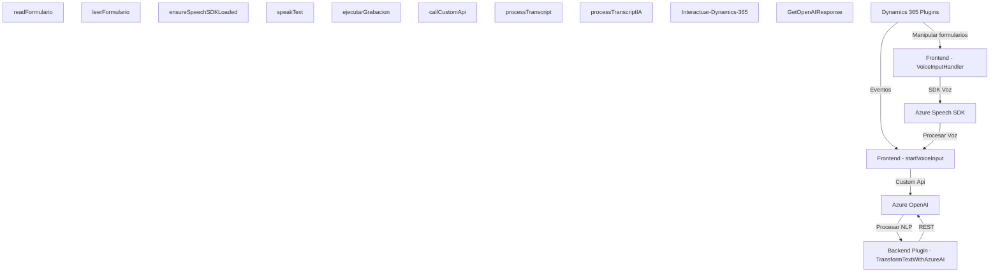

### Análisis detallado

#### 1. Breve Resumen Técnico
El repositorio contiene una solución que integra múltiples componentes para la interacción usuario-sistema mediante entrada y salida de voz. La solución es híbrida: combina un frontend en JavaScript, para trabajar con formularios, con funcionalidades backend como plugins en C# orientados al entorno Dynamics 365 y la integración con servicios de Azure (Azure Speech SDK y Azure OpenAI Service).

#### 2. Descripción de arquitectura
La solución parece seguir una **arquitectura n-capas**, donde cada layer tiene un rol diferenciado:
- **Presentación (Frontend)**: Comprende scripts en JavaScript para interactuar con datos de formularios en Dynamics 365 y realizar síntesis/entrada de voz mediante el Azure Speech SDK.
- **Business Logic (Plugins)**: Implementación en C# con servicios exclusivos de Dynamics 365 y llamadas al servicio Azure OpenAI para transformar textos.
- **Integración/procesos externos**: Lógicas para interactuar con la API REST de Azure OpenAI y servicio de voz.

El uso de la nube de Azure sugiere una orientación hacia **Service-Oriented Architecture** (SOA), donde los servicios Azure proporcionan funciones especializadas (voz e IA) para extender el procesamiento local.

#### 3. Tecnologías, frameworks y patrones
- **Frontend (JavaScript)**:
  - `Azure Speech SDK`: Generación de voz y reconocimiento de entradas habladas.
  - Patrones como carga dinámica de scripts, delegación de tareas y modularidad.
  - Manejo del DOM de Dynamics 365 para controlar formularios y campos.

- **Backend (C#)**:
  - `Dynamics 365 SDK (Microsoft.Xrm.Sdk)`: Implementación de plugins en el ecosistema CRM.
  - Integración de API REST con servicios externos como Azure OpenAI para NLP avanzado.
  - Patrones como plugin, SOA, y uso de REST para servicios externos.

#### 4. Dependencias o componentes externos
La solución utiliza varias dependencias externas y servicios:
- **Azure Speech SDK**: Para generar y recibir datos de voz.
- **Azure OpenAI Service (GPT)**: Para estructurar datos de texto a través de procesamiento natural del lenguaje (NLP).
- **Microsoft Dynamics 365 SDK**: Usado tanto en frontend (manipulación de formularios) como en backend (plugins y API).
- **REST API**: Comunicación entre el plugin y servicio de OpenAI.
- **Newtonsoft.Json** (en C#): Manipulación de objetos JSON.

#### 5. Diagrama Mermaid válido para GitHub Markdown

### Conclusión Final
La solución es parte de un ecosistema híbrido orientado a la interacción de voz con usuarios y la transformación avanzada de texto mediante IA. La arquitectura n-capas está integrada con herramientas modernas (como Azure Speech SDK y OpenAI GPT). A pesar de su modularidad, podría beneficiarse de mejoras en algunos aspectos:
- Modularización adicional para encapsular lógicas específicas.
- Uso de mejores prácticas de autenticación en las llamadas de API.
- Expansión de testing automatizado para el frontend y plugins.

