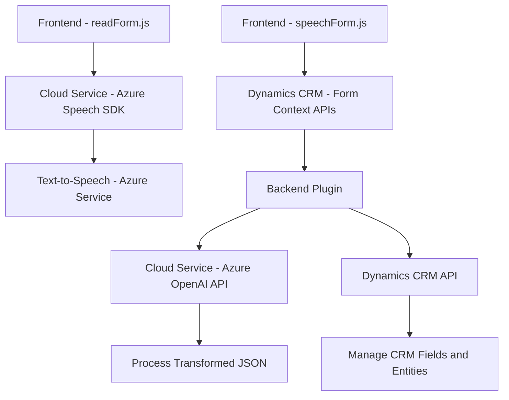

### Breve resumen técnico
Los archivos analizados indican una solución que integra componentes frontend (JavaScript) y backend (.NET plugins), junto con servicios de Azure (Speech SDK y OpenAI) para implementar funcionalidades relacionadas con el reconocimiento de voz, síntesis de texto a voz y procesamiento basado en IA en el contexto de Microsoft Dynamics CRM. 

---

### Descripción de arquitectura
1. **Tipo de solución:** 
   - Sistema extendido para Microsoft Dynamics CRM.
   - Componentes como `readForm.js` y `speechForm.js` sugieren que se trata de un frontend interactivo que se integra con el CRM a través de formularios y gestión de eventos.
   - En el backend, **plugins C#** específicos como `TransformTextWithAzureAI.cs` ofrecen funcionalidades avanzadas para procesamiento de datos usando servicios externos como Azure OpenAI.

2. **Arquitectura:**  
   - Es una **arquitectura modular y híbrida**:
     - La parte frontend es orientada a eventos y modular, con separación de responsabilidades en funciones autónomas.
     - La parte backend sigue el **patrón de Plugin Architecture** de Dynamics CRM y utiliza interacción con servicios externos.
     - Los servicios externos se integran en tiempo de ejecución, sugiriendo un estilo orientado a microservicios para las funciones avanzadas que involucran Speech y OpenAI.

3. **Patrones utilizados:**
   - **Event-driven architecture:** Funciones en los archivos JavaScript son disparadas por eventos (como entradas de voz en formularios).
   - **Facade pattern:** Uso de puntos únicos de acceso como `startVoiceInput()` y `execute()` para gestionar flujos complejos.
   - **Service/adapter pattern:** En el backend, el módulo para interactuar con Azure OpenAI está encapsulado en `GetOpenAIResponse`, centralizando la comunicación externa.

---

### Tecnologías usadas
1. **Frontend stack:**
   - **HTML/JavaScript** para manejo de formularios y lógica del cliente.
   - **Azure Speech SDK** para reconocimiento y síntesis de voz directo en el navegador.
   - **Dynamic 365 CRM API (`Xrm` API)** para acceso y manipulación de datos en formularios del CRM.

2. **Backend stack:**
   - **C#/.NET framework** para la escritura de plugins de Dynamics CRM.
   - **Microsoft.Xrm.Sdk** para interacción directa con entidades, formularios y datos del CRM.
   - **Azure OpenAI API** para procesamiento de texto con modelos basados en inteligencia artificial (como GPT).
   - **HTTP Client Framework** para la comunicación con servicios de Azure.

3. **Libraries:**
   - `Newtonsoft.Json` y `System.Text.Json` para manejo de JSON en el código del backend.

---

### Diagrama Mermaid válido para GitHub

---

### Conclusión final
La solución parece implementar una **multi-capa híbrida** donde los componentes frontend gestionan las interacciones de usuario y la entrada de voz, conectándose directamente con servicios externos (Azure Speech SDK). En el backend, los plugins en .NET se integran profundamente con Dynamics CRM para enriquecer las funcionalidades de los formularios mediante IA (Azure OpenAI).  

El uso de eventos, comunicación adaptativa con servicios externos y separación modular contribuyen a una arquitectura eficiente, extensible y particularmente idónea para entornos corporativos. Con un enfoque en Microsoft Dynamics CRM, esta solución proporciona capacidades de voz y procesamiento avanzado, aprovechando al máximo la interoperabilidad de herramientas modernas.