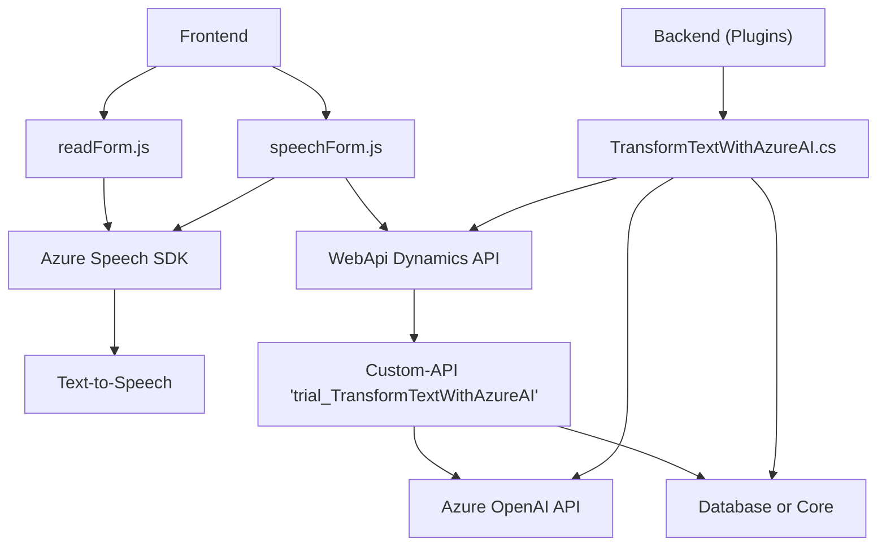

### Breve resumen técnico

El repositorio contiene múltiples archivos destinados a la integración con tecnologías como Azure Speech SDK y Azure OpenAI, mediante el entorno de Dynamics CRM y su plugin architecture. Los principales objetivos del sistema son:
- **Entrada de Voz y Conversión de Texto a Voz**: Diseñado para captar y sintetizar información del formulario dinámico.
- **Procesamiento con Inteligencia Artificial**: Mediante servicios externos como Azure AI para mapear, transformar y actualizar datos en formularios.
- **Sincronización de datos en Dynamics CRM**: Empleando plugins y una API personalizada para realizar operaciones sobre los datos transcritos o transformados.

---

### Descripción de arquitectura

La arquitectura es una combinación de patrones **x-en-nubes** y **Service-Oriented Architecture (SOA)**:
1. **Componentes**:
    - Archivo **readForm.js**: Recopila y sintetiza datos del formulario, con Azure Speech SDK para Text-to-Speech.
    - Archivo **speechForm.js**: Facilita entrada de voz y reconocimiento, incluyendo el uso de APIs personalizadas de Dynamics CRM y Azure AI.
    - Plugin **TransformTextWithAzureAI.cs**: Implementa una lógica del lado servidor en Dynamics CRM, utilizando OpenAI API para transformar y estructurar datos recibidos.
2. **Patrones de diseño**:
    - **Delegate Pattern**: Uso intensivo de callbacks para ejecución dinámica de SDK o servicios asincrónicos.
    - **Modular Programming**: Separación clara de funciones por responsabilidad.
    - **API Gateway**: La interacción con Azure AI y Dynamics CRM está centralizada, lo que constituye una forma de Gateway.
3. **Estilo de Arquitectura**: **N-capas o SOA**, con capas separadas para conexión de servicios externos, lógica de negocio y presentación de datos. Los plugins y dependencias externas refuerzan su estructura orientada a servicios.

---

### Tecnologías usadas

1. **Frontend/JavaScript**:
   - Azure Speech SDK: Manejo de capturas de entrada de voz y salida de síntesis.
   - Document Object Model (DOM): Utilización de eventos y atributos del formulario.
   - Xrm.WebApi (Dynamics CRM API): Manipulación de datos del formulario y llamadas a APIs personalizadas.

2. **Backend/C# (Plugins)**:
   - Microsoft.Xrm.Sdk: Framework estándar para desarrollo de plugins basados en Dynamics CRM.
   - Azure OpenAI (GPT-4): Transformación dinámica de texto en JSON según reglas.
   - HttpClient: Comunicación con APIs externas sincronizadas con Dynamics CRM.
   - Newtonsoft.Json: Manejo avanzado de estructuras JSON.

3. **Patrones destacados**:
   - Delegate Pattern, Service Provider Pattern, Modular Programming, Plugin Pattern y API Gateway.

---

### Diagrama Mermaid

---

### Conclusión final

Este repositorio implementa una solución híbrida basada en la arquitectura SOA. La combinación de un frontend modular con la integración de servicios externos como Azure Speech SDK y OpenAI, junto con un backend en Dynamics CRM para las reglas de negocio y la persistencia, presenta una solución avanzada para el manejo dinámico de formularios. Esto permite entrada, salida y procesamiento inteligente de datos, adaptada a flujos comunicativos modernos en aplicaciones CRM. Sin embargo, es importante gestionar y proteger las configuraciones sensibles para evitar riesgos de seguridad.