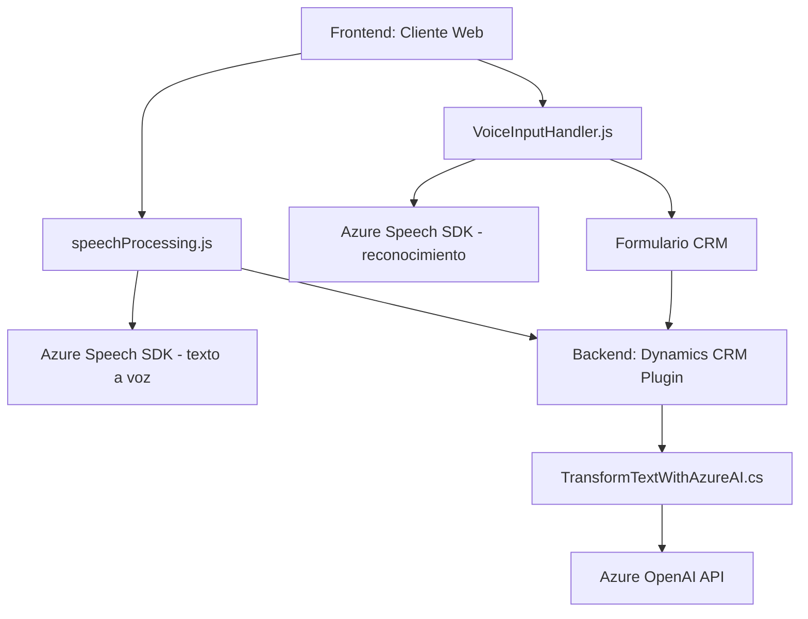

### Breve Resumen Técnico
El repositorio contiene archivos destinados a integrar funcionalidades avanzadas de interacción por voz, procesamiento de formularios y transformación de texto con servicios cognitivos de Azure, dentro del contexto de un sistema CRM (probablemente Microsoft Dynamics 365). La solución está compuesta por una **mezcla de frontend basado en JavaScript** y **backend mediante un plugin C# para Dynamics CRM**, todo apuntando a una arquitectura de integración con servicios externos como Azure Speech y OpenAI.

---

### Descripción de Arquitectura
La arquitectura general está orientada a una **cliente-servidor** de **n capas** aplicando patrones de integración con servicios externos. El frontend utiliza JavaScript para captar datos de formularios y procesarlos con Azure Speech SDK. Luego, en el backend, el plugin de **Dynamics CRM** (TransformTextWithAzureAI.cs) usa la **Azure OpenAI API** para transformar los datos antes de que se interactúe directamente con el entorno del CRM.

Esencialmente:
1. **Frontend:** Carga dinámica del SDK, procesamiento de voz en tiempo real, y actualización de formularios CRM.
2. **Backend:** Combina un plugin C# con lógica configurada para usar el servicio Azure OpenAI.

---

### Tecnologías Usadas
1. **Frontend (JavaScript):**
   - **Azure Speech SDK:** Para convertir texto a voz y para reconocimiento de voz.
   - Promesas y callbacks: Manejo asíncrono de solicitudes y respuestas.
   - Modularización: Funcionalidad separada por responsabilidad.
   - Dynamic loading: Carga del SDK de Azure Speech en tiempo de ejecución.

2. **Backend (C#, Dynamics CRM Plugin):**
   - **Microsoft.Xrm.Sdk:** Para integrar el plugin dentro del framework de Dynamics CRM.
   - **Azure OpenAI API:** Para transformar texto según reglas específicas.
   - **System.Net.Http:** Para realizar peticiones HTTP.
   - **Newtonsoft.Json:** Procesamiento JSON avanzado.
   - **IoC (ServiceProvider):** Patrón de inversión de control para obtener contexto en tiempo de ejecución.

3. **Servicios Externos:**
   - **Azure Speech SDK:** Control de interacción por voz dinámica.
   - **Azure OpenAI (GPT):** Modelo cognitivo para procesamiento avanzado de texto.

---

### Diagrama Mermaid

---

### Conclusión Final
La solución combina inteligentemente capacidades de servicios cognitivos de Azure y funcionalidades avanzadas en tanto el frontend como el backend para crear una integración fluida con Microsoft Dynamics CRM. Está diseñada bajo una arquitectura de cliente-servidor en n capas, priorizando modularidad, escalabilidad y el consumo de recursos externos (APIs de Azure). 

**Recomendación para mejora:**
- **Seguridad:** Evitar el uso de claves de API en el código fuente; aprovechar servicios de gestión de secretos como Azure Key Vault.
- **Error Handling:** Cambiar alertas directas por sistemas estructurados de logs para garantizar trazabilidad adecuada.
- **Escalabilidad:** Evaluar la viabilidad de extender la arquitectura hacia una basada en microservicios si los servicios de Azure aumentan en la solución.