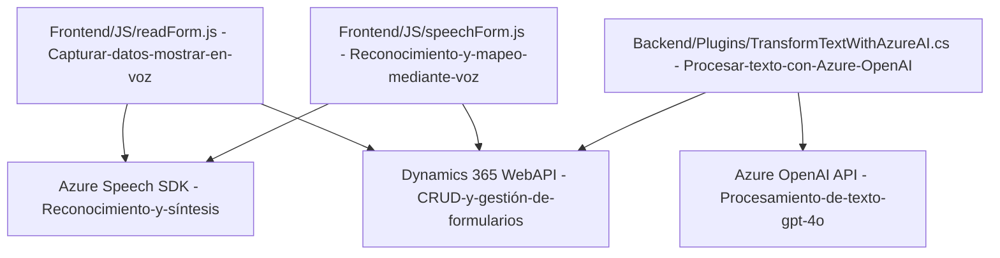

### Breve resumen técnico

El repositorio contiene archivos para una solución que integra procesos de reconocimiento de voz, síntesis de voz y procesamiento de texto con servicios de Azure, específicamente Speech SDK y OpenAI. La solución parece estar relacionada con formularios web dinámicos, usados en entornos como Dynamics 365.

---

### Descripción de arquitectura

La arquitectura se basa en múltiples capas:
1. **Frontend:** Archivos JavaScript (`readForm.js` y `speechInputHandler.js`) procesando la captura, síntesis de voz y asignación de valores a campos dinámicos de formularios web. Utilizan el SDK de Azure Speech y APIs de Dynamics 365.
2. **Backend/Plugin:** Archivo C# (`TransformTextWithAzureAI.cs`) que actúa como un plugin para Dynamics CRM. Este realiza transformaciones de texto mediante Azure OpenAI y entrega datos estructurados en formato JSON.
3. **Servicio externo:** Uso de APIs de Azure Speech y Azure OpenAI como servicios externos para reconocimiento, síntesis y procesamiento de datos interactivos.

El diseño arquitectónico combina **n capas** (separando frontend, backend y APIs externas) con enfoques de **modularización**, donde cada componente tiene una responsabilidad claramente definida.

---

### Tecnologías usadas

#### **Frontend**
- **JavaScript**
- **Azure Speech SDK**: Para reconocimiento y síntesis de voz.
- **Dynamics 365 Web API**: Interacción con APIs de Dynamics para CRUD y mapeo de atributos.

#### **Backend**
- **C#**: Implementación de plugins. 
- **Azure OpenAI**: Procesamiento de texto con API gpt-4o.
- **Microsoft Dynamics CRM SDK**: Implementación del patrón de extensibilidad mediante `IPluginExecutionContext`.
- **Newtonsoft.Json**: Manejo de JSON.
- **System.Net.Http**: Para interacción con servicios externos.

#### **General**
- **Modularización**: Dividiendo responsabilidades por archivos.
- **Event-based flow**: Implementación de callbacks (en frontend) y eventos del plugin (en backend).

---

### Diagrama Mermaid válido para GitHub

---

### Conclusión final

El repositorio implementa una solución que combina frontend para formularios interactivos, backend mediante plugins extensibles, y servicios externos avanzados de Azure. La arquitectura modular y de n capas permite distribuir responsabilidades y facilita la integración con servicios de Microsoft Dynamics y Azure.