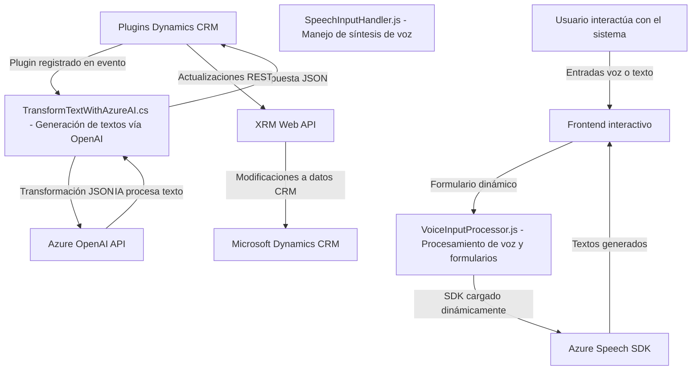

### Breve resumen técnico

El repositorio contiene módulos relacionados con gestión de formularios interactivos basados en voz y procesamiento de texto en un entorno de CRM (Customer Relationship Management). Los componentes aprovechan el SDK de Azure Speech y la API de Azure OpenAI para habilitar funcionalidades de reconocimiento y síntesis de voz, así como generación de texto asistida por inteligencia artificial.

### Descripción de arquitectura

#### General
La solución sigue un enfoque modular combinado con arquitectura basada en **componentes distribuidos**. Existen tres principales capas funcionales en el diseño:
1. **Frontend:**
   - Interactúa con el usuario para capturar voz, procesar texto y gestionar formularios.
   - Comunicación directa con SDKs y APIs relacionadas con Azure Speech.
2. **Backend Plugins:**
   - Diseñado para integrarse como un plugin dentro de un sistema Microsoft Dynamics CRM.
   - Ejecuta transformaciones de texto relevantes mediante peticiones REST hacia Azure OpenAI.
3. **Servicios Externos:**
   - **Azure Speech SDK:** Procesa voz en transcripciones (texto) o convierte texto en síntesis de voz (audio).
   - **Azure OpenAI API:** Procesa textos enriquecidos para generación inteligente mediante IA.

#### Arquitectura relacionada
La arquitectura combinada se aproxima a un modelo **n-capas evolucionado**:
1. **Capa de presentación (Frontend):**
   Estilo modular basado en funciones independientes para interactuar con formularios y usar servicios de voz.
   
2. **Capa lógica (Plugins):**
   Implementa lógica de negocio como extensiones dentro de CRM, utilizando servicios IA y APIs externas.

3. **Servicios externos:**
   Capa de servicios integrados, como Azure Speech SDK y Azure OpenAI, para tareas complejas.

Esta interacción entre capas permite un sistema extensible y desacoplado.

---

### Tecnologías y patrones usados

#### Tecnologías principales:
- **Frontend:**
  - **JavaScript:** Manipulación del DOM y lógica interactiva.
  - **Azure Speech SDK:** SDK cargado dinámicamente para funciones de reconocimiento y síntesis de voz.
  - **XRM API:** Interfaz de Dynamics CRM para acceso y actualización de datos.
  - HTTP REST para llamada a API personalizada.

- **Backend:**
  - **C# .NET:** Desarrollo de plugins para Dynamics CRM.
  - **Azure OpenAI API:** Servicios IA mediante endpoints.
  - **HTTP Client:** Generación de solicitudes REST.

#### Patrones utilizados:
1. **Modularidad:** División en funciones específicas y reutilizables.
2. **Delegación de tareas:** Cada función delega subprocesos a otras con responsabilidades precisas.
3. **Carga dinámica:** Carga condicional de SDKs en frontend.
4. **Adaptador:** Interface entre datos locales y APIs externas.

#### External Dependencies:
1. **Azure Speech SDK**: (Reconocimiento y síntesis de voz).
2. **Azure OpenAI API**: (Generación inteligente asistida por IA).
3. **Newtonsoft.Json**: (Manejo avanzado de JSON en backend).
4. **XRM REST API**: Integración con el CRM Microsoft Dynamics.

---

### Diagrama **Mermaid** válido para GitHub Markdown

---

### Conclusión final

El repositorio implementa una solución centrada en la interacción entre usuario y CRM a través de tecnologías avanzadas, como reconocimiento de voz, síntesis de texto y generación automática mediante IA, distribuidas en **componentes independientes**. Su arquitectura, aunque basada en **n-capas**, incluye elementos de integración distribuida, con un enfoque hacia futuros escenarios de microservicios.

Puntos fuertes:
1. Modularidad: Los componentes son reutilizables y tienen funciones bien definidas.
2. Uso de tecnologías modernas en el ecosistema Azure.
3. Integración con CRM asegura su aplicabilidad en entornos empresariales.

Mejoras recomendadas:
1. Seguridad: Refactorizar manejo de claves para evitar exposición (ej., uso de Key Vault).
2. Extensibilidad: Transformar el backend en una API de microservicio independiente para desacoplar CRM.