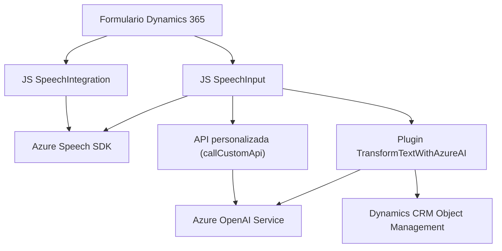

### Breve resumen técnico
El repositorio contiene la implementación de una solución orientada a formularios en Dynamics 365 con integración de herramientas de reconocimiento y síntesis de voz mediante Azure Speech SDK y procesamiento avanzado de texto con Azure OpenAI. Los archivos indican la existencia de un frontend (en JavaScript) que interactúa con la interfaz del formulario y un backend (en C#) para procesamiento de datos.

---

### Descripción de arquitectura
La arquitectura implementada emplea un enfoque de **n capas** donde el frontend (JavaScript) administra la interacción directa con el usuario y datos del formulario, mientras el backend (C# Plugins) gestiona la lógica de interacción avanzada con servicios externos como Azure OpenAI. Además, existen patrones de **Microservicios** debido a la interacción con APIs externas y servicios de terceros (Azure Speech SDK y OpenAI). Los fragmentos explicados también exhiben cierto nivel de modularidad dentro del diseño del software.

---

### Tecnologías usadas
- **Frontend:**
  - **JavaScript**: Para interacción con formularios.
  - **Azure Speech SDK**: Para síntesis y reconocimiento de voz.
  - **Dynamics 365 form SDK (`formContext`)**: Para manipulación de datos de los formularios.
  - **JavaScript Promises**: Manejo de asincronismo.

- **Backend:**
  - **C# Plugins para Dynamics CRM**: Implementación de lógica personalizada.
  - **Azure OpenAI Service**: Para procesamiento semántico y transformación de texto.

- **Servicios externos y APIs:**
  - **REST API**: Para interacción con Azure OpenAI Service y otros servicios externos.
  
---

### Diagrama Mermaid válido para GitHub

---

### Conclusión final
La solución combina un frontend que permite a los usuarios interactuar con los formularios de Dynamics 365 mediante entradas de voz y síntesis de texto, y un backend que transforma texto con procesamiento avanzado utilizando Azure OpenAI. La arquitectura es una mezcla de **n capas** (frontend-backend integration) con paradigmas de **Microservicio** aplicados a los servicios externos. Esta innovación es particularmente útil para mejorar la interacción de los usuarios con formularios y sistemas ERP como Dynamics 365.