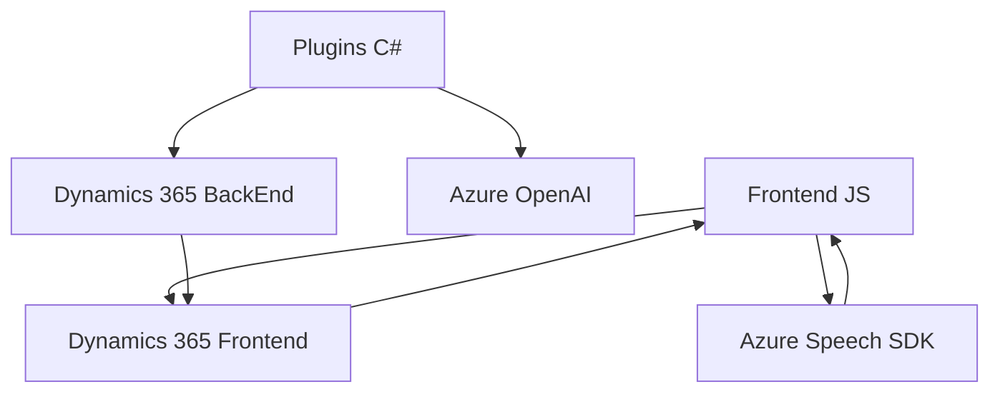

### Breve resumen técnico

Este repositorio tiene una solución híbrida que combina frontend basado en JavaScript y plugins back-end en C#, todos utilizados en el contexto de Dynamics 365. Los componentes principales reflejan la integración con servicios de inteligencia artificial de Azure como **Azure Speech SDK** y **Azure OpenAI**, aplicados en tareas de procesamiento de voz-texto y transformación automatizada de texto. También hay un fuerte enfoque en la interacción dinámica con formularios y API en entornos CRM.

---

### Descripción de arquitectura

1. **Tipo de solución:** La solución es una combinación de un **frontend integrado** (procesamiento de datos y activadores de formularios en Dynamics 365) y un **plugin backend** diseñado como parte de un ecosistema CRM. No es una API autónoma ni un entorno de microservicios.

2. **Tipo de arquitectura:**  
   - **Frontend:** Diseño modular que opera bajo un patrón de n capas con integración directa al frontend del CRM (especialmente Dynamics 365).  
   - **Backend:** Componentes dentro de Dynamics CRM que funcionan como plugins con enfoque en arquitectura centrada en servicios. 

---

### Tecnologías usadas

1. **Frontend (JavaScript):**
   - **Azure Speech SDK:** Procesamiento de voz-texto y síntesis de texto a voz.
   - **Dynamics 365 Web API (Xrm.WebApi):** Manejador de interacciones con CRM.
   - **Modular JavaScript:** Cada archivo está estructurado con funciones desacopladas para distintas responsabilidades.
   - **Patrones:** Modularización, integración por medio de SDK externos, y callbacks asíncronos.

2. **Backend (C#):**
   - **Microsoft.Xrm.Sdk y Query:** Utilizados para interactuar con el contexto de Dynamics CRM y realizar consultas.
   - **Azure OpenAI:** Servicio externo utilizado para procesamiento de lenguaje natural.
   - **Newtonsoft.Json:** Manejo del formato JSON para la interacción con APIs.
   - **Patrones:** Plugin-based development, service-oriented design y API integration.

---

### Dependencias o componentes externos

1. **Frontend:**
   - **Azure Speech SDK:** Cargado dinámicamente desde un CDN.
   - **Dynamics 365 API:** Acceso y manipulación de datos en formularios del CRM.

2. **Backend:**
   - **Azure OpenAI API:** Llamadas HTTP a endpoints para procesamiento de texto.
   - **CRM SDK (Microsoft.Xrm.Sdk):** Manipulación y ejecución dentro del entorno CRM.
   - **HttpClient:** Envío de datos a APIs comerciales, como Azure.

---

### Diagrama Mermaid válido para **GitHub Markdown**

---

### Conclusión final

Esta solución combina un **frontend modular dinámico escrito en JavaScript** con un **backend extensible mediante plugins en C#** que operan en un ecosistema Dynamics 365. El desarrollo depende significativamente de herramientas cognitivas de Azure (Speech SDK y OpenAI), con patrones bien definidos como integración de servicios externos y modularización. Sin embargo, el diseño parece ser monolítico dentro del entorno CRM, ya que todos los componentes contribuyen a una plataforma única sin una división clara entre servicios independientes. Para escalar, podría evaluarse una migración parcial hacia una arquitectura basada en **microservicios** o **API independientes**.