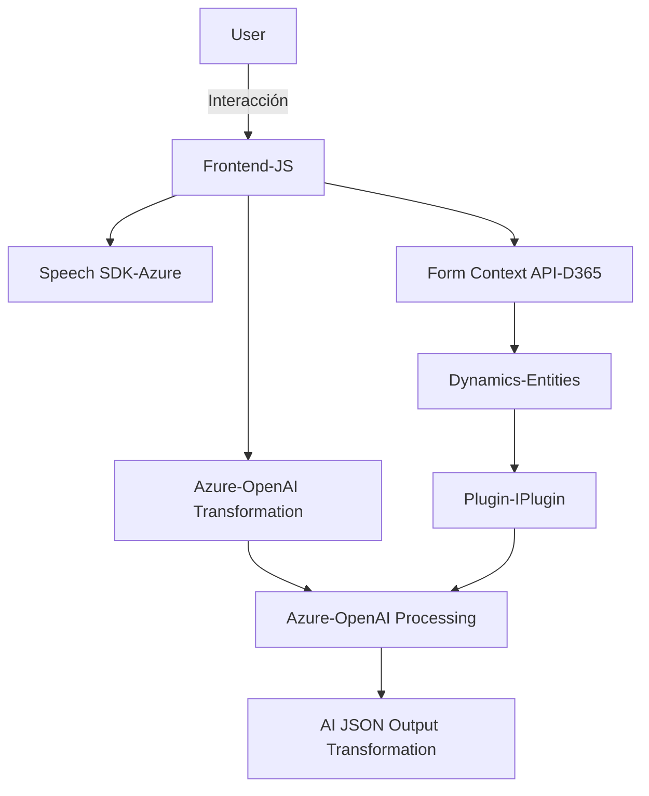

### Breve resumen técnico
Este repositorio parece ser un sistema híbrido que integra un **frontend basado en JavaScript** con **servicios de backend para Dynamics CRM** y **Azure cloud services**. Se enfoca en el procesamiento de datos de un formulario mediante entrada de voz, síntesis de texto en voz y la transformación de texto a resultados estructurados a través de Azure OpenAI.

### Descripción de la arquitectura
La arquitectura adopta un modelo **modular y basado en n capas**, con una integración directa con los servicios de Azure y Dynamics CRM. En el lado del cliente, se tiene una aplicación orientada a eventos y servicios que interactúa con el usuario y con las APIs externas (Azure Speech SDK). En el backend, se utiliza el diseño de plugins personalizados (`IPlugin`) abarcando lógica para procesar datos y enviar solicitudes a servicios externos como Azure OpenAI.

### Tecnologías usadas
1. **Frontend:**
   - **JavaScript**: Escrito en formato modular y orientado a funciones.
   - **Azure Speech SDK**: Servicio para síntesis de voz y transcripción.
   - **Form Context API**: API interna de Dynamics CRM para gestión de atributos y entidades.

2. **Backend:**
   - **Plugins de Dynamics 365 (Microsoft.Xrm.Sdk)**: Desarrollo en **C#** para extender funcionalidades de CRM.
   - **Azure OpenAI API**: Procesamiento y transformación de texto.

3. **Frameworks/Librerías:**
   - **Newtonsoft.Json**: Gestión de JSON del lado Backend.
   - **System.Net.Http**: Realización de llamadas HTTP hacia APIs externas.
   - **System.Text.Json**: Manipulación de datos JSON.
   - **Microsoft Dynamics CRM SDK**: Contexto de ejecución de plugins y acceso a datos del sistema.

4. **Patrones de diseño identificados:**
   - **Event-driven architecture**: Orientado a eventos para frontend y backend.
   - **Modularity**: Dividido en funciones y clases bien segmentadas.
   - **Service-oriented architecture**: Integración directa con servicios como Azure Speech SDK y Azure OpenAI.
   - **Lazy loading**: Carga dinámica del SDK de Azure Speech en frontend.
   - **API Gateway pattern**: Toda la interacción entre módulos hace uso de APIs centralizadas (Dynamics CRM y Azure).

### Dependencias externas
1. **Azure Speech SDK:** Servicio utilizado para síntesis de texto en voz y transcripción.
2. **Azure OpenAI API:** Procesamiento de texto avanzado usando IA.
3. **Dynamics 365 Web API:** Framework interno para integración con formularios, entidades y atributos.
4. **Newtonsoft.Json y System.Net.Http:** Para operaciones JSON y solicitudes HTTP.
5. **Forms Context API:** Para interactuar con formularios en Dynamics CRM.

---

### Diagrama **Mermaid**

---

### Conclusión final
Este repositorio representa una solución **orientada a servicios**, donde un frontend de JavaScript interactúa con APIs externas y servicios de Azure para proporcionar funcionalidades avanzadas como entrada/salida de voz y transformación de texto mediante IA. La arquitectura es modular y de n capas, con una delimitación clara entre frontend, backend, y servicios externos. Esto facilita la escalabilidad y mantenimiento del sistema, y su diseño está bien optimizado para aplicaciones integradas con Dynamics CRM y Microsoft Azure.