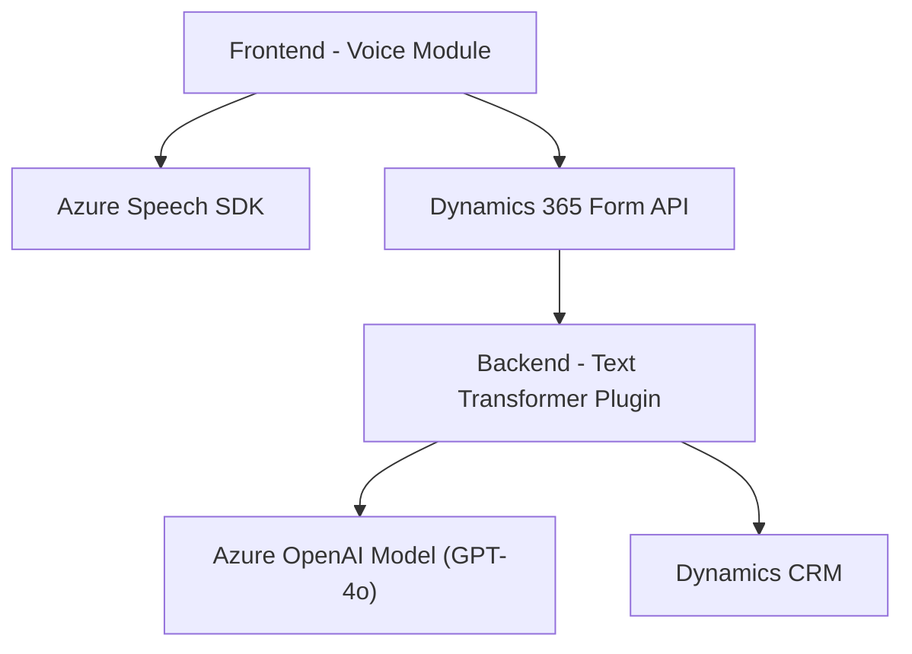

### Breve resumen técnico

La solución descrita se enfoca en **integrar servicios externos (Azure Speech SDK y Azure OpenAI)** para facilitar la interacción con formularios dentro de **Dynamics 365**. Está dividida en varios módulos basados en dos objetivos principales: entrada de voz (integración con Azure Speech SDK para síntesis y transcripción) y procesamiento avanzado de texto con inteligencia artificial (Azure OpenAI). Además, incluye un plugin para Dynamics CRM que realiza transformaciones textuales en JSON.

---

### Descripción de arquitectura

La solución puede clasificarse como una arquitectura de **microservicios híbridos** que se integra con sistemas externos y aporta extensiones funcionales a Dynamics 365. 

1. **Estructura distribuida:**
   - Una capa frontend basada en JavaScript que utiliza servicios de voz y realiza la transcripción o síntesis con **Azure Speech SDK**.
   - Una capa de backend que introduce un plugin en forma de extensión en Dynamics CRM, que actúa como intermediario entre el flujo del formulario y los servicios de **Azure OpenAI** para transformar texto.

2. **Patrones de diseño:**
   - **Modularidad:** Cada archivo está diseñado con un enfoque claro, separado por responsabilidad.
   - **Integración asincrónica:** Uso intensivo de promesas, callbacks, y solicitudes HTTP para interactuar con APIs externas.
   - **Extensibilidad:** Implementación del patrón de plugins en el backend (Dynamics CRM).
   - **Carga dinámica:** Azure Speech SDK se carga dinámicamente en el frontend, optimizando el rendimiento y reduciendo la necesidad de dependencias constantes.
   - **Adaptador:** Traducción de nombres de campos visuales en formularios a nombres técnicos.

3. **Dinámica de integración:**
   - **Frontend:** Enlaza la interfaz de uso (gestión dinámica de formularios y síntesis/transcripción de voz).
   - **Backend:** Automatiza procesos de entrada textuales. Se apoya en un servicio IA externo (Azure OpenAI) y realiza las transformaciones JSON necesarias.

---

### Tecnologías usadas

1. **Frontend:**
   - **Lenguaje:** JavaScript.
   - **Servicios externos:**
     - Azure Speech SDK: Herramienta para síntesis de voz y transcripción.
     - Dynamics 365 Web API: Manipulación de formularios en entornos de Dynamics 365.

2. **Backend:**
   - **Lenguaje:** C# (NET Framework/NET SDK).
   - **Plataforma:** Microsoft Dynamics CRM.
   - **Servicios externos:**
     - Azure OpenAI: Consumo del modelo GPT para transformar texto.

3. **Patrones observados:**
   - Carga dinámica de SDK en el cliente.
   - Interacción cliente-servidor con promesas y callbacks.
   - Uso de APIs externas (API Gateway).
   - Plugin-based architecture en backend.
   - Transformación avanzada de datos (AI-driven).

---

### Diagrama Mermaid compatible con GitHub Markdown

---

### Conclusión final

La solución utiliza una arquitectura híbrida que combina elementos de **microservicios** con extensibilidad específica para **Dynamics CRM**, integrando funciones avanzadas de voz mediante **Azure Speech SDK** y procesamiento de texto con **Azure OpenAI**. Esto proporciona una experiencia enriquecida orientada a simplificar y optimizar la interacción con formularios mediante tecnología vocal e inteligencia artificial. Además, la modularidad y adaptabilidad del diseño la hacen escalable y fácil de mantener.