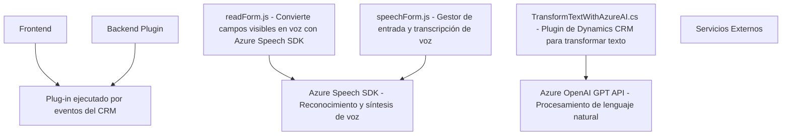

**Resumen técnico:**
El repositorio parece ser una solución enfocada en mejorar la experiencia de usuario en Microsoft Dynamics CRM a través de interacción por voz y transformación de texto. Consiste en tres componentes principales:
1. Módulos frontend hechos en **JavaScript**, diseñados para integrar la funcionalidad de síntesis y reconocimiento de voz mediante **Azure Speech SDK**.
2. Un plugin para Dynamics CRM desarrollado en **C#**, que utiliza el servicio **Azure OpenAI GPT** para transformar texto según reglas predefinidas.
3. Se integra servicios externos como Azure Speech y Azure OpenAI para habilitar los procesos de voz y lenguaje natural.

---

**Descripción de arquitectura:**
1. La solución sigue el patrón **n-capas**, donde cada capa tiene una responsabilidad específica:
    - **Frontend**: Capa de presentación e interacción con el usuario.
    - **Backend/Negocio**: Plugins (C#), donde se procesan las solicitudes y se interactúa con Azure OpenAI.
    - **Servicios externos**: Azure Speech SDK y Azure OpenAI (gestión de voz y transformación de texto).

2. Elementos arquitectónicos:
    - **Event-driven** para activar funcionalidades del frontend mediante eventos y callbacks.
    - **Service-Oriented Architecture (SOA)** por el uso de servicios externos que encapsulan funcionalidades específicas.
    - **Plugin Design Pattern**, típico de Dynamics CRM, utilizado para extender su funcionalidad y conectar datos con los servicios.

---

**Tecnologías usadas:**
1. **JavaScript**:
   - Usa APIs modernas para DOM dinámico y promesas asincrónicas.
   - Carga condicional del SDK (lazy loading).

2. **Azure Speech SDK**:
   - Funcionalidad de síntesis y reconocimiento de voz.
   - Configuración basada en claves y regiones de servicios específicos de Azure.

3. **C# (Plugins)**:
   - Librerías estándar de Dynamics CRM como `Microsoft.Xrm.Sdk`.
   - Uso extensivo de llamadas HTTP mediante `HttpClient`.
   - Integración de JSON con `Newtonsoft.Json`.

4. **Azure OpenAI GPT**:
   - Utiliza **API GPT** para procesar texto y transformarlo en formato JSON estructurado.

---

**Dependencias o componentes externos presentes:**
1. **Azure Speech SDK**: Para reconocimiento y síntesis de voz en el navegador.
2. **Azure OpenAI GPT API**: Utilizado en el plugin para transformar texto según reglas específicas.
3. **Librerías de Dynamics CRM (C#)**: `Microsoft.Xrm.Sdk`.
4. **Newtonsoft.Json.Net**: Manejo de JSON en el plugin .NET.

---

**Diagrama Mermaid válido para GitHub:**

---

**Conclusión Final:**
La solución presentada sigue un diseño modular basado en el patrón de arquitectura **n-capas**. Aprovecha frameworks y servicios potentes como el **Azure Speech SDK** y **Azure OpenAI GPT** para proporcionar una experiencia avanzada de entrada/salida mediante voz y procesamiento de texto estructurado. Este diseño es eficiente, extensible y adecuado para escenarios de interacción avanzada con los datos en un CRM como Dynamics, además de ser compatible con espacios de trabajo híbridos utilizando tecnologías frontend y backend modernas.