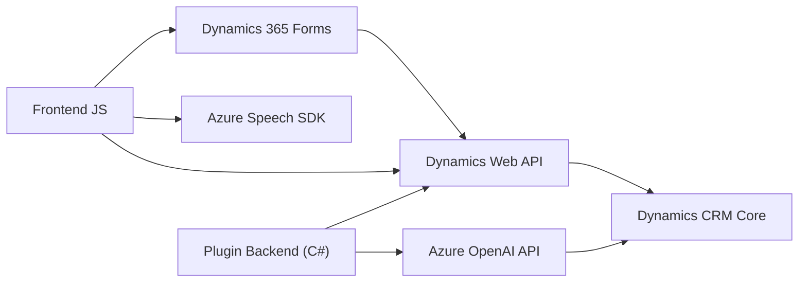

### Análisis Técnico del Repositorio
Con base en los archivos proporcionados, se deduce que el repositorio es una solución híbrida que integra una **Web Application Frontend** con funcionalidades de **Speech Recognition and Synthesis**, junto a un backend en forma de plugin para **Microsoft Dynamics 365 CRM** que utiliza **Azure OpenAI API**. A continuación, se analiza cada punto solicitado:

---

#### 1. Tipo de Solución
Este repositorio combina múltiples partes:
- **Frontend:** JavaScript para formularios y manejo de reconocimiento y síntesis de voz en aplicaciones web integradas en Dynamics 365 CRM.
- **Plugin Backend:** C# destinado a expandir las capacidades de Microsoft Dynamics 365 con transformaciones de texto hechas mediante la API de Azure OpenAI.

Por tanto, podríamos clasificarlo como un **sistema de integración SaaS (API y funcionalidades frontend/backend)** diseñado para entornos de **Microsoft Dynamics**.

---

#### 2. Tecnologías, Frameworks y Patrones Usados
##### Tecnologías
- **Frontend:**
  - **JavaScript:** Principal lenguaje de scripting. 
  - **Azure Speech SDK:** Servicio de reconocimiento de voz y síntesis vía web.
  - **Dynamics 365 CRM SDK:** API del CRM para el manejo de datos y formularios.
- **Backend (Plugin):**
  - **C#:** Desarrollo de lógica específica para el entorno Dynamics.
  - **Azure OpenAI API:** Utilizada para procesamiento avanzado de texto vía inteligencia artificial (GPT-4).

##### Patrones
- **Modularidad:** Tanto el frontend como el backend dividen la lógica en funciones cohesivas. Cada método tiene un propósito único.
- **Integración con Servicios Externos:** El backend consume datos de Azure OpenAI y el frontend usa el SDK de Azure Speech.
- **Event-driven:** Usa eventos y callbacks en el frontend para desencadenar acciones dinámicas, como cargar datos del formulario o iniciar la grabación/síntesis de voz.
- **Plugin Pattern:** El backend utiliza dinámicamente hooks (`IPlugin`) en el entorno de Dynamics CRM para extender funcionalidades.
- **Servicio API Externo:** Modelo basado en servicios externos, donde el back utiliza Azure OpenAI y el front emplea Speech SDK para todas las extensiones.

---

#### 3. Arquitectura Detectada
La arquitectura de la solución puede describirse como **modular y distribuida**:
- **Frontend:** Código en JavaScript interactúa directamente con el SDK del formulario de Dynamics 365 y Speech API. Se encapsula lógica para la síntesis y el reconocimiento de voz con enfoque modular.
- **Plugin Backend:** Una lógica individual en C# para extender Dynamics CRM con OpenAI (plugin como componente externo).

Por tanto, la solución emplea:
- **Arquitectura de n capas:**
  - Capa de presentación (UI/formularios en Dynamics).
  - Capas de negocio y procesamiento (speechForm.js y Plugin C#).
  - Integración con APIs externas (Azure Speech y Azure OpenAI).
- **Microservicios:** Aunque no del todo microservicios, la integración con servicios de Azure podría considerarse un uso ligero de arquitectura de servicios distribuida.

---

#### 4. Dependencias y Componentes Externos Presentes
La solución consume las siguientes dependencias externas:
- **Azure Speech SDK:** Reconocimiento y síntesis de voz en JavaScript.
- **Dynamics 365 Web API:** Gestión de datos del CRM, lectura de formularios, y asignaciones a los campos del CRM.
- **Azure OpenAI API:** GPT-4 para transformación de texto estructurado (implementación en el plugin backend).
- **Newtonsoft.Json:** Librería para manejo de datos JSON en el backend.
- **Microsoft Dynamics CRM SDK:** Facilita el desarrollo y ejecución de plugins en CRM.

---

#### 5. Diagrama Mermaid
El siguiente diagrama describe cómo interactúan los componentes internos y externos detectados:

---

### Conclusión Final
La solución está diseñada específicamente para entornos de **Microsoft Dynamics 365 CRM**, permitiendo manejar formularios mediante reconocimiento y síntesis de voz, además de extender capacidades de texto estructurado mediante procesamiento en Azure OpenAI. Se observa un diseño modular con fuerte integración de servicios externos como **Azure Speech SDK** y **OpenAI API**. Además, con una arquitectura distribuida, soporta extensibilidad en escenarios dinámicos de CRM y aplicaciones SaaS.

Este análisis muestra que la solución es robusta y bien adaptada para su propósito, con uso adecuado de las tecnologías y patrones señalados.