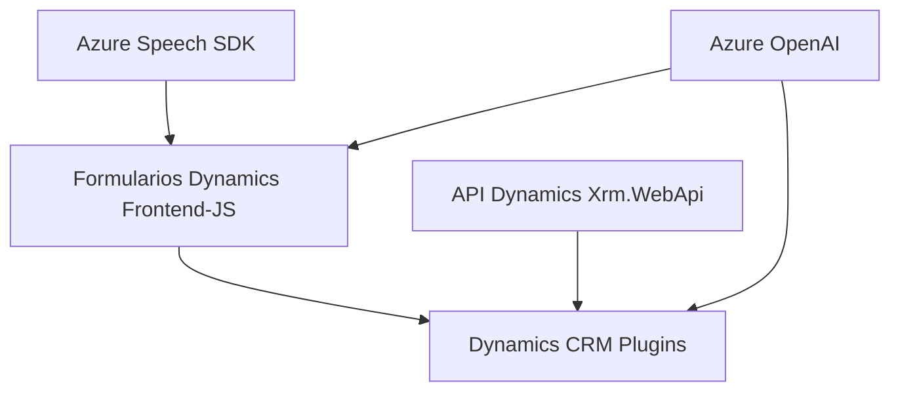

### Breve resumen técnico

El sistema en el repositorio está organizado de forma modular y permite configurar una integración entre Dynamics 365, Azure Speech SDK y OpenAI mediante múltiples componentes con funciones específicas. Implementa funciones para síntesis de voz, reconocimiento de voz, procesamiento contextual de datos de formularios y reglas mediante IA.

---

### Descripción de arquitectura

- **Tipo de solución**: 
  - La solución combina una interfaz frontend (JavaScript y Dynamics 365 formularios) con una capa de backend que usa plugins personalizados en Dynamics CRM. Es un sistema híbrido que utiliza servicios externos (Azure Speech SDK, Azure OpenAI) para mejorar la interacción entre usuarios y formularios.

- **Arquitectura**:
  - La estructura sigue el patrón **n capas**: hay una separación entre lógica de negocio (aplicaciones en Dynamics 365 y los plugins), la interfaz de usuario (frontend JS para formularios), y un componente externo que actúa como proveedor (Azure Speech/OpenAI). Además, el uso de Azure Speech SDK evidencia un modelo **cliente-servidor** con llamada a servicios en tiempo real.
  - **Plug-In Architecture**: El plugin ejecuta acciones sobre eventos en Dynamics CRM, mientras que las llamadas externas se gestionan mediante servicios API.
  - **Microarquitectura para IA**: Los servicios Azure OpenAI sirven como microservicios externos invocados por los plugins.

---

### Tecnologías usadas

#### **Frontend**
- **JavaScript con Azure Speech SDK**:
  - Herramienta clave para reconocimiento y síntesis de voz.
  - Integración de proceso de entrada/salida de voz con formularios en Dynamics 365.

#### **Backend**
- **Dynamics CRM Plugin Architecture**:
  - Uso de la interfaz `IPlugin` para ejecutar lógica sobre eventos dentro de Dynamics CRM.

- **Azure OpenAI**:
  - Servicio de procesamiento de texto mediante IA conectado vía la biblioteca `System.Net.Http`.

#### **Dependencias comunes**
- **Newtonsoft.Json** y `System.Text.Json`: Para estructuración de JSON.
- **Servicios dinámicos de Dynamics CRM**: Vía `Xrm.WebApi` en el frontend y `IOrganizationService` en el plugin.

#### **Patrones y paradigmas**
- **Modularidad**: Aislamiento en funciones pequeñas con responsabilidades claras.
- **Procesamiento asincrónico**: Uso de promesas (JavaScript), callbacks y solicitudes HTTP.
- **Integración con servicios externos**: Azure Speech SDK y OpenAI conectados al sistema base.
- **Field Mapping**: Mapeo entre datos visibles y claves internas en formularios.

---

### Diagrama **Mermaid** válido para GitHub

---

### Conclusión final

Este repositorio implementa una solución híbrida que usa tecnologías de **Microsoft Dynamics 365**, **Azure Speech SDK**, y servicios externos de IA como **Azure OpenAI** para mejorar la interacción con usuarios. Su arquitectura **n capas** organiza la solución en ámbitos independientes (modularidad en el frontend, plugins externos en el backend). Los puntos destacados de esta solución incluyen la integración mediante APIs y servicios externos, el procesamiento dinámico en tiempo real y la interacción usuario-sistema basada en voz e IA. Esta estructura es extensible y aprovecha patrones modernos de arquitectura.