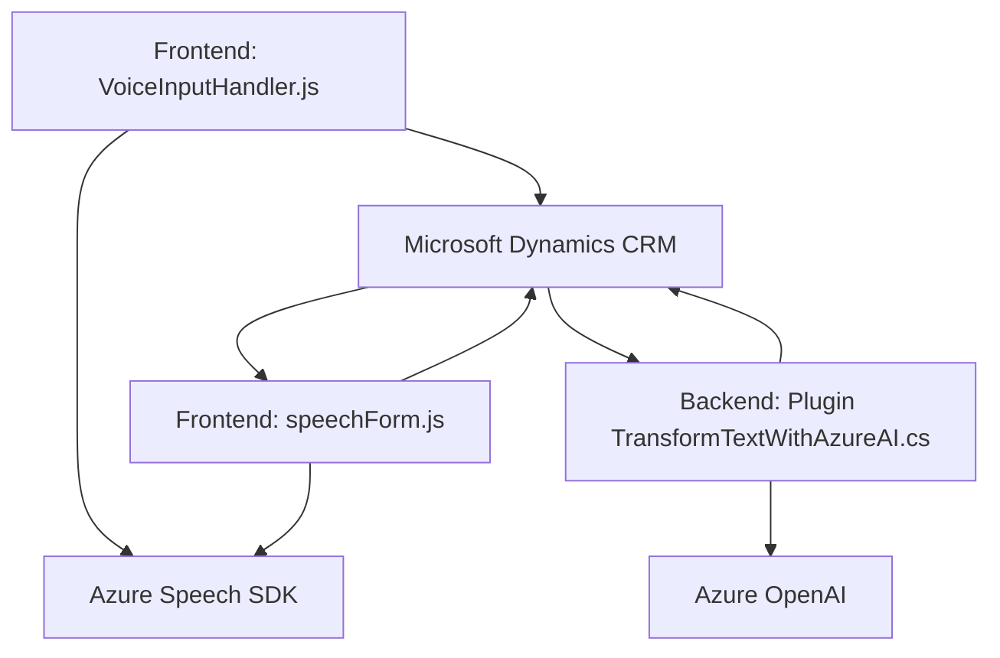

### Resumen técnico
El repositorio parece ser parte de un ecosistema híbrido que integra frontend (Javascript) y backend (.NET) para proporcionar funciones avanzadas de interacción por voz (entrada y lectura) y transformación asistida por inteligencia artificial de texto en ambientes como **Microsoft Dynamics CRM**. Utiliza Azure Speech SDK y Azure OpenAI para el reconocimiento de voz, síntesis de texto y procesamiento avanzado.

---

### Descripción de arquitectura
1. **Modular y de capas**:
   - **Frontend**: Código organizado en funciones independientes que manipulan datos del DOM/formulario y llaman servicios externos (Azure Speech/AI).
   - **Backend**: Plugin centralizado que emplea Azure OpenAI para transformar texto en un formato útil dentro del contexto de Dynamics CRM.
   
2. **Integración SaaS**: Los módulos parecen ser dependientes de Dynamics CRM, con funciones específicas para manejar el contexto de formularios.
3. **Servicios externos**:
   - Azure Speech SDK: Para conversión entre voz y texto, tanto en entrada como en salida.
   - Azure OpenAI: Para interpretación avanzada y transformación de texto.
   
4. **Desacoplamiento**: Tanto el diseño frontend como el backend presenta modularidad, lo cual favorece el mantenimiento y escalabilidad.

---

### Tecnologías usadas
1. **Frontend**:
   - HTML/JavaScript.
   - Azure Speech SDK (SDK dinámico para convertir texto en voz y voz en texto).
   - Llamadas API desde Dynamics CRM (`Xrm.WebApi`).

2. **Backend**:
   - C# (.NET Framework).
   - Microsoft Dynamics SDK (`IPlugin`).
   - Azure OpenAI integrado mediante REST API.
   - JSON Parsing con `Newtonsoft.Json` y `System.Text.Json`.

---

### Diagrama Mermaid

---

### Conclusión final
Este repositorio implementa una solución de interacción por voz y transformación de texto que combina integración de servicios externos (Azure Speech SDK, Azure OpenAI) con Microsoft Dynamics CRM para mejorar la experiencia del usuario con capacidades avanzadas de lectura y entrada de datos. Mediante patrones de arquitectura modular y capa, pone énfasis en la eficiencia y escalabilidad del diseño. Este enfoque es adecuado para aplicaciones empresariales que buscan integrar IA y capacidades de voz para mejorar la productividad.