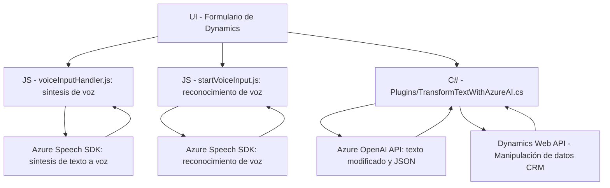

### Breve resumen técnico
El repositorio contiene varios módulos enfocados en la integración de una solución accesible y dinámica utilizando servicios de Azure, específicamente Speech SDK y OpenAI, combinados con el entorno de Microsoft Dynamics 365. Se implementan funcionalidades para mejorar la accesibilidad (voz), procesar datos de formularios, y extender capacidades de AI para la generación y manipulación de contenido estructurado.

---

### Descripción de arquitectura
La arquitectura general puede considerarse **n-capas** con elementos de integración externa. Las capas manejan las siguientes responsabilidades:
1. **Frontend**: Implementa interacción directa con el usuario, en este caso utilizando voz para entrada y salida de datos.
2. **API externa (Azure)**: Realiza procesamiento avanzado de texto (Speech SDK y OpenAI) conectándose con servicios de Azure.
3. **Lógica empresarial (CRM Dynamics)**: Plugins incorporados para manipular datos dentro del contexto de formularios en Dynamics 365.
4. **Persistencia**: Gestión de datos internos de CRM con servicios como `IOrganizationService`.

Esta arquitectura es modular y extensible, permitiendo ampliaciones futuras sin afectar los componentes existentes.

---

### Tecnologías usadas
1. **Frontend**:
   - **JavaScript**:
     - Integración dinámica del SDK de Azure Speech para síntesis de texto a voz y reconocimiento de voz.
     - Manejo de datos y formularios: `executionContext`, `formContext` (probable dependencia de Dynamics 365 frontend APIs).
2. **Backend**:
   - **C# Dynamics Plugins**:
     - Interfaz `IPlugin` que extiende la lógica de Dynamics CRM.
     - Uso de funciones de Azure OpenAI para generar contenido transformado.
   - **Azure Speech SDK**:
     - Servicios para procesamiento de entrada de voz y síntesis.
   - **Azure OpenAI API**:
     - Procesamiento de texto basándose en reglas y generación de JSON estructurado.
3. **Servicios**:
   - **Dynamics 365 Web API** (`Xrm.WebApi`): Para realizar operaciones sobre entidades y datos en el CRM.
   - **HTTPClient** y librerías JSON (`Newtonsoft.Json`) para manejar comunicación API.

#### Patrones aplicados
- **Lazy Loading**: Carga dinámica de dependencias (`Speech SDK`).
- **Facade**: Simplificación del acceso a la funcionalidad del SDK de Azure.
- **Modularidad**: Cada archivo representa módulos independientes.
- **Responsabilidad Única**: Métodos organizados según su propósito particular (lectura, síntesis, integración, etc.).

---

### Dependencias externas
1. **Servicios**:
   - Azure Speech SDK (URL: `https://aka.ms/csspeech/jsbrowserpackageraw`).
   - Azure OpenAI API (URL: `https://openai-netcore.openai.azure.com`).
2. **Framework Dynamics y librerías**:
   - Dynamics 365 Web API (`Xrm.WebApi`).
   - `Newtonsoft.Json.Linq` para manipulación JSON avanzada en C#.
3. **Entorno de ejecución**:
   - Dynamics 365 CRM para gestión de formularios y datos empresariales.

---

### Diagrama Mermaid

---

### Conclusión final
Este repositorio combina una solución **modular** basada en tecnologías de **Azure** y **Dynamics 365** para mejorar accesibilidad, interacción audible y manipulación de datos mediante inteligencia artificial. La arquitectura **n-capas** permite una separación clara entre las responsabilidades frontend (interacción de voz), servicios externos (Speech y OpenAI), y backend (CRM plugins). Esto facilita tanto la extensibilidad como la escalabilidad, ideal para entornos empresariales que priorizan accesibilidad y automatización avanzada.

