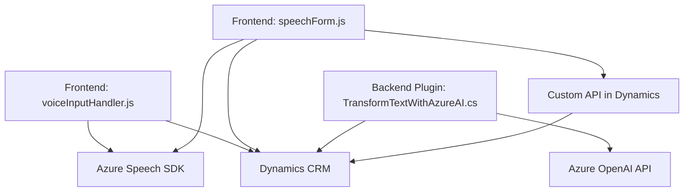

# Breve resumen técnico

El repositorio contiene una solución orientada a la integración de funcionalidades de voz e inteligencia artificial en el contexto de Dynamics 365 y CRM. Involucra tres componentes principales:
1. **Frontend (JavaScript):** Manejo de entrada y salida de voz mediante Azure Speech SDK con funciones de lectura de formularios y síntesis de voz.
2. **Backend Plugin (C#):** Plugin de Dynamics CRM para transformar texto mediante la API de Azure OpenAI (GPT-4).
3. **Custom API:** Interacción con una API definida en Dynamics para procesamiento y asignación de datos.

---

# Descripción de arquitectura

La solución tiene una **arquitectura híbrida**, combinando elementos de **arquitectura basada en eventos**, interacción con microservicios externos (APIs de Azure), y un **modelo cliente-servidor**. Dynamics actúa como un elo central para la lógica de negocio, mientras que los servicios en la nube amplían su funcionalidad.

1. **Frontend Modular (JavaScript):** Arquitectura basada en funciones bien segmentadas para interacción dinámica con formularios y servicios de voz, integrando SDK y APIs.
2. **Backend Plugin (C#):** Encapsula lógica específica de procesamiento en Dynamics CRM, delegando actividades complejas (transformaciones) a servicios como Azure OpenAI.
3. La integración combina patrones de carga dinámica, modularidad y extensibilidad para utilizar dependencias externas solo cuando sean necesarias.

---

# Tecnologías usadas

1. **Frontend:**
   - **Azure Speech SDK**: Para síntesis y reconocimiento de voz.
   - **JavaScript**: Base para manejar eventos y lógica del SDK.
   - **Dynamics 365 API**: Llamados para interacción con formularios.

2. **Backend Plugin (C#):**
   - **Azure OpenAI API**: Procesamiento de texto con GPT-4.
   - **Dynamics CRM SDK (`Microsoft.Xrm.Sdk`)**: Interacción y manipulación de datos CRM.
   - **.NET Libraries (HttpClient, Json):** Comunicación con servicios externos.

3. **Comunicación API:**
   - **HTTP Requests**: Llamados a APIs externas como Azure OpenAI y Dynamics Custom API.

4. **Patrones:**
   - Modularidad.
   - Encapsulación de lógica en funciones y métodos.
   - Dependencia dinámica (ejemplo: SDK de Azure Speech).

---

# Diagrama Mermaid compatible con GitHub Markdown

---

# Conclusión final

La solución presentada es un ejemplo bien estructurado de integración de tecnologías en un ecosistema corporativo orientado a Dynamics CRM. La combinación de módulos frontend, funciones de voz y plugins backend demuestra una arquitectura híbrida que escala además de ser flexible. Esta solución ilustra cómo integrar servicios de AI (Azure OpenAI y Speech) con un sistema CRM, aprovechando APIs y plugins en un flujo de gestión de datos eficaz.

- **Escalabilidad:** La arquitectura modular permite añadir nuevos microservicios o ampliar funcionalidades.
- **Optimización:** Integrando SDK de manera específica (carga dinámica), garantiza uso eficiente de recursos.
- **Simplicidad:** Aunque existen dependencias externas, la lógica está segmentada en componentes de fácil mantenimiento.