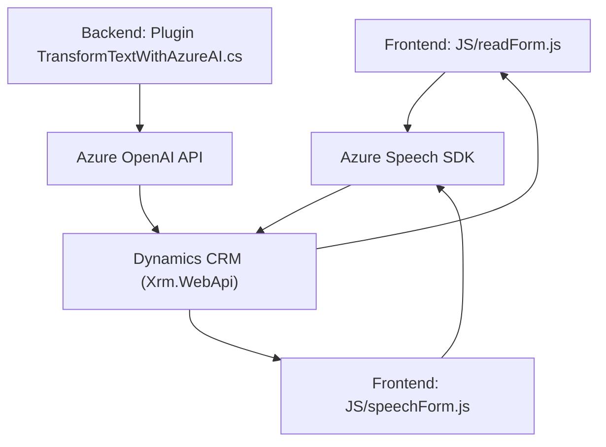

### Breve resumen técnico
El repositorio contiene tres archivos centrales que integran funcionalidades de procesamiento de voz, transformación de texto mediante Azure AI y flujos relacionados con formularios dinámicos dentro de Dynamics CRM. Cada componente está diseñado para utilizar servicios externos como **Azure Speech SDK** y **Azure OpenAI**, además de APIs internas proporcionadas por Dynamics 365. 

### Descripción de arquitectura
1. **Tipo de solución**  
   Es una aplicación híbrida centrada en la gestión de formularios dinámicos (frontend) y complementada con un plugin en el backend para procesamiento avanzado de texto. Integra servicios externos como APIs de voz y texto para extender las capacidades de Dynamics CRM. La arquitectura combina procesamiento en el cliente (frontend en JavaScript) y un plugin en el servidor (C#) como parte de la configuración de Dynamics.  

2. **Tipo de arquitectura**  
   La solución sigue el modelo de **arquitectura de capas (n-capas)**, dividida principalmente en:  
   - **Presentación:** Archivos **Frontend/JS** para interacción con usuarios y procesamiento de voz.  
   - **Aplicación:** Lógica empresarial del plugin **TransformTextWithAzureAI.cs** que gestiona llamadas asíncronas a Azure OpenAI.  
   - **Servicios:** Uso de APIs externas (Azure Speech SDK y OpenAI endpoint).  

3. **Patrones utilizados**  
   - **Patrón Observador**: Carga dinámica del Azure Speech SDK con `ensureSpeechSDKLoaded`.  
   - **Adaptadores**: Traducción de datos de entrada en objetos formateados para Dynamics CRM.  
   - **Plugin Pattern**: En el archivo C# para encapsular la lógica asociada a Dynamics.  

### Tecnologías usadas
- **Frontend:**  
  - Lenguaje: JavaScript.  
  - Librerías/frameworks: Azure Speech SDK, Web APIs de Dynamics CRM.  

- **Backend:**  
  - Lenguaje: C#.  
  - Frameworks: Dynamics CRM SDK (Microsoft.Xrm.Sdk).  
  - Servicios Rest: Microsoft Azure OpenAI (GPT-4).  

- **Dependencias externas:**  
  - Servicios API: Azure Speech SDK, Azure OpenAI endpoint.  
  - Utils: Newtonsoft.Json, System.Text.Json, System.Net.Http para manejo JSON y solicitudes HTTP.

---

### Diagrama Mermaid válido para GitHub

---

### Conclusión final
Esta solución proporciona un enfoque moderno para interactuar con formularios dinámicos mediante voz y transformación de texto hacia estructuras JSON inteligentes. La integración con Microsoft Dynamics CRM está bien estructurada, usando estándares de arquitectura n-capas para separar responsabilidades. Por último, la colaboración entre servicios externos como Azure Speech SDK y OpenAI permite una experiencia robusta con procesamiento avanzado y comunicación eficiente. Es ideal para soluciones empresariales que demandan integración de IA en aplicaciones CRM.