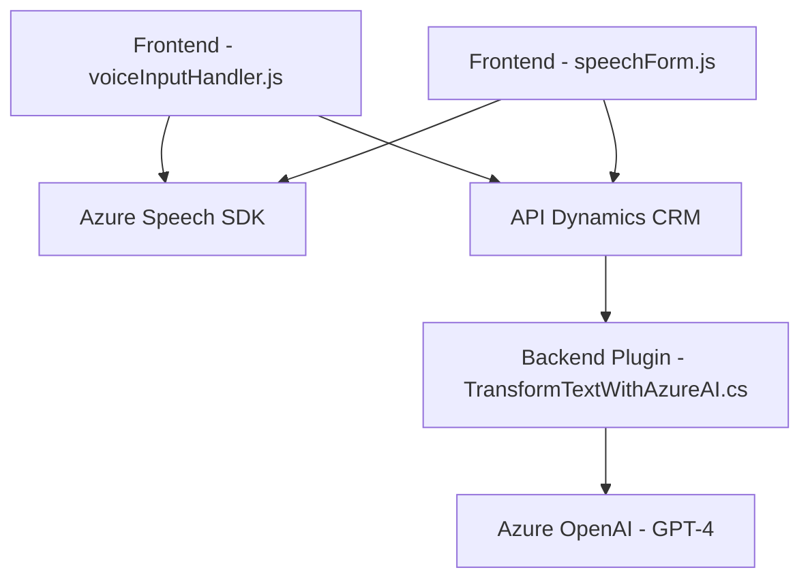

## Breve resumen técnico

La solución analizada consiste en una integración entre un frontend basado en JavaScript y Dynamics CRM utilizando un modelo de procesamiento de voz y texto en combinación con servicios de Azure Speech SDK y Azure OpenAI. El frontend comprende dos módulos para gestionar la entrada y síntesis de voz, así como para interactuar con APIs externas y el backend de Dynamics CRM. En el lado del servidor, se incluye un plugin de Dynamics CRM que ejecuta transformaciones inteligentes del texto mediante el modelo GPT-4 de Azure OpenAI.

---

## Descripción de arquitectura

La arquitectura observada puede clasificarse como **arquitectura en n capas**, con una clara separación entre los siguientes componentes:
1. **Frontend (JavaScript)**: Responsable de gestionar la entrada de voz, interactuar con el usuario y consumir servicios API para tareas inteligentes como el procesamiento de texto.
2. **Backend (Dynamics CRM Plugins)**: Responsable de conectar con servicios externos (como Azure OpenAI), realizar transformaciones mediante IA y estructurar los datos en JSON para el consumo del frontend.
3. **Servicios Externos**:
   - **Azure Speech SDK** para reconocimiento de voz y síntesis de texto en el frontend.
   - **Azure OpenAI (GPT-4)** para procesamiento y transformación avanzada del texto en el backend.

En términos de interacción, la solución es altamente dependiente de APIs externas (Azure) y de los servicios de Dynamics CRM.

---

## Tecnologías usadas

### **Frontend**
1. **Lenguaje:** JavaScript.
2. **Frameworks/Librerías/SDKs:**
   - Azure Speech SDK para reconocimiento de voz y síntesis de texto.  
   - Comunicación con Dynamics CRM usando APIs (e.g., XRM API).

### **Backend**
1. **Lenguaje:** C# (.NET).
2. **Frameworks/Librerías/SDKs:**
   - Microsoft Dynamics CRM SDK (`Microsoft.Xrm.Sdk`, `IPluginExecutionContext`, etc.)
   - Azure OpenAI API (GPT-4).
   - Newtonsoft.Json para manipulación JSON.
   - System.Net.Http para integrar APIs externas.

### **Patrones de diseño**
1. Modularidad: Separación clara de la lógica en funciones específicas con roles bien definidos.
2. Factory Pattern: Configuración y construcción de objetos de servicio (SpeechConfig, AudioConfig) siguiendo patrones estándar.
3. Plugin Pattern: Uso del modelo de ejecución de plugin en Dynamics CRM.
4. External API Wrapper: Encapsulación de la lógica de interacción con APIs externas (Azure Speech y OpenAI).

---

## Diagrama Mermaid válido para GitHub

---

## Conclusión final

Este repositorio representa una **integración inteligente entre APIs para la interacción humano-computadora**, con una arquitectura en n capas que distribuye la lógica a lo largo de un frontend, un backend en Dynamics CRM, y servicios externos de Azure. El fuerte enfoque en la modularidad y la integración con servicios escalables como Azure Speech SDK y OpenAI lo hace una solución extensible y eficiente.

Sin embargo, la inclusión directa de valores de configuración sensibles (como claves y URLs de las APIs) dentro del código fuente podría ocasionar problemas de seguridad y debería ser motivo de mejora. Se recomienda utilizar **Azure Key Vault** o soluciones similares para gestionar las configuraciones sensibles.