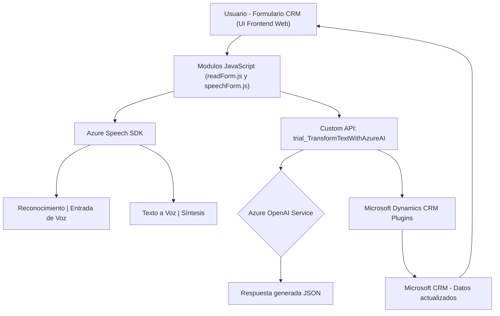

### Breve resumen técnico:
El repositorio representa un sistema construido sobre una integración entre un frontend y una solución de Microsoft Dynamics CRM. Los componentes principales del sistema posibilitan la interacción basada en voz y texto, con soporte de dos servicios externos: **Azure Speech SDK** para la conversión de texto a voz y reconocimiento de voz, y **Azure OpenAI** para la generación y estructuración de texto mediante inteligencia artificial (GPT-4). Además, el sistema utiliza plugins personalizados en Dynamics CRM para manejar eventos y extender su funcionalidad.

---

### Descripción de arquitectura:

Este sistema utiliza una **arquitectura en n capas** con integración de servicios externos. Las tres componentes principales son:
1. **Cliente frontend**: JavaScript y HTML en el navegador para capturar la entrada de voz y manejar datos del formulario.
2. **Custom API y Azure Speech SDK**: La API de Azure OpenAI es utilizada desde el plugin del CRM o el frontend para el procesamiento de texto, mientras que Azure Speech SDK se encarga de la conversión de texto a voz y reconocimiento de voz en tiempo real.
3. **Microsoft Dynamics CRM Plugins**: Extensiones que trabajan como intermediarios entre los datos del CRM y el servicio de Azure OpenAI.

La solución también puede ser considerada una forma de **Distributed System**, con el cliente y las capacidades de procesamiento detrás de APIs SaaS (Software-as-a-Service). 

---

### Tecnologías usadas:
- **Frontend**:
  - **JavaScript/ES6**: Principal lenguaje de programación que implementa la lógica de negocio del cliente.
  - **Azure Speech SDK**: Reconocimiento de texto y síntesis de voz, integrado dinámicamente desde un CDN.

- **CRM-backend**:
  - **Microsoft Dynamics SDK**: Framework para la gestión y ampliación de soluciones CRM.
  - **Azure OpenAI Service (GPT-4)**: Realización de solicitudes HTTP POST para transformaciones inteligentes de texto.

- **Complementos y herramientas**:
  - **JSON (System.Text.Json / Newtonsoft.Json)**: Manejo de datos JSON estructurado en el backend y frontend.
  - **System.Net.Http**: Realiza las solicitudes a APIs externas.

---

### Diagrama Mermaid válido para GitHub:
Este diagrama representa la interacción entre los componentes clave.

---

### Conclusión final:
Este proyecto implementa una solución híbrida basada en **n capas** y arquitectura orientada a servicios, que interconecta un frontend JavaScript con un backend CRM extensible mediante plugins en **Microsoft Dynamics**. Utiliza como dependencias el **Azure Speech SDK** y el **Azure OpenAI Service** para realizar la conversión de voz en texto y la generación de textos estructurados. 

El código está construido con separación adecuada de responsabilidades mediante funciones específicas para cada tarea (e.g., síntesis de voz, lectura/escritura de formularios, interacción con APIs externas). Su diseño modular y uso de tecnologías SaaS facilita la escalabilidad y mantenimiento del sistema.