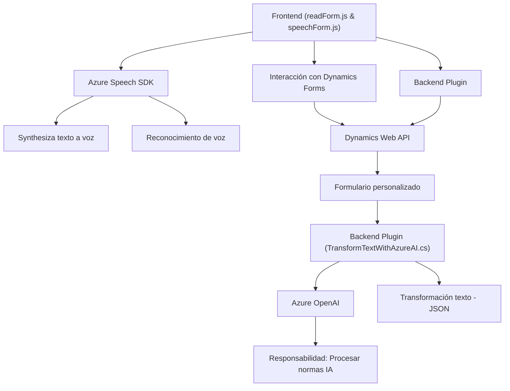

### Breve Resumen Técnico
El repositorio analiza tres archivos que forman parte de un sistema integrado para Microsoft Dynamics 365 con funcionalidades avanzadas de voz, reconocimiento, y procesamiento de datos utilizando servicios de inteligencia artificial y SDKs externos.

1. `readForm.js` y `speechForm.js`: Scripts frontend escritos en JavaScript que trabajan con el Azure Speech SDK para síntesis y reconocimiento de voz, integrándose con formularios y datos de Dynamics 365.
2. `TransformTextWithAzureAI.cs`: Un plugin en C# que extiende la funcionalidad de Dynamics CRM al procesar texto con Azure OpenAI, transformando entradas en respuestas estructuradas para el CRM.

---

### Descripción de Arquitectura
El sistema se basa en un **modelo n-capas y cliente-servidor**:
- **Frontend**: Scripts que habilitan el reconocimiento de voz y la síntesis de texto en un entorno de formularios Dynamics 365.
- **Backend**: Plugin que transforma texto mediante Azure AI y devuelve respuestas procesables como JSON estructurado.
- **Servicios externos**: Azure Speech SDK para voz y Azure OpenAI para procesamiento AI.

La arquitectura se encuentra entre un **modelo n-capas** para estructurar la interacción entre cliente-servidor y una integración orientada a eventos.

---

### Tecnologías, Frameworks y Patrones Usados
1. **Frontend**:
   - **JavaScript** para funcionalidades de síntesis y reconocimiento de voz.
   - **Azure Speech SDK** para interacción con los servicios de habla y texto.
   - **Dynamics 365 esqueleto** para lectura y escritura sobre formularios personalizados.

2. **Backend**:
   - **C#** para desarrollo del plugin que extiende Dynamics CRM.
   - **Azure OpenAI** como servicio externo para procesamiento de texto.
   - **HTTPClient y JSON Parsing** para comunicación REST y manejo de objetos.
   - **Newtonsoft.Json** para trabajar con datos JSON en el plugin.

3. **Patrones de Diseño y Arquitectura**:
   - **Adaptador**: Integración específica de SDKs (Azure SDKs y Dynamics API).
   - **Responsabilidad Única**: Scripts y plugins focalizados en tareas específicas.
   - **Flujos basados en eventos**: Uso de callbacks en la carga del SDK y acciones del plugin.
   - **Factory**: Generación de mapas y asociaciones dinámicas como parte del flujo de reconocimiento de voz.
   - **Delegate Loader**: Evita dependencias estáticas cargando SDKs dinámicamente.

---

### Dependencias o Componentes Externos
- **Azure Speech SDK**: Utilizado tanto para conversión de texto a voz como para reconocimiento de audio.
- **Azure OpenAI**: Llamadas REST para transformar texto según IA semántica.
- **Microsoft Dynamics CRM API**: Utilización del modelo de entidades, atributos y custom APIs específicas de Dynamics.
- **Newtonsoft.Json**: Manipulación avanzada de datos JSON en plugins.
- **System.Text.Json y System.Net.Http**: Comunicación y manejo de respuestas HTTP para interacciones REST.
- **Dynamics Web API**: Para realizar CRUD en entidades de Dynamics 365.

---

### Diagrama Mermaid

---

### Conclusión Final
Este repositorio implementa una solución **integrada para Dynamics 365** que mejora la experiencia de usuario a través de herramientas avanzadas de interacción por voz (speech SDK) y procesamiento automatizado de texto (Azure OpenAI). La aplicación está estructurada en un modelo híbrido entre **cliente-servidor en n-capas** y patrones de integración modular con servicios externos. La combinación de frontend/scripts y plugins backend permite una adaptación eficiente a diferentes entornos empresariales orientados a CRM.