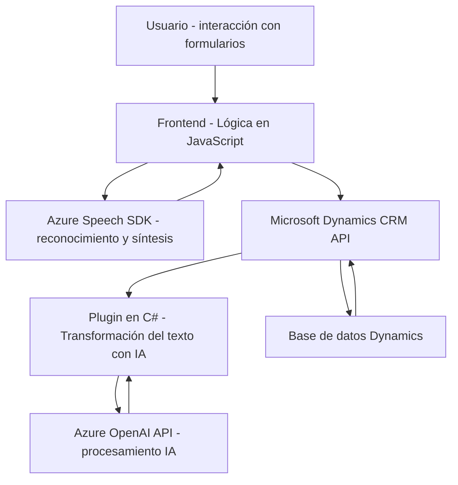

### Análisis del repositorio

El repositorio contiene múltiples archivos asociados al manejo de formularios con inputs por voz, procesamiento de texto mediante inteligencia artificial y plugins extendidos para Microsoft Dynamics 365. A continuación el análisis detallado.

---

### Breve resumen técnico:
La solución trata de integrar funcionalidades avanzadas de reconocimiento de voz, generación de voz y manejo de inteligencia artificial (IA) con Microsoft Dynamics 365. Esto se logra mediante el uso de **Azure Speech SDK** para reconocimiento y síntesis de voz, además de un plugin en **C#** que utiliza **Azure OpenAI API** de manera externa.

---

### Descripción de arquitectura:
1. **Arquitectura de n capas**:  
   El diseño plantea una separación por capas:
   - **Frontend** (JavaScript): Captura y procesamiento de datos del formulario. Lógica de cliente.
   - **Negocio y procesamiento**:
     - JavaScript: Procesamiento de transcripciones (formato simple o JSON) y actualización dinámica de datos en el formulario.
     - Plugin en C#: Extensión de Dynamics mediante reglas específicas.
   - **Servicios externos** (Microsoft Dynamics API y Azure Speech/OpenAI SDK): Integración de APIs externas para reconocimiento de voz y procesamiento de texto.  

   La relación entre las capas asegura independencia funcional pero una implementación acoplada.  

2. **Patrón modular**:
   Cada componente está diseñado modularmente, desde funciones en **JavaScript** desacopladas y centradas en propósitos definidos, hasta la implementación basada en plugins de Dynamics.

3. **Dependencia fuerte de servicios externos**:
   La solución depende directamente de **Azure Speech SDK**, **Azure OpenAI API**, y **Microsoft Dynamics Web API**. La arquitectura asume conectividad constante con las nubes de Microsoft.

---

### Tecnologías usadas:
1. **JavaScript**:
   - Aplicado en el frontend para interacción con formularios.
   - Frameworks: Ninguno aparente, uso nativo de DOM y ES6 (promises, funciones asíncronas).
   - Uso de Azure Speech SDK para síntesis y reconocimiento de voz (`https://aka.ms/csspeech/jsbrowserpackageraw`).

2. **C# (.NET)**:
   - Extensión basada en el patrón plugin (`IPlugin`) dentro de Dynamics 365.
   - Librerías adicionales: Newtonsoft.Json para manejo avanzado de datos JSON.

3. **Servicios de Microsoft**:
   - Dynamics 365 API: Manipulación y actualización de formularios en tiempo real.
   - Azure Speech SDK: Reconocimiento y síntesis de voz.
   - Azure OpenAI API: Procesamiento de texto con modelos como GPT.

4. **Patrones usados**:
   - **Estructura modular de funciones**: Generalmente usadas en el frontend para desacoplar la lógica.
   - **Gestión asíncrona**: Uso de promesas y callbacks tanto para SDKs como APIs externas (Speech SDK y OpenAI).
   - **Integración API externa**: Plugins dinámicos que consumen servicios externos como Azure OpenAI.

---

### Dependencias o componentes externos:
1. **Dependencias de frontend**:
   - **Azure Speech SDK**: Cargado dinámicamente desde un CDN.
   - **Dynamics 365 Web API**: Uso en transcripción y actualización de formularios.

2. **Dependencias de backend**:
   - **Microsoft Dynamics SDK**: Uso estándar de CRM SDK para plugins.
   - **HTTP libraries**: Comunicación con Azure OpenAI para procesamiento IA.
   - **Newtonsoft.Json**: Procesamiento JSON avanzado en el plugin.

3. **Servicios Externos**:
   - SDK dinámicos como Azure Speech.
   - APIs específicas como Azure OpenAI (`chat/completions`).

---

### Diagrama Mermaid válido para GitHub:

---

### Conclusión final:
La solución integra tres componentes principales: flujo de datos basado en voz (frontend), procesamiento dinámico de formularios (negocio) y transformación avanzada con IA (plugin en backend). Gracias al uso de las APIs de Microsoft (Dynamics API, Speech SDK y OpenAI), se aprovechan múltiples servicios avanzados para accesibilidad y generación de contenido dinámico.  

Sin embargo, el diseño se encuentra altamente acoplado a servicios externos y depende de la conectividad con la nube. Además, podría beneficiarse en escalabilidad si se trabajara bajo un enfoque con arquitectura hexagonal o microservicios que desacoplen las responsabilidades.