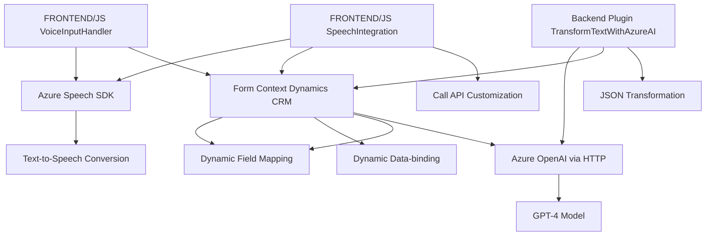

### Breve Resumen Técnico
El repositorio contiene archivos que implementan una solución para integrar reconocimiento de voz con formularios dinámicos en Microsoft Dynamics CRM (en el frontend) y un plugin que usa Azure OpenAI para transformar texto ingresado en el backend de Dynamics CRM. La solución combina tecnologías y servicios de Microsoft Azure para habilitar una integración avanzada basada en IA y reconocimiento de voz.

---

### Descripción de la Arquitectura
1. **Tipo de solución**: 
   - Una integración modular para Microsoft Dynamics CRM con capacidades de reconocimiento de voz (frontend) y un plugin que utiliza inteligencia artificial (backend).
   - Los archivos "Frontend/JS/*" corresponden a funcionalidades habilitadas por JavaScript que interactúan con formularios y Azure Speech SDK.
   - El archivo "Plugins/TransformTextWithAzureAI.cs" ejecuta una lógica backend basada en Dynamics CRM y Azure OpenAI con estructura de plugin.

2. **Tecnologías usadas**:
   - **Frontend**:
     - JavaScript.
     - Azure Speech SDK para reconocimiento de voz y síntesis de texto a voz.
     - Microsoft Dynamics CRM para gestión de formularios y datos.
   - **Backend**:
     - Microsoft Dynamics CRM (C# / Microsoft Xrm SDK).
     - Azure OpenAI Service (GPT-4) para procesamiento de texto con IA.

3. **Patrones utilizados**:
   - Frontend:
     - **Dynamic Lazy-Loading**: SDK cargado dinámicamente cuando se necesita, optimizando el rendimiento.
     - **Encapsulación**: Separación de responsabilidades con modularidad basada en funciones.
     - **Event-driven programming**: Respuesta a eventos provenientes del usuario (e.g. reconocimiento de voz, acciones de interfaz).
   - Backend:
     - **Plugin-Based Architecture**: Extendibilidad de Dynamics CRM mediante la interfaz de `IPlugin`.
     - **Repository Pattern**: Uso del servicio `IOrganizationService` para interactuar con el CRM en el backend.
     - **Gateway Pattern**: Comunicación mediante HTTP con servicios externos (Azure OpenAI API).

4. **Arquitectura Global**:
   - **Distribuida por capas**:
     - **Frontend**: JavaScript accede a servicios de reconocimiento y síntesis a través del navegador y gestiona la interacción con Dynamics CRM.
     - **Backend**: Plugins de CRM (c#/.NET) realizan transformación y comunicación con Azure API.
   - **Propósito híbrido**:
     - Reconocimiento/síntesis de voz y procesamiento de texto (Frontend).
     - Aplicación de lógica empresarial y transformación de texto en el backend (Plugin Dynamics CRM).

---

### Tecnologías Usadas
- **Frontend**:
  - Microsoft Azure Speech SDK.
  - JavaScript, compatible con entornos que soportan Dynamics CRM.
- **Backend**:
  - C# con Microsoft Xrm SDK para desarrollo de plugins de Dynamics CRM.
  - HTTP API para comunicación con Azure OpenAI GPT-4.

---

### Diagrama Mermaid (GitHub Markdown Compatible)

---

### Conclusión Final
La solución es una arquitectura híbrida diseñada para la integración avanzada con Microsoft Dynamics CRM. Combina tecnologías de Azure, como Speech SDK y OpenAI, con una lógica de integración contextual para optimizar la interacción entre formularios y comandos de usuario basados en voz o texto. Su estructura modular proporciona un diseño eficiente y escalable para aplicaciones CRM modernas, donde la IA y el reconocimiento de voz desempeñan un rol central en la interacción usuario-sistema. Sin embargo, la dependencia directa de Azure para ambos componentes externos indica una vinculación fuerte al ecosistema de Microsoft, lo que puede ser una limitación en entornos fuera de la nube de Azure.