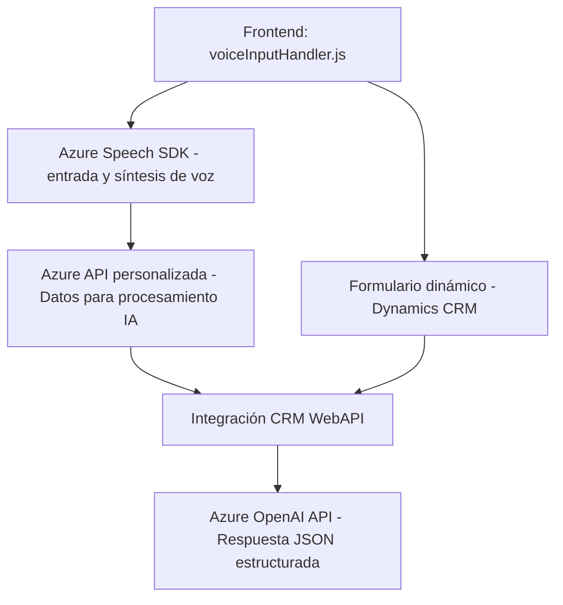

### Resumen técnico
Analizando la estructura de los archivos y sus funcionalidades descritas, la solución implementa una **herramienta de interacción de un formulario dinámico**, que usa features de voz y texto con servicios de **Azure Speech SDK** y **Azure OpenAI API**. Los módulos **JS** trabajan en el frontend para gestionar la UI y realizar llamadas a servicios de síntesis y transcripción, mientras que el plugin **C#** extiende un sistema CRM (como Dynamics) para aplicar AI en la transformación de texto.

---

### Descripción de arquitectura
La solución presenta una arquitectura híbrida con tres capas principales:
1. **Capa de Interfaz (Frontend):**
   - Scripts JS que interactúan con el entorno del formulario (Dynamics CRM o similar).
   - Gestión de entrada y salida de voz/texto con Azure Speech SDK, y validación de datos.

2. **Capa del Backend (CRM Plugins):**
   - Los plugins desarrollados en C# para Dynamics CRM amplían capacidades del sistema utilizando Azure OpenAI API.
   - Actúan como intermediarios para transformar datos en formatos útiles.

3. **Capa de Servicios Externos:**
   - Uso conectado de Azure Speech SDK para entrada/salida de voz y Azure OpenAI para IA avanzada.

La arquitectura puede verse como una **solución n-capas** con integración de servicios externos y uso del concepto de **event-driven architecture** para la interacción entre frontend, backend CRM y APIs externas.

### Tecnologías y patrones usados
1. **Frontend:**
   - **HTML/JavaScript**: Interacción con interfaces de formulario y típico manejo de eventos en UI.
   - **Azure Speech SDK**: Utilizado para síntesis de voz y reconocimiento de audio.
   - **Dynamic Web API (Xrm)**: Para integrar funcionalidades REST en el entorno CRM.
2. **Backend:**
   - **Microsoft Dynamics CRM plugins (C#)**: Extendiendo capacidades internas del CRM.
   - **Azure OpenAI API**: Transformación de texto a través de Machine Learning y servicios en la nube.
3. **Patrones:**
   - **Fachada**: Para el encapsulamiento de la lógica en funciones reutilizables (p.ej. `applyValueToField`).
   - **Event-driven Architecture**: Uso de callbacks para realizar tareas bajo la carga asincrónica del SDK y la interacción directa con servicios de API externa.
   - **Separation of Concerns**: Modularización tanto en el backend (plugin) como frontend (JavaScript).

---

### Componentes externos y dependencias
1. **Azure Speech SDK**: Sintetizar texto y transcribir audio en el frontend.
2. **Azure OpenAI API**: Procesamiento de texto en el backend.
3. **Microsoft Dynamics CRM API**: Plugins integrados para extender el entorno CRM y gestionar datos.
4. **System.Net.Http y Newtonsoft.Json**: Biblioteca estándar para solicitudes HTTP y manejo de JSON en C#.
5. **Dynamic Web API (Xrm)**: Interacción entre la UI, CRM y APIs REST personalizadas para el manejo de datos y entidades.

---

### Diagrama **Mermaid** compatible con GitHub Markdown

---

### Conclusión final
Este repositorio proporciona una solución integral que utiliza tecnologías modernas para mejorar interacción y accesibilidad mediante la integración de voz, texto y AI. La arquitectura es apropiada para sistemas basados en la nube y orientados hacia plataformas CRM. Es una solución de **n-capas** con una clara separación de responsabilidades, facilitando la escalabilidad y el mantenimiento en aplicaciones más grandes. Aunque la dependencia principal de Azure podría limitar su portabilidad fuera de la nube de Microsoft, ofrece una integración sólida en entornos empresariales como Dynamics CRM.