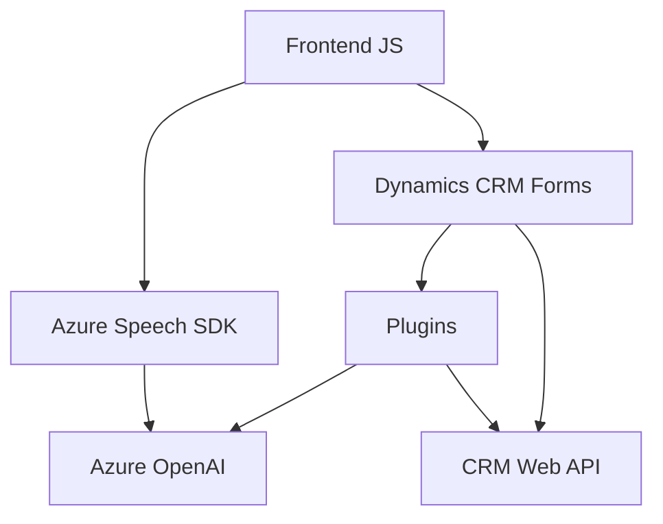

### Breve resumen técnico
El repositorio analiza diversas integraciones entre front-end (JavaScript), Dynamics CRM y servicios de Azure, creando una solución basada en reconocimiento de voz, síntesis de texto a voz y procesamiento de texto con inteligencia artificial. Los archivos presentan funcionalidades modulares que trabajan en conjunto para ofrecer una experiencia conectada y personalizada dentro del ecosistema de Dynamics CRM.

---

### Descripción de la arquitectura
La solución sigue una **arquitectura de n capas**, dividiendo las responsabilidades en:
1. **Capa de presentación (Frontend)**:
   - `readForm.js` y `speechForm.js` interactúan con el usuario mediante reconocimiento de voz, síntesis de texto a voz, y captura de datos desde formularios CRM.
2. **Capa de negocio**:
   - El archivo `TransformTextWithAzureAI.cs` actúa como una capa intermedia donde se procesan datos y se conectan a servicios externos como Azure OpenAI.
3. **Capa de integración**:
   - Conexión directa con APIs externas: Azure Speech SDK (reconocimiento y síntesis de voz) y Azure OpenAI (transformación de texto).
4. **Capa de datos**:
   - Manejo de datos provenientes de Dynamics 365 CRM, incluidas entradas y valores manipulados directamente en los formularios.

---

### Tecnologías usadas
- **Frontend (JavaScript)**:
  - Operaciones con DOM.
  - Integración dinámica de servicios web como `Azure Speech SDK`.
- **Dynamics CRM (Plugins)**:
  - Manipulación de formularios mediante el SDK `Microsoft.Xrm.Sdk`.
  - Plugins personalizados integrados como extensiones con la arquitectura de Dynamics.
- **Servicios externos de Azure**:
  - Azure OpenAI Service para procesamiento de texto.
  - Azure Speech SDK para reconocimiento y síntesis de voz.
- **Frameworks y librerías externos**:
  - `System.Net.Http` para realizar solicitudes HTTP.
  - `Newtonsoft.Json.Linq` para manipulación de JSON.
  - `System.Text.Json` para serialización y deserialización.

---

### Diagrama **Mermaid**
A continuación, se presenta un diagrama que ilustra cómo se interconectan las capas y componentes.

---

### Conclusión final
La solución es una implementación integrada que utiliza un **patrón de arquitectura de n capas**, conectando múltiples componentes: frontend dinámico en JavaScript, lógica de negocios en Dynamics CRM Plugins, y servicios externos de Azure (Speech SDK y OpenAI). Este enfoque modular resulta eficaz para aplicaciones empresariales, permitiendo flexibilidad y la incorporación de inteligencia artificial para mejorar la experiencia del usuario.

Áreas de mejora podrían incluir una estrategia más robusta de seguridad para gestionar datos sensibles (por ejemplo, claves de acceso y configuración de servicios externos), además de una posible abstracción para gestionar dependencias con menor acoplamiento.