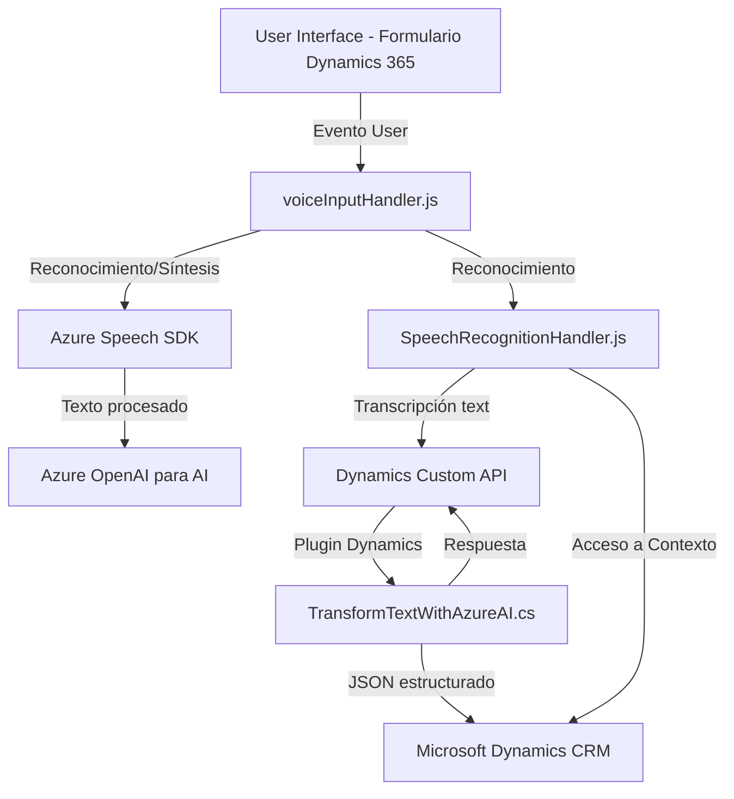

### Breve resumen técnico:

El repositorio describe elementos de un ecosistema híbrido entre frontend, backend y servicios alojados en la nube. Los archivos analizados implementan una solución que integra **Azure Speech SDK**, **Azure OpenAI**, y **Dynamics 365 CRM**. Esto indica que la solución ofrece funcionalidades para el reconocimiento y síntesis de voz, además de transformación avanzada de datos enriquecidos mediante inteligencia artificial.

### Descripción de arquitectura:

La arquitectura del repositorio utiliza una combinación de enfoques:
1. **Arquitectura de Microservicios**: Integración con servicios externos como Azure Speech SDK y Azure OpenAI para procesamiento de voz y transformación de texto.
2. **Capas n-tier**: Relación entre frontend (JavaScript para reconocimiento/síntesis de voz), respaldo API REST con plugins en Dynamics 365, y servicios cloud.
3. Uso de **Azure Platforms** fomenta un diseño descentralizado (backends separados para procesamiento de IA y lógica CRM).

### Tecnologías usadas:

1. **Frontend:**  
   - **JavaScript**: Para manejar reconocimiento de voz, síntesis de texto a voz, y procesamiento dinámico en el navegador.  
   - **Azure Speech SDK**: Carga dinámica del SDK desde una fuente externa para funcionalidad relacionada con voz (syntheses y recognition).  

2. **Backend:**  
   - **C#**: Utilizado para implementar plugins en Dynamics 365 CRM.  
   - **Microsoft Dynamics CRM SDK**: Facilita la integración y personalización de los formularios y datos en Dynamics.  
   - **Azure OpenAI**: Procesamiento avanzado basado en inteligencia artificial.  

3. **Dependencias externas:**  
   - **Azure Speech SDK**: Biblioteca de JavaScript dinámica para reconocimiento de entrada de voz.  
   - **Azure OpenAI**: Endpoint para procesamiento de texto y respuesta en formato JSON.  
   - **Microsoft Dynamics CRM**: Se conecta como núcleo del negocio para manipular formularios y datos vinculados al procesamiento.  
   - **Newtonsoft.Json / System.Text.Json**: Para serialización/estructuración de datos JSON en el código backend.

### Diagrama Mermaid válido para GitHub:

### Conclusión final:

La solución descrita en el repositorio se centra en la integración entre capacidades avanzadas como reconocimiento y síntesis de voz, transformación de texto mediante inteligencia artificial, y manipulación de formularios en un CRM empresarial. La arquitectura está diseñada como un ecosistema descentralizado basado en **microservicios** con servicios en la nube siempre dependientes de componentes externos como **Azure Speech SDK** y **Azure OpenAI**. Sin embargo, hay indicios también de elementos monolíticos (en el plugin) y patrones como **Adapter** y **Lazy Loading**, lo que fortalece su modularidad y escalabilidad. Este enfoque es ideal para entornos empresariales que requieren automatización de decisiones y captura de datos mediante IA.