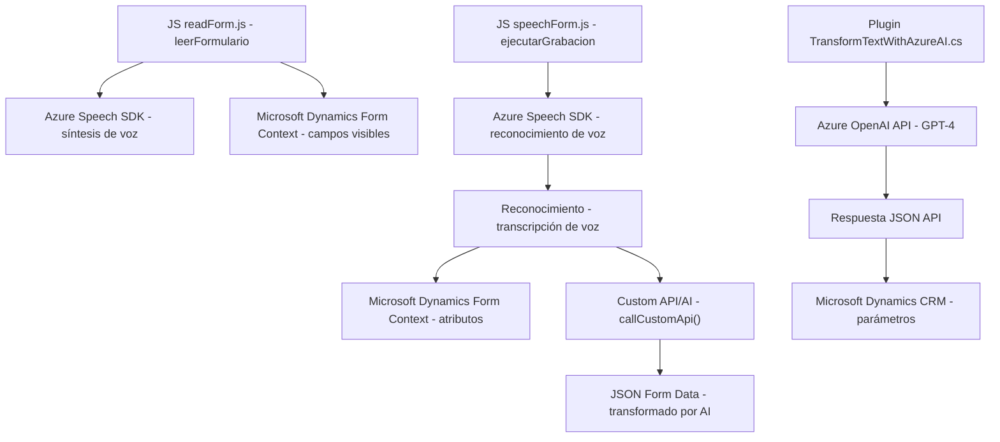

### Breve resumen técnico
El repositorio contiene tres principales módulos relacionados con la integración de dos tecnologías principales: Microsoft Dynamics CRM y servicios en la nube de Azure. La solución parece ser una mezcla de frontend y backend, con lógica orientada a mejorar la interacción con formularios utilizando tecnologías de reconocimiento y síntesis de voz (Azure Speech SDK), además de inteligencia artificial (Azure OpenAI GPT-4).

### Descripción de arquitectura
1. Con base en la estructura y finalidad de los archivos:
   - **Frontend/JS/readForm.js** y **Frontend/JS/speechForm.js**: Están enfocados en ejecución dentro de entornos web y probablemente están destinados a extender la funcionalidad de formularios en una aplicación Dynamics 365.
   - **Plugins/TransformTextWithAzureAI.cs**: Es parte del backend y ejecuta lógica dentro del Plugin Framework de Dynamics CRM. Este se conecta directamente con el servicio Azure OpenAI para realizar transformaciones de texto.

2. **Tipo de arquitectura:**
   - **Híbrida entre N capas y desacoplamiento a través de servicios externos:** La solución integra la arquitectura de Microsoft Dynamics CRM que es típicamente n-capas (donde frontend y backend se conectan mediante APIs y servicios), pero delega funciones específicas a servicios externos como Azure Speech y Azure OpenAI para manejar tareas avanzadas como síntesis y reconocimiento de voz.

3. **Flujo arquitectónico:**
   - Los archivos de la carpeta `FRONTEND/JS` interactúan directamente con el DOM del navegador y cargan dinámicamente servicios externos (como el Azure Speech SDK) en un enfoque centrado en eventos.
   - Las funcionalidades del formulario en Dynamics CRM se extienden con un plugin específico (escrito en C#), que se integra con el servicio de inteligencia artificial Azure OpenAI para transformar texto.

### Tecnologías usadas
1. **Frontend:**
   - JavaScript (incluye ES6 y modularización).
   - Azure Speech SDK (para síntesis y reconocimiento de voz).
   - Microsoft Dynamics APIs (`Xrm.WebApi`).

2. **Backend:**
   - C# con .NET Framework (Dynamics CRM plugin).
   - Azure OpenAI (GPT-4 API vía HTTP/HTTPS request).
   - Microsoft.Xrm.Sdk para interactuar con Dynamics entities.
   - System.Net.Http para comunicación con servicios web externos.
   - Newtonsoft.Json.Linq para manipulación de JSON.

3. **Patrones:**
   - **Callback managing pattern:** Para gestionar eventos asíncronos, como la carga del SDK y el procesamiento de voz.
   - **Plugin Framework:** Estándar aplicado al desarrollo en Microsoft Dynamics para capturar eventos y extender la funcionalidad.
   - **Microservice Integration:** Uso de servicios de terceros como Azure Speech SDK y Azure OpenAI para funcionalidades específicas.
   - **Modular Design:** Cada archivo organiza funcionalidades relacionadas dentro de funciones internas.

### Diagrama Mermaid válido para GitHub
El siguiente diagrama representa el flujo general de interacción en el repositorio descrito.

### Conclusión final
Este repositorio muestra una solución robusta que combina extensiones de frontend en Microsoft Dynamics con la potencia de servicios en la nube de Azure, específicamente Azure Speech SDK y Azure OpenAI. La arquitectura es mayormente de n-capas, pero con integración a servicios externos, lo que la convierte en una solución híbrida de manera parcial. Si bien no utiliza microservicios, delega tareas críticas como reconocimiento de voz y procesamiento de texto a APIs dedicadas; todo esto orquestado en un esquema modular y extensible mediante el framework y patrones de Dynamics CRM y Azure.