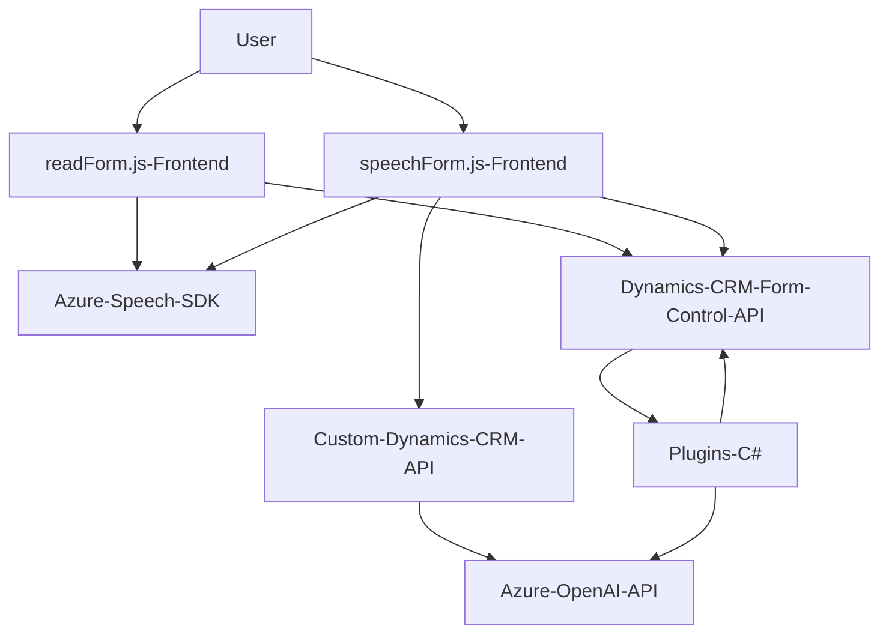

### Breve resumen técnico

El conjunto de archivos y sus respectivas funcionalidades está orientado hacia una solución integral que procesa formularios dinámicos, utilizando reconocimiento de voz y servicios externos de inteligencia artificial, como **Azure Speech SDK** y **Azure OpenAI API**. La solución se integra profundamente dentro de **Dynamics CRM** para realizar tareas específicas como el mapeo de valores transcritos hacia campos de formulario y la transformación de texto en estructuras avanzadas mediante AI.

---

### Descripción de arquitectura

#### Tipo de solución
La solución parece ser un **monolito funcional**, dividido en capas que combinan:
- **Capa de presentación** (interacción con el usuario, reconocimiento de voz y síntesis de voz en frontend).
- **Capa de lógica de negocio** (plugins personalizados para manejar la interacción entre Dynamics CRM y Azure AI, especialmente en la transformación del texto).
- **Servicios externos** (consumo del SDK de Azure Speech para reconocimiento y síntesis de voz; y Azure OpenAI para procesamiento semántico avanzado).

#### Tipos de arquitectura implementada
1. **Arquitectura orientada a eventos**: Los plugins actúan cuando se disparan eventos dentro del CRM.
2. **Modelo de capas (N-Tiers)**:
   - **Frontend (JS archivos)**: Encapsulación de las interacciones del usuario y el mapeo de datos.
   - **Backend (Plugins en C#)**: Mapeo entre datos dinámicos y procesamiento de texto mediante reglas definidas en AI.
3. **Microfrontend**: Los archivos parecen ser parte de una solución microfrontend en Dynamics CRM, donde cada uno se encarga de resolver tareas específicas.

---

### Tecnologías usadas

1. **Dinámicas generales:**
   - **Dynamics CRM**:
     - Gestión de objetos de formulario (atributos, contexto).
     - API personalizada siguiendo el estándar `Xrm.WebApi`.
   - **SDK externo**:
     - `Azure Speech SDK` para síntesis y reconocimiento de voz.
     - `Azure OpenAI API` para procesamiento semántico avanzado del texto.
2. **Lenguajes y frameworks**:
   - **Frontend**:
     - JavaScript para interacción dinámica con el formulario.
   - **Backend**:
     - C# (Plugins basados en `IPlugin`) para lógica de negocio en Dynamics CRM.
   - Serialización: `Newtonsoft.Json` y `System.Text.Json` para JSON parsing.
3. **Patrones**:
   - **Manejo asíncrono**: Uso de Promises en JavaScript; comunicación HTTP en C#.
   - **Gestión modular**: Separación lógica por componentes (reconocimiento de voz, síntesis, procesamiento IA).

---

### Diagrama Mermaid válido para GitHub

---

### Conclusión final

La solución es una integración avanzada entre frontend y backend diseñada para:
- Proveer una experiencia de usuario interactiva basada en reconocimiento de voz (usando **Azure Speech SDK**).
- Realizar la transformación de datos de entrada a través de servicios de inteligencia artificial (**Azure OpenAI API**).
- Integrarse con sistemas empresariales complejos como **Dynamics CRM** para aplicaciones específicas como formularios dinámicos y mapeo inteligente.

Esta arquitectura es capaz de manejar flujos dinámicos de información, adaptándose a diferentes tipos de entrada del usuario y posicionándose como una solución de alto nivel para mejorar la productividad en entornos empresariales. #####