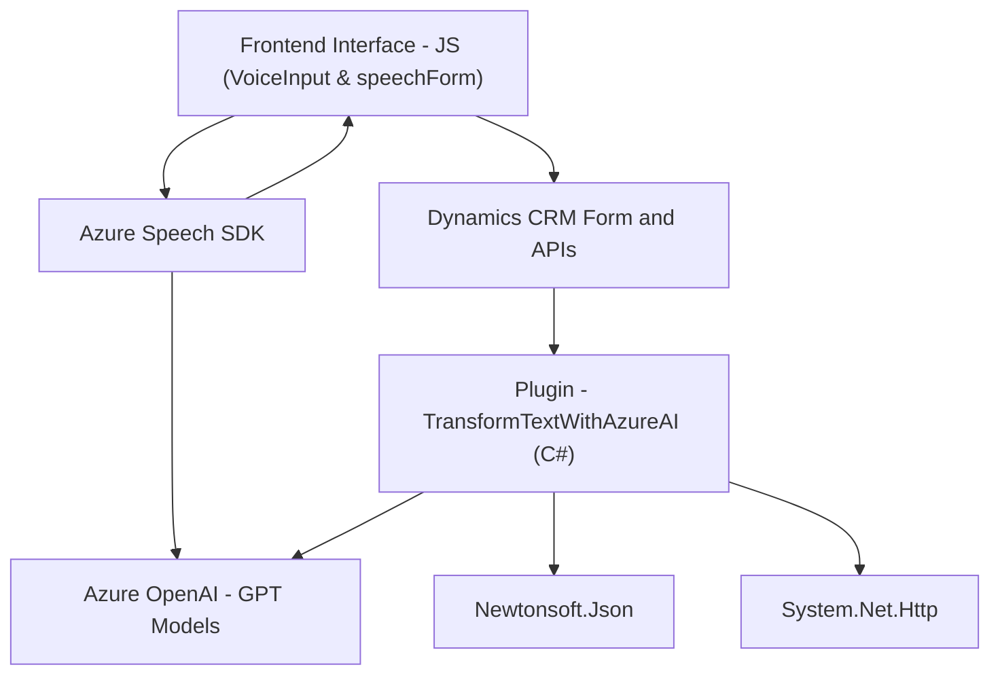

### Breve resumen técnico

La estructura del repositorio indica que los archivos están organizados en dos áreas principales: **Frontend** (implementación en JavaScript) y **Plugins** (implementación en C# para Dynamics CRM). Los archivos de Frontend parecen estar diseñados para habilitar funcionalidades de interacción avanzada con formularios mediante voz y procesamiento de datos. Por otro lado, el plugin de C# en la carpeta `Plugins` está implementado para extender funcionalidades de Dynamics CRM, utilizando servicios de inteligencia artificial de Azure (Azure OpenAI) para estructurar texto de entrada.

---

### Descripción de arquitectura

#### **Arquitectura general:**
El conjunto del repositorio refleja una solución con una arquitectura **híbrida**, combinando lógica de **event-driven architecture** para el Frontend y un **plugin architecture** para la extensión de Dynamics 365 mediante el modelo `IPlugin`. 

El Frontend está basado en una estructura modular, mientras que la arquitectura del plugin se alinea con el estilo monolítico de Dynamics CRM porque todas las operaciones están contenidas dentro de un mismo paquete (.dll).

#### **Componentes principales:**
1. **Frontend con integración de SDK:** En esta capa se proporciona la interfaz visual en la que los usuarios interactúan. Utiliza **Azure Speech SDK** para ofrecer funcionalidades de reconocimiento de voz, síntesis de habla y transformación de datos mediante la API de Dynamics 365 y APIs externas.
2. **Backend (Plugins) en Dynamics CRM:** La lógica empresarial se extiende mediante un plugin de C#, que procesa las transcripciones obtenidas del Frontend y las transforma en datos estructurados utilizando Azure OpenAI.

#### **Interacción entre componentes:**
- **Frontend:** Realiza la captura, transcripción y síntesis de datos desde el formulario. Procesa datos directamente desde los campos de Dynamics CRM interactuando con sus APIs internas y personalizadas.
- **Plugins:** Procesa textos mediante reglas predefinidas usando Azure OpenAI para generar información estructurada (JSON). La información procesada se integra dentro de los registros del CRM.

---

### Tecnologías usadas

1. **Frontend:**
   - **JavaScript**: Lenguaje principal para la implementación de las funcionalidades.
   - **Azure Speech SDK**: Para servicio de texto a voz y reconocimiento de habla con integración directa.
   - **Microsoft Dynamics APIs**: Para interactuar con formularios y sus propiedades.
   - **Browser APIs**: Como `document.createElement`.

2. **Backend - Plugins:**
   - **C#**: Lenguaje usado para implementar los plugins del CRM.
   - **Microsoft Dynamics SDK**: Integración con funcionalidades de Dynamics CRM.
   - **Azure OpenAI**: Uso de la API externa en servicios REST para procesamiento de texto.
   - **Newtonsoft.Json**: Bibliotecas para manejo de JSON.
   - **System.Net.Http**: Para realizar solicitudes HTTP a servicios REST.
   - **Plugin architecture**: Extensión de las capacidades estándar de Dynamics CRM.

---

### Diagrama Mermaid válido para GitHub

---

### Conclusión final

La solución implementada en este repositorio se encuentra orientada principalmente a la automatización de procesos en el contexto de Microsoft Dynamics 365. La combinación de Frontend y Plugins evidencia una arquitectura híbrida que integra servicios de nube (Azure Speech SDK y Azure OpenAI). Entre los puntos clave que destacan:

1. **Responsabilidad bien distribuida:** El Frontend captura y procesa datos por voz y los envía al Backend, donde los plugins transforman y almacenan los datos utilizando servicios de AI.
2. **Uso de patrones de diseño:** El código refleja buenas prácticas como modularidad, separación de responsabilidades y delegación de tareas, aunque la estructura podría ser más avanzada con patrones como **Ports and Adapters (Hexagonal Architecture)** para mejorar la mantenibilidad y escalabilidad.
3. **Dependencia de componentes externos:** La solución depende de múltiples APIs externas como Azure Speech SDK, Azure OpenAI, y Microsoft Dynamics APIs.

Finalmente, el diagrama Mermaid muestra cómo los componentes interactúan entre sí para ofrecer una funcionalidad robusta y escalable de automatización en el contexto de formularios y procesamiento de datos por voz.