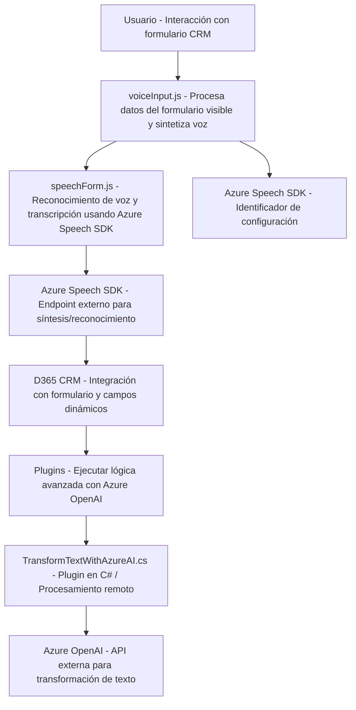

### Breve resumen técnico:
El repositorio describe un proyecto que integra capacidades de procesamiento de datos de formularios y síntesis/reconocimiento de voz con servicios externos como Azure Speech SDK y Azure OpenAI. Es un sistema que combina procesamiento del lado del cliente (JavaScript) con extensiones del lado del servidor (C# plugins en Dynamics 365 CRM).

---

### Descripción de la arquitectura:
1. **Tipo de solución:** 
   - **Híbrido Frontend-Backend** con integración a servicios API y SDK externos. Consiste de:
     - Un **frontend** basado en JavaScript que interactúa con un formulario y realiza operaciones relacionadas con la entrada por voz y síntesis.
     - Un **backend** (plugin de Dynamics 365 CRM) en C# que extiende la funcionalidad del CRM mediante procesamiento avanzado con Azure OpenAI.

2. **Arquitectura del proyecto:**
   - **Frontend:**
     - Diseño modular, cada archivo tiene una responsabilidad específica (interacción del usuario, mapeo de datos, integración con voz).
     - Adopta arquitectura **n-capas** debido a la separación del procesamiento de datos, integración a SDK externos y lógica interna.
   - **Backend Plugin:**
     - Sigue un patrón de extensión basado en **Plugin Architecture** de Dynamics 365 CRM.
     - Utiliza arquitectura **orientada a servicios** (REST) al integrar Azure OpenAI para procesamiento de texto.

3. **Patrones aplicados:**
   - **Cargador dinámico de dependencias:** En JavaScript, se gestiona la carga del Azure Speech SDK en tiempo de ejecución.
   - **Facade:** Simplifica operaciones críticas (voz y texto) mediante funciones encapsuladas en el frontend.
   - **Integración con API:** Tanto el frontend como el plugin C# utilizan servicios RESTful para comunicarse con Azure.

4. **Technologías usadas:**
   - **Frontend:**
     - JavaScript y HTML para lógica y procesamiento de formularios.
     - Azure Speech SDK (JavaScript) para entrada de voz/síntesis.
     - Dynamics 365 API (`Xrm` WebApi) para acceso a datos de formularios.
   - **Backend:**
     - Azure OpenAI SDK para procesamiento avanzado de texto.
     - C# con librerías: `System.Text.Json`, `Newtonsoft.Json.Linq`, `System.Net.Http`.
     - Dynamics SDK (`Microsoft.Xrm.Sdk`) para extensibilidad del CRM.

---

### Dependencias/Componentes externos:
1. **Azure Speech SDK:** 
   - Utilizado para entrada y síntesis de voz.
   - URL específica: `https://aka.ms/csspeech/jsbrowserpackageraw`.
2. **Azure OpenAI Service:** 
   - Transformación avanzada de texto con reglas específicas en el backend.
   - Endpoint: `https://openai-netcore.openai.azure.com/`.
3. **Dynamics 365 CRM:** 
   - Utilizado como base para formularios y gestión de datos.
4. **Browser Environment:** 
   - Los scripts JavaScript dependen de navegadores modernos para cargar dinámicamente el Azure Speech SDK.

---

### Diagrama Mermaid:

---

### Conclusión final:
El sistema proporciona una solución híbrida orientada a combinar funcionalidad cliente-servidor, integrando servicios cloud como Azure Speech y Azure OpenAI con Dynamics 365 CRM. La modularidad y los múltiples puntos de integración externa hacen que esta arquitectura sea fácil de escalar, extensible y altamente interoperable, aunque aumenta la dependencia de servicios de terceros como Azure. Según todos los elementos analizados, la arquitectura implementada es una **solución n-capas con integración de servicios externos** adecuada para escenarios CRM avanzados como entrada/síntesis de voz y datos generados por inteligencia artificial.