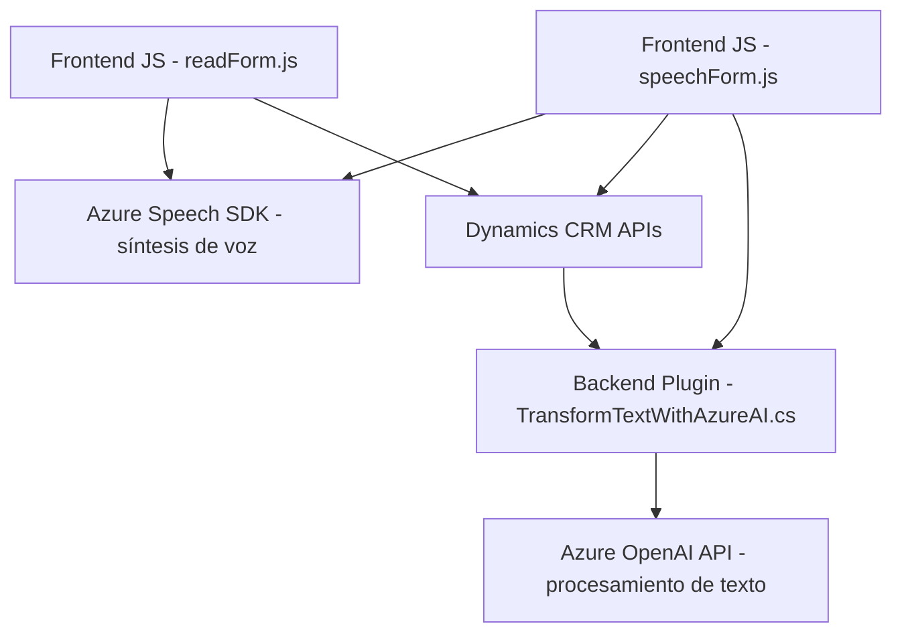

### Breve Resumen Técnico
El repositorio presenta una solución centrada en la interacción con formularios de Dynamics CRM, mediante reconocimiento y síntesis de voz con Azure Speech SDK y un plugin que utiliza Azure OpenAI para procesamiento de texto estructurado. Incluye componentes de frontend en JavaScript y un plugin backend desarrollado en C#.

---

### Descripción de Arquitectura
La arquitectura es **modular de n capas** con integración de servicios externos a través de APIs. Los componentes de frontend interactúan con formularios web, facilitando lectura y entrada mediante reconocimiento de voz. Los plugins en la capa de backend manejan la transformación avanzada de datos a través de Azure OpenAI y Dynamics CRM.

### Tecnologías Usadas
1. **Frontend (JavaScript)**:
   - Azure Speech SDK para reconocimiento y síntesis de voz.
   - Manipulación del DOM para obtener y procesar formularios.
   - Asynchronous JS (promesas y callbacks) para manejar eventos.
   - Dynamics CRM API para acceso y manipulación de datos del sistema.

2. **Backend (.NET/C#)**:
   - Microsoft Dynamics CRM SDK para construir plugins integrados.
   - Integración con Azure OpenAI para procesamiento de texto.
   - HTTP Request/Response (API REST) para comunicación con OpenAI.
   - Serialización/Deserialización con `System.Text.Json` y `Newtonsoft.Json`.

3. **Externo**:
   - **Azure Speech SDK**: Reconocimiento y síntesis de voz.
   - **Azure OpenAI**: Procesamiento de texto utilizando GPT modelos.

---

### Diagrama Mermaid (100 % compatible con GitHub Markdown)

---

### Conclusión Final
El repositorio implementa una solución altamente modular y escalable basada en la integración de APIs externas y servicios en la nube. El sistema permite interacción vocal, captura dinámica de formularios en entornos web y procesamiento avanzado de datos en el backend mediante técnicas de Inteligencia Artificial. La combinación de **Azure Speech SDK** y **Azure OpenAI** demuestran que la solución está diseñada para tareas avanzadas relacionadas con accesibilidad, automatización y transformación inteligente de datos.