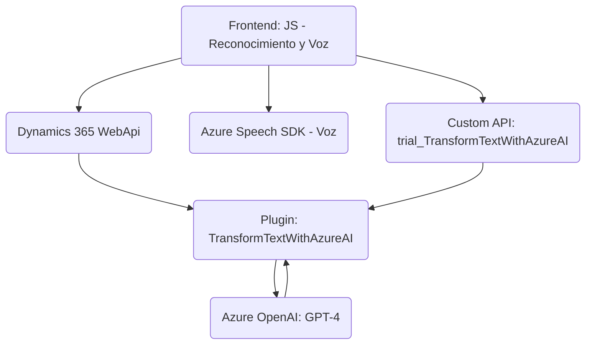

### Breve Resumen Técnico

La solución presentada es una aplicación basada en la interacción dinámica entre formularios de **Dynamics 365 CRM**, reconocimiento mediante **Azure Speech SDK**, y procesamiento avanzado de texto a través de **Azure OpenAI GPT-4**. La finalidad es automatizar tareas en formularios mediante voz, transcripciones y transformación avanzada de datos en texto estructurado.

---

### Descripción de Arquitectura

La arquitectura puede clasificarse como **modular multicapa** con características de **orientación a servicios (Service-Oriented Architecture - SOA)** donde:
1. La capa frontend interactúa directamente con los formularios de Dynamics 365 utilizando reconocimiento y síntesis de voz (Azure Speech SDK).
2. Una capa de inteligencia adicional procesa transcripciones utilizando **Azure OpenAI** para gestión avanzada de texto, y aplica cambios estructurados en tiempo real.
3. La lógica más pesada y desacoplada ocurre a través de un **plugin** de Dynamics CRM que interactúa como microservicio con la API de Azure.

### Tecnologías Usadas
1. **Frontend**
   - **Azure Speech SDK (JavaScript):** Reconocimiento y síntesis de voz.
   - **Dynamics 365 Web API (`Xrm.WebApi`):** Manipulación de formularios e interacción CRUD con entidades.
2. **Backend Plugin**
   - **Azure OpenAI GPT-4:** Procesamiento de texto con inteligencia artificial.
   - **Microsoft.Xrm.Sdk:** API estándar para plugins de Dynamics CRM.
   - **System.Net.Http:** Para interactuar con servicios externos.
3. **Otros Frameworks/Librerías**
   - **Newtonsoft.Json / System.Text.Json:** Procesamiento de objetos JSON.

### Dependencias o Componentes Externos
1. **Azure Speech SDK:** Para reconocer y sintetizar voz.
2. **Dynamics CRM Custom API ("trial_TransformTextWithAzureAI"):** Procesamiento avanzado de texto utilizando GPT.
3. **Azure OpenAI Service:** Procesamiento de alto nivel mediante modelos de lenguaje.

---

### Diagrama Mermaid

---

### Conclusión Final

La solución refleja una implementación híbrida basada en **capa modulada y desacoplada**, donde los procesos más exigentes y la inteligencia se delegan a servicios externos como GPT-4 y el SDK de Azure. Esto garantiza escalabilidad, flexibilidad en las actualizaciones, y una integración fluida entre reconocimiento de voz, procesamiento de texto y manipulación dinámica de formularios de Dynamics CRM.

Este enfoque permite operar tanto dentro de un **monolito dinámico (Dynamics CRM + Plugin)** como aprovechar el **desacoplamiento mediante APIs externas**, lo cual habilita un modelo distribuido muy eficiente para sistemas empresariales modernos.