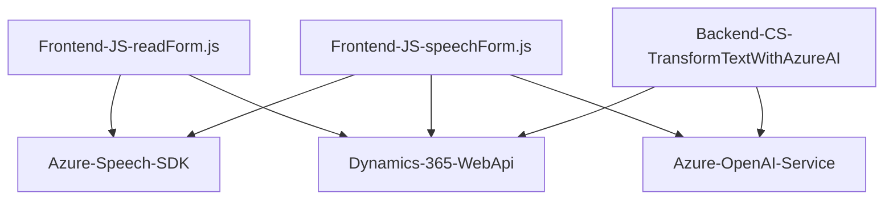

# Análisis del repositorio

## Breve Resumen Técnico
El repositorio incluye múltiples archivos que implementan soluciones específicas para interactuar con formularios basados en Dynamics 365, servicios de Azure Speech SDK y Azure OpenAI para habilitar funcionalidades avanzadas. Cada archivo está diseñado para cumplir una subfunción específica que opera dentro de la arquitectura general del sistema.

---

## Descripción de Arquitectura
Este repositorio forma parte de una solución híbrida **Cliente-Servidor**, con una arquitectura **orientada a servicios**. En términos generales:
1. **Frontend:** Una capa cliente que actúa como un cliente enriquecido (Rich Client). Utiliza JavaScript para interactuar con el navegador, tomar información de formularios y comunicarla con servicios de Azure.
2. **Backend:** Integra plugins basados en .NET para Dynamics CRM, que actúan como extensiones en eventos del servidor. Utilizan el servicio Azure OpenAI y cumplen una lógica definida para transformar datos entrantes.
3. **APIs externas:** Se realiza una integración con dos servicios externos, el **Azure Speech SDK** para síntesis y reconocimiento de voz, y **Azure OpenAI**, para transformar texto siguiendo reglas específicas. El sistema representa una arquitectura basada en **n capas** donde la capa de negocio interactúa con capas externas y un cliente avanzado.

---

## Tecnologías Usadas
1. **Frontend (Arquitectura Cliente):**  
   - Lenguaje: **JavaScript**
   - Frameworks/SDK: **Azure Speech SDK**
   - API de cliente de **Dynamics 365** (`Xrm.WebApi`).
   - Patrones:
     - **Rich Client Architecture:** Manejo y procesamiento de datos en el cliente antes de enviarlos al servidor.
     - **Callback Pattern:** Callback tras la carga dinámica de scripts.
     - **Desacoplamiento** en las operaciones de integración con SDK externo.

2. **Backend (Plugins en Dynamics 365):**  
   - Lenguaje: **C#**
   - Framework: **Microsoft.Xrm.Sdk** para la implementación de plugins Dynamics CRM.
   - Herramientas:
     - **HttpClient** para integración con APIs externas.
     - **System.Text.Json** y **Newtonsoft.Json.Linq** para serialización y manipulación JSON.
   - API externa: **Azure OpenAI**

### Patrones de diseño:
- **Modelo Vista Controlador (MVC):** En el frontend, las funciones separan responsabilidades entre la extracción de datos (Modelo), procesamiento por voz o texto (Controlador) y actualización de formularios (Vista).
- **Callback-driven Design (asíncrono):** Uso explícito de callbacks para manejar la carga de SDK y comunicación con servicios remotos.
- **Repositorios:** En plugins .NET, se utiliza mapeo y abstracción de estructuras de datos en funciones como `getFieldMap`.
- **Plugins extensibles:** Componentes .NET diseñados como plugins de Dynamics CRM, ejecutados bajo eventos específicos.
- **Integración basada en APIs:** Los sistemas interactúan con servicios de Azure API como Speech SDK y OpenAI, lo que define una arquitectura de microservicios acoplada a tecnologías web.

---

## Dependencias y componentes externos
1. **Azure Speech SDK:** Utilizado en el frontend para síntesis de voz y reconocimiento de audio.
2. **Azure OpenAI Service (GPT model):** Consumo desde el backend (`TransformTextWithAzureAI.cs`) para transformar texto según reglas definidas.
3. **Dynamics 365 Web API (`Xrm.WebApi`)**: Usada para la interacción con el sistema CRM desde el cliente.
4. **Microsoft.Xrm.Sdk API:** Parte de la biblioteca de extensibilidad de Dynamics CRM con servicios como `IOrganizationService` y `IPluginExecutionContext`.
5. **HTTP Communication Stack:** Comunicación entre el backend y el servicio de Azure OpenAI mediante `HttpClient`.
6. Serialización/deserialización de JSON: Realizada por bibliotecas .NET (`System.Text.Json`, `Newtonsoft.Json`).

---

## Diagrama Mermaid válido para GitHub

---

## Conclusión Final
Este repositorio implementa una solución orientada a integraciones entre clientes avanzados y servicios externos de inteligencia artificial y síntesis de voz, aplicados en un contexto de automatización de formularios de Dynamics 365. La arquitectura corresponde a **n capas** con componentes desacoplados mediante APIs y plugins. Este diseño favorece la escalabilidad y sostenibilidad al reutilizar SDKs y servicios externos (Azure) para ofrecer funcionalidades de voz y texto.