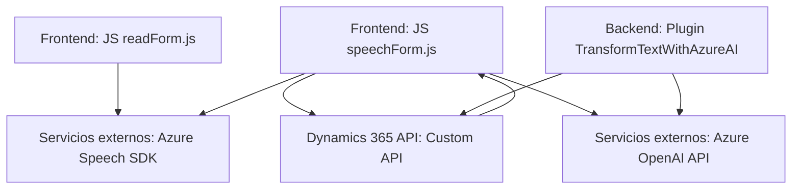

### Breve resumen técnico
El repositorio contiene una solución que integra capacidades de reconocimiento y síntesis de voz con APIs externas personalizadas y plataformas como Dynamics 365 y Azure Speech SDK. Además, incluye un plugin para transformar texto utilizando Azure OpenAI.

---

### Descripción de arquitectura
La solución presenta una **arquitectura basada en n capas** con integración dinámica hacia componentes externos:
1. **Frontend (JavaScript)**: Contiene dos módulos JS (`readForm.js` y `speechForm.js`) encargados de interactuar con el usuario, procesar datos de formularios y conectarse con servicios Azure Speech SDK y APIs.
2. **Backend (Plugin)**: Implementa un plugin en Dynamics 365 escrito en `.NET`, que usa Azure OpenAI para transformar texto de forma avanzada. Este componente se registra como un evento en la plataforma Dynamics.
3. **Servicios externos**: Azure Speech SDK y Azure OpenAI son los principales servicios utilizados.

---

### Tecnologías usadas
1. **Frontend**:
   - **JavaScript**: Interacción con DOM y formularios.
   - **Azure Speech SDK**: Procesamiento de voz (síntesis y reconocimiento).
2. **Backend** (Plugins):
   - **Microsoft Dynamics 365 SDK** (`Microsoft.Xrm.Sdk`).
   - **Azure OpenAI API**: API REST para transformar texto con GPT-4.
   - **.NET Framework**: Para desarrollo del plugin en C#.
3. **Dependencias externas**:
   - `System.Net.Http` y `System.Text.Json` para hacer peticiones HTTP al servicio de OpenAI.
   - CDN: Azure Speech SDK cargado dinámicamente.
   - Servicios REST: APIs personalizadas en Dynamics y Azure OpenAI.

---

### Diagrama **Mermaid** (válido para GitHub)

---

### Conclusión final
La solución es un ejemplo de integración tecnológica entre frontend, backend plugin, y servicios externos, implementada dentro de un ecosistema empresarial utilizando Dynamics 365. Presenta una arquitectura de **n-capas** que separa claramente las responsabilidades de cada componente. Los principios de modularidad y extensibilidad están implementados con funciones que interactúan con APIs externas (Azure Speech SDK y OpenAI) y un plugin basado en el pipeline de Dynamics. Es un caso práctico de cómo implementar tecnologías modernas (AI y SDKs) en soluciones empresariales.